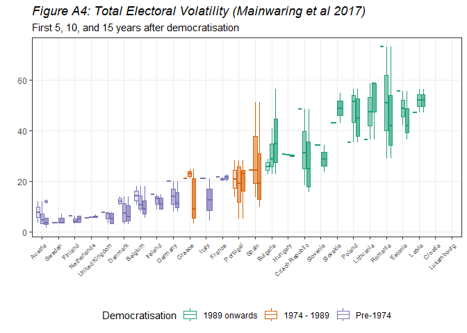
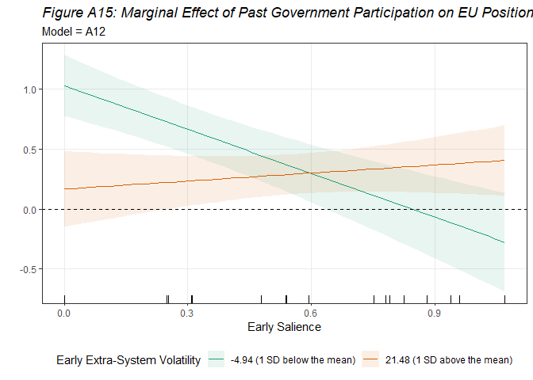
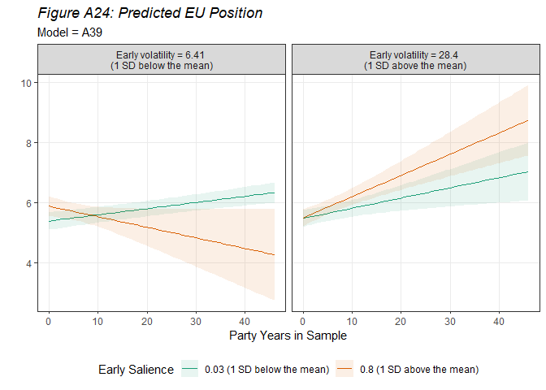

Thesis Code
================
Duarte Amaro
2024-02-12

## Hypothesised Relationship

<!-- -->

## Data Cleaning and Descriptive Statistics

### CHES and CMP

### Volatility

### Descriptive Statistics

<!-- --><!-- --><!-- -->

<!-- --><!-- --><!-- --><!-- --><!-- --><!-- -->

### ParlGov, Eurostat, and Merging

### Appendix Descriptives

#### Tables and Variable Distributions

    ## 
    ## <table style="text-align:center"><caption><strong>Table A1: Descriptive Statistics</strong></caption>
    ## <tr><td colspan="9" style="border-bottom: 1px solid black"></td></tr><tr><td style="text-align:left">Variable</td><td>N</td><td>Min</td><td>Max</td><td>Mean</td><td>Median</td><td>SD</td><td>Skewness.Skewness</td><td>Skewness.SE</td></tr>
    ## <tr><td colspan="9" style="border-bottom: 1px solid black"></td></tr><tr><td style="text-align:left">earlySalience</td><td>1,241</td><td>0</td><td>1.070</td><td>0.410</td><td>0.310</td><td>0.380</td><td>0.220</td><td>0.070</td></tr>
    ## <tr><td style="text-align:left">earlyVolat</td><td>1,178</td><td>3.800</td><td>48.300</td><td>17.410</td><td>14.100</td><td>10.990</td><td>1.110</td><td>0.070</td></tr>
    ## <tr><td style="text-align:left">earlyVolat_m</td><td>1,199</td><td>3.700</td><td>73.090</td><td>24</td><td>21.100</td><td>18.340</td><td>0.870</td><td>0.070</td></tr>
    ## <tr><td style="text-align:left">earlyExtra</td><td>1,199</td><td>0</td><td>70.410</td><td>8.270</td><td>2.770</td><td>13.210</td><td>3.120</td><td>0.070</td></tr>
    ## <tr><td style="text-align:left">earlypi_z</td><td>1,241</td><td>-0.850</td><td>1.200</td><td>0.010</td><td>-0.070</td><td>0.580</td><td>0.410</td><td>0.070</td></tr>
    ## <tr><td style="text-align:left">eu_position</td><td>1,241</td><td>1</td><td>7</td><td>5.030</td><td>5.590</td><td>1.670</td><td>-0.840</td><td>0.070</td></tr>
    ## <tr><td style="text-align:left">lrecon</td><td>1,241</td><td>0</td><td>9.330</td><td>4.870</td><td>4.880</td><td>2.150</td><td>-0.130</td><td>0.070</td></tr>
    ## <tr><td style="text-align:left">galtan</td><td>1,240</td><td>0.130</td><td>10</td><td>5.130</td><td>5.090</td><td>2.500</td><td>0.050</td><td>0.070</td></tr>
    ## <tr><td style="text-align:left">vote</td><td>1,237</td><td>0.140</td><td>49.280</td><td>12.050</td><td>8</td><td>10.900</td><td>1.280</td><td>0.070</td></tr>
    ## <tr><td style="text-align:left">seat</td><td>1,027</td><td>0</td><td>64.600</td><td>13.030</td><td>8</td><td>13.790</td><td>1.450</td><td>0.080</td></tr>
    ## <tr><td style="text-align:left">enp_seats</td><td>1,241</td><td>2.120</td><td>9.700</td><td>4.580</td><td>4.430</td><td>1.740</td><td>0.910</td><td>0.070</td></tr>
    ## <tr><td style="text-align:left">enp_votes</td><td>1,241</td><td>2.350</td><td>10.960</td><td>5.570</td><td>5.270</td><td>2</td><td>0.830</td><td>0.070</td></tr>
    ## <tr><td style="text-align:left">log_gdp</td><td>1,213</td><td>8.070</td><td>11.330</td><td>9.950</td><td>10.130</td><td>0.640</td><td>-0.640</td><td>0.070</td></tr>
    ## <tr><td style="text-align:left">log_pop</td><td>1,236</td><td>13.190</td><td>18.240</td><td>16.250</td><td>16.140</td><td>1.160</td><td>0.050</td><td>0.070</td></tr>
    ## <tr><td style="text-align:left">net_exports</td><td>1,160</td><td>-864,742</td><td>2,103,014</td><td>65,696.470</td><td>3,836.200</td><td>271,317.100</td><td>5.350</td><td>0.070</td></tr>
    ## <tr><td style="text-align:left">past_govt</td><td>1,241</td><td>0</td><td>1</td><td>0.600</td><td>1</td><td>0.490</td><td>-0.400</td><td>0.070</td></tr>
    ## <tr><td style="text-align:left">govt_duration</td><td>1,195</td><td>0</td><td>59.990</td><td>7.430</td><td>2.060</td><td>11.740</td><td>2.130</td><td>0.070</td></tr>
    ## <tr><td colspan="9" style="border-bottom: 1px solid black"></td></tr></table>

    ## 
    ## <table style="text-align:center"><caption><strong>Table A2: Election dates per country</strong></caption>
    ## <tr><td colspan="2" style="border-bottom: 1px solid black"></td></tr><tr><td style="text-align:left">Country</td><td>Election Year</td></tr>
    ## <tr><td colspan="2" style="border-bottom: 1px solid black"></td></tr><tr><td style="text-align:left">Austria</td><td>1949-10-09</td></tr>
    ## <tr><td style="text-align:left">Austria</td><td>1953-02-22</td></tr>
    ## <tr><td style="text-align:left">Austria</td><td>1956-05-13</td></tr>
    ## <tr><td style="text-align:left">Austria</td><td>1959-05-10</td></tr>
    ## <tr><td style="text-align:left">Belgium</td><td>1946-02-17</td></tr>
    ## <tr><td style="text-align:left">Belgium</td><td>1949-06-29</td></tr>
    ## <tr><td style="text-align:left">Belgium</td><td>1950-06-04</td></tr>
    ## <tr><td style="text-align:left">Belgium</td><td>1954-04-11</td></tr>
    ## <tr><td style="text-align:left">Bulgaria</td><td>1990-06-10</td></tr>
    ## <tr><td style="text-align:left">Bulgaria</td><td>1991-10-13</td></tr>
    ## <tr><td style="text-align:left">Bulgaria</td><td>1994-12-18</td></tr>
    ## <tr><td style="text-align:left">Bulgaria</td><td>1997-04-19</td></tr>
    ## <tr><td style="text-align:left">Croatia</td><td>1990-04-22</td></tr>
    ## <tr><td style="text-align:left">Croatia</td><td>1992-08-02</td></tr>
    ## <tr><td style="text-align:left">Croatia</td><td>1995-10-29</td></tr>
    ## <tr><td style="text-align:left">Croatia</td><td>2000-01-03</td></tr>
    ## <tr><td style="text-align:left">Czech Republic</td><td>1990-06-09</td></tr>
    ## <tr><td style="text-align:left">Czech Republic</td><td>1992-06-06</td></tr>
    ## <tr><td style="text-align:left">Czech Republic</td><td>1996-05-31</td></tr>
    ## <tr><td style="text-align:left">Czech Republic</td><td>1998-06-19</td></tr>
    ## <tr><td style="text-align:left">Denmark</td><td>1945-10-30</td></tr>
    ## <tr><td style="text-align:left">Denmark</td><td>1947-10-28</td></tr>
    ## <tr><td style="text-align:left">Denmark</td><td>1950-09-05</td></tr>
    ## <tr><td style="text-align:left">Denmark</td><td>1953-04-21</td></tr>
    ## <tr><td style="text-align:left">Denmark</td><td>1953-09-22</td></tr>
    ## <tr><td style="text-align:left">Estonia</td><td>1992-09-20</td></tr>
    ## <tr><td style="text-align:left">Estonia</td><td>1995-03-05</td></tr>
    ## <tr><td style="text-align:left">Estonia</td><td>1999-03-07</td></tr>
    ## <tr><td style="text-align:left">Finland</td><td>1945-03-18</td></tr>
    ## <tr><td style="text-align:left">Finland</td><td>1948-07-02</td></tr>
    ## <tr><td style="text-align:left">Finland</td><td>1951-07-03</td></tr>
    ## <tr><td style="text-align:left">Finland</td><td>1954-03-08</td></tr>
    ## <tr><td style="text-align:left">France</td><td>1946-11-10</td></tr>
    ## <tr><td style="text-align:left">France</td><td>1951-06-17</td></tr>
    ## <tr><td style="text-align:left">France</td><td>1956-01-02</td></tr>
    ## <tr><td style="text-align:left">Germany</td><td>1949-08-14</td></tr>
    ## <tr><td style="text-align:left">Germany</td><td>1953-09-06</td></tr>
    ## <tr><td style="text-align:left">Germany</td><td>1957-09-15</td></tr>
    ## <tr><td style="text-align:left">Greece</td><td>1974-11-17</td></tr>
    ## <tr><td style="text-align:left">Greece</td><td>1977-11-20</td></tr>
    ## <tr><td style="text-align:left">Greece</td><td>1981-10-18</td></tr>
    ## <tr><td style="text-align:left">Hungary</td><td>1990-03-25</td></tr>
    ## <tr><td style="text-align:left">Hungary</td><td>1994-05-08</td></tr>
    ## <tr><td style="text-align:left">Hungary</td><td>1998-05-10</td></tr>
    ## <tr><td style="text-align:left">Ireland</td><td>1948-02-04</td></tr>
    ## <tr><td style="text-align:left">Ireland</td><td>1951-05-30</td></tr>
    ## <tr><td style="text-align:left">Ireland</td><td>1954-05-18</td></tr>
    ## <tr><td style="text-align:left">Ireland</td><td>1957-03-05</td></tr>
    ## <tr><td style="text-align:left">Italy</td><td>1946-06-02</td></tr>
    ## <tr><td style="text-align:left">Italy</td><td>1948-04-18</td></tr>
    ## <tr><td style="text-align:left">Italy</td><td>1953-06-07</td></tr>
    ## <tr><td style="text-align:left">Latvia</td><td>1993-06-05</td></tr>
    ## <tr><td style="text-align:left">Latvia</td><td>1995-09-30</td></tr>
    ## <tr><td style="text-align:left">Latvia</td><td>1998-10-03</td></tr>
    ## <tr><td style="text-align:left">Latvia</td><td>2002-10-05</td></tr>
    ## <tr><td style="text-align:left">Lithuania</td><td>1992-10-25</td></tr>
    ## <tr><td style="text-align:left">Lithuania</td><td>1996-10-20</td></tr>
    ## <tr><td style="text-align:left">Lithuania</td><td>2000-10-08</td></tr>
    ## <tr><td style="text-align:left">Luxembourg</td><td>1945-10-21</td></tr>
    ## <tr><td style="text-align:left">Luxembourg</td><td>1948-06-06</td></tr>
    ## <tr><td style="text-align:left">Luxembourg</td><td>1951-06-03</td></tr>
    ## <tr><td style="text-align:left">Luxembourg</td><td>1954-05-30</td></tr>
    ## <tr><td style="text-align:left">Netherlands</td><td>1946-05-17</td></tr>
    ## <tr><td style="text-align:left">Netherlands</td><td>1948-07-07</td></tr>
    ## <tr><td style="text-align:left">Netherlands</td><td>1952-06-25</td></tr>
    ## <tr><td style="text-align:left">Poland</td><td>1991-10-27</td></tr>
    ## <tr><td style="text-align:left">Poland</td><td>1993-09-19</td></tr>
    ## <tr><td style="text-align:left">Poland</td><td>1997-09-21</td></tr>
    ## <tr><td style="text-align:left">Poland</td><td>2001-09-23</td></tr>
    ## <tr><td style="text-align:left">Portugal</td><td>1975-04-25</td></tr>
    ## <tr><td style="text-align:left">Portugal</td><td>1976-04-25</td></tr>
    ## <tr><td style="text-align:left">Portugal</td><td>1979-12-02</td></tr>
    ## <tr><td style="text-align:left">Portugal</td><td>1980-10-05</td></tr>
    ## <tr><td style="text-align:left">Portugal</td><td>1983-04-25</td></tr>
    ## <tr><td style="text-align:left">Romania</td><td>1990-05-20</td></tr>
    ## <tr><td style="text-align:left">Romania</td><td>1992-09-27</td></tr>
    ## <tr><td style="text-align:left">Romania</td><td>1996-11-03</td></tr>
    ## <tr><td style="text-align:left">Slovakia</td><td>1990-06-09</td></tr>
    ## <tr><td style="text-align:left">Slovakia</td><td>1992-06-06</td></tr>
    ## <tr><td style="text-align:left">Slovakia</td><td>1994-09-30</td></tr>
    ## <tr><td style="text-align:left">Slovakia</td><td>1998-09-26</td></tr>
    ## <tr><td style="text-align:left">Slovenia</td><td>1990-04-08</td></tr>
    ## <tr><td style="text-align:left">Slovenia</td><td>1992-12-06</td></tr>
    ## <tr><td style="text-align:left">Slovenia</td><td>1996-11-10</td></tr>
    ## <tr><td style="text-align:left">Spain</td><td>1977-06-15</td></tr>
    ## <tr><td style="text-align:left">Spain</td><td>1979-03-01</td></tr>
    ## <tr><td style="text-align:left">Spain</td><td>1982-10-28</td></tr>
    ## <tr><td style="text-align:left">Spain</td><td>1986-06-22</td></tr>
    ## <tr><td style="text-align:left">Sweden</td><td>1944-09-17</td></tr>
    ## <tr><td style="text-align:left">Sweden</td><td>1948-09-19</td></tr>
    ## <tr><td style="text-align:left">Sweden</td><td>1952-09-21</td></tr>
    ## <tr><td style="text-align:left">United Kingdom</td><td>1945-07-05</td></tr>
    ## <tr><td style="text-align:left">United Kingdom</td><td>1950-02-23</td></tr>
    ## <tr><td style="text-align:left">United Kingdom</td><td>1951-10-25</td></tr>
    ## <tr><td style="text-align:left">United Kingdom</td><td>1955-05-26</td></tr>
    ## <tr><td colspan="2" style="border-bottom: 1px solid black"></td></tr></table>

    ##    Min. 1st Qu.  Median    Mean 3rd Qu.    Max. 
    ##   3.000   3.000   4.000   3.654   4.000   5.000

    ## 
    ## <table style="text-align:center"><caption><strong>Table A3: Parties Coded as Dominant</strong></caption>
    ## <tr><td colspan="4" style="border-bottom: 1px solid black"></td></tr><tr><td style="text-align:left">Country</td><td>Party Abbreviation</td><td>Party Name</td><td>First coded as Dominant</td></tr>
    ## <tr><td colspan="4" style="border-bottom: 1px solid black"></td></tr><tr><td style="text-align:left">Austria</td><td>SPO</td><td>Sozialdemokratische Partei Osterreichs</td><td>1919</td></tr>
    ## <tr><td style="text-align:left">Austria</td><td>OVP</td><td>Osterreichische Volkspartei</td><td>1919</td></tr>
    ## <tr><td style="text-align:left">Austria</td><td>KPO</td><td>Kommunistische Partei Osterreichs</td><td>1945</td></tr>
    ## <tr><td style="text-align:left">Austria</td><td>FPO</td><td>Freiheitliche Partei Osterreichs</td><td>1983</td></tr>
    ## <tr><td style="text-align:left">Belgium</td><td>CVP| CD&V</td><td>Christelijke Volkspartij Christen Democratisch en Vlaams</td><td>1968</td></tr>
    ## <tr><td style="text-align:left">Belgium</td><td>PSC-CDH</td><td>Parti Social Chretien Centre Democrate Humaniste</td><td>1968</td></tr>
    ## <tr><td style="text-align:left">Belgium</td><td>PVV| VLD</td><td>Partij Voor Vrijheid en Vooruitgang Vlaamse Liberalen en Democraten</td><td>1974</td></tr>
    ## <tr><td style="text-align:left">Belgium</td><td>PRL</td><td>Parti Reformateur Liberal</td><td>1974</td></tr>
    ## <tr><td style="text-align:left">Belgium</td><td>VU</td><td>Volksunie</td><td>1977</td></tr>
    ## <tr><td style="text-align:left">Belgium</td><td>FDF</td><td>Front Democratique Des Francophones De Fi</td><td>1977</td></tr>
    ## <tr><td style="text-align:left">Belgium</td><td>PS</td><td>Parti Socialiste</td><td>1978</td></tr>
    ## <tr><td style="text-align:left">Belgium</td><td>SP</td><td>Socialistische Partij</td><td>1978</td></tr>
    ## <tr><td style="text-align:left">Belgium</td><td>Ecolo</td><td>Ecologistes Confederes Pour Lorganisation De Luttes Originales</td><td>1999</td></tr>
    ## <tr><td style="text-align:left">Belgium</td><td>AGL-Gr</td><td>Agalev Groen</td><td>1999</td></tr>
    ## <tr><td style="text-align:left">Belgium</td><td>MR</td><td>Mouvement Reformateur</td><td>2003</td></tr>
    ## <tr><td style="text-align:left">Belgium</td><td>SPa+Spi</td><td>Socialistische Partij Anders Sociaal Liberale Partij</td><td>2003</td></tr>
    ## <tr><td style="text-align:left">Bulgaria</td><td>SDS</td><td>Suyuz Na Demokratichnite Sili</td><td>1991</td></tr>
    ## <tr><td style="text-align:left">Bulgaria</td><td>KzB| DL</td><td>Koalitsiya Za Balgariya Demokratichna Levitsa</td><td>1994</td></tr>
    ## <tr><td style="text-align:left">Bulgaria</td><td>NDSV</td><td>Natsionalno Dvizhenie Simeon Vtori</td><td>2001</td></tr>
    ## <tr><td style="text-align:left">Bulgaria</td><td>DPS</td><td>Dvizhenie Za Prava i Svobodi</td><td>2001</td></tr>
    ## <tr><td style="text-align:left">Bulgaria</td><td>GERB</td><td>Grazhdani Za Evropeysko Razvitie Na Balgariya</td><td>2009</td></tr>
    ## <tr><td style="text-align:left">Bulgaria</td><td>RB</td><td>Reformatorski Blok</td><td>2014</td></tr>
    ## <tr><td style="text-align:left">Bulgaria</td><td>ABV</td><td>Alternativa Za Balgarsko Vazrazhdane</td><td>2014</td></tr>
    ## <tr><td style="text-align:left">Bulgaria</td><td>NFSB</td><td>Natsionalen Front Za Spasenie Na Balgariya</td><td>2017</td></tr>
    ## <tr><td style="text-align:left">Bulgaria</td><td>PP</td><td>Prodalzhavame Promyanata</td><td>2021</td></tr>
    ## <tr><td style="text-align:left">Bulgaria</td><td>ITN</td><td>Ima Takav Narod</td><td>2021</td></tr>
    ## <tr><td style="text-align:left">Bulgaria</td><td>DSB| DB</td><td>Demokrati Za Silna Balgariya Demokratichna Balgariya</td><td>2021</td></tr>
    ## <tr><td style="text-align:left">Czech Republic</td><td>KDU-CSL</td><td>Krestanska a Demokraticka Unie Ceskoslovenska Strana Lidova</td><td>1990</td></tr>
    ## <tr><td style="text-align:left">Czech Republic</td><td>ODS</td><td>Obcanska Demokraticka Strana</td><td>1992</td></tr>
    ## <tr><td style="text-align:left">Czech Republic</td><td>ODA</td><td>Obcanska Demokraticka Aliance</td><td>1992</td></tr>
    ## <tr><td style="text-align:left">Czech Republic</td><td>CSSD</td><td>Ceska Strana Socialne Demokraticka</td><td>1998</td></tr>
    ## <tr><td style="text-align:left">Czech Republic</td><td>US</td><td>Unie Svobody</td><td>2002</td></tr>
    ## <tr><td style="text-align:left">Czech Republic</td><td>TOP09</td><td>Tradice Odpovednost Prosperita 09</td><td>2010</td></tr>
    ## <tr><td style="text-align:left">Czech Republic</td><td>VV</td><td>Veci Verejne</td><td>2010</td></tr>
    ## <tr><td style="text-align:left">Czech Republic</td><td>ANO</td><td>Akce Nespokojenych Obcanu 2011</td><td>2013</td></tr>
    ## <tr><td style="text-align:left">Czech Republic</td><td>STAN</td><td>Starostove a Nezavisli</td><td>2021</td></tr>
    ## <tr><td style="text-align:left">Germany</td><td>SPD</td><td>Sozialdemokratische Partei Deutschlands</td><td>1919</td></tr>
    ## <tr><td style="text-align:left">Germany</td><td>FDP</td><td>Freie Demokratische Partei</td><td>1949</td></tr>
    ## <tr><td style="text-align:left">Germany</td><td>B90/Gru</td><td>Bundnis 90 Die Grunen</td><td>1998</td></tr>
    ## <tr><td style="text-align:left">Denmark</td><td>KF</td><td>Konservative</td><td>1901</td></tr>
    ## <tr><td style="text-align:left">Denmark</td><td>V</td><td>Venstre</td><td>1903</td></tr>
    ## <tr><td style="text-align:left">Denmark</td><td>RV</td><td>Det Radikale Venstre</td><td>1913</td></tr>
    ## <tr><td style="text-align:left">Denmark</td><td>Sd</td><td>Socialdemokraterne</td><td>1924</td></tr>
    ## <tr><td style="text-align:left">Denmark</td><td>CD</td><td>Centrumdemokraterne</td><td>1984</td></tr>
    ## <tr><td style="text-align:left">Denmark</td><td>KrF</td><td>Kristeligt Folkeparti</td><td>1984</td></tr>
    ## <tr><td style="text-align:left">Denmark</td><td>SF</td><td>Socialistisk Folkeparti</td><td>2011</td></tr>
    ## <tr><td style="text-align:left">Denmark</td><td>M</td><td>Moderaterne</td><td>2022</td></tr>
    ## <tr><td style="text-align:left">Spain</td><td>PSOE</td><td>Partido Socialista Obrero Espanol</td><td>1982</td></tr>
    ## <tr><td style="text-align:left">Spain</td><td>AP-P</td><td>Alianza Partido Popular</td><td>1996</td></tr>
    ## <tr><td style="text-align:left">Spain</td><td>ECP</td><td>En Comu Podem</td><td>2019</td></tr>
    ## <tr><td style="text-align:left">Spain</td><td>EM| GCE</td><td>En Marea Grupo Comun Da Esquerda</td><td>2019</td></tr>
    ## <tr><td style="text-align:left">Estonia</td><td>SDE| M</td><td>Sotsiaaldemokraatlik Erakond Moodukad</td><td>1992</td></tr>
    ## <tr><td style="text-align:left">Estonia</td><td>EK</td><td>Eesti Keskerakond</td><td>1995</td></tr>
    ## <tr><td style="text-align:left">Estonia</td><td>ERe</td><td>Eesti Reformierakond</td><td>1999</td></tr>
    ## <tr><td style="text-align:left">Estonia</td><td>I</td><td>Isamaaliit</td><td>1999</td></tr>
    ## <tr><td style="text-align:left">Estonia</td><td>ERP</td><td>Erakond Res Publica</td><td>2003</td></tr>
    ## <tr><td style="text-align:left">Estonia</td><td>ERa/EKR</td><td>Eestimaa Rahvalliit Eesti Konservatiivne Rahvaerakond</td><td>2003</td></tr>
    ## <tr><td style="text-align:left">Estonia</td><td>IRL</td><td>Erakond Isamaa Ja Res Publica Liit</td><td>2007</td></tr>
    ## <tr><td style="text-align:left">Estonia</td><td>E200</td><td>Erakond Eesti 200</td><td>2023</td></tr>
    ## <tr><td style="text-align:left">Finland</td><td>KESK</td><td>Keskusta</td><td>1917</td></tr>
    ## <tr><td style="text-align:left">Finland</td><td>RKP-SFP</td><td>Ruotsalainen Kansanpuolue Svenska Folkepartiet i Finland</td><td>1917</td></tr>
    ## <tr><td style="text-align:left">Finland</td><td>KOK</td><td>Kansallinen Kokoomus Samlingspartiet</td><td>1930</td></tr>
    ## <tr><td style="text-align:left">Finland</td><td>SSDP</td><td>Suomen Sosialidemokraattinen Puolue Finlands Socialdemokratiska Parti</td><td>1939</td></tr>
    ## <tr><td style="text-align:left">Finland</td><td>DL| VAS</td><td>Demokraattinen Liitto Demokratiska Forbundet Vasemmistoliitto Vansterforbundet</td><td>1945</td></tr>
    ## <tr><td style="text-align:left">Finland</td><td>SP| P</td><td>Suomen Puolue Perussuomalaiset</td><td>1983</td></tr>
    ## <tr><td style="text-align:left">Finland</td><td>KD</td><td>Kristillisdemokraatit Kristdemokraterna</td><td>1991</td></tr>
    ## <tr><td style="text-align:left">Finland</td><td>VIHR</td><td>Vihrea Liitto Grona Forbundet</td><td>1995</td></tr>
    ## <tr><td style="text-align:left">France</td><td>PR</td><td>Parti Radical Socialiste</td><td>1902</td></tr>
    ## <tr><td style="text-align:left">France</td><td>PS</td><td>Parti Socialiste_2</td><td>1936</td></tr>
    ## <tr><td style="text-align:left">France</td><td>PCF</td><td>Parti Communiste Francaise</td><td>1936</td></tr>
    ## <tr><td style="text-align:left">France</td><td>none</td><td>Sans Etiquette</td><td>1945</td></tr>
    ## <tr><td style="text-align:left">France</td><td>PRG</td><td>Parti Radical De Gauche</td><td>1981</td></tr>
    ## <tr><td style="text-align:left">France</td><td>RPR</td><td>Rassemblement Pour La Republique</td><td>1986</td></tr>
    ## <tr><td style="text-align:left">France</td><td>UDF| MD</td><td>Union Pour La Democratie Francaise Mouvement Democrate</td><td>1986</td></tr>
    ## <tr><td style="text-align:left">France</td><td>V</td><td>Les Verts</td><td>1997</td></tr>
    ## <tr><td style="text-align:left">France</td><td>MDC</td><td>Mouvement Des Citoyens</td><td>1997</td></tr>
    ## <tr><td style="text-align:left">France</td><td>UMP| LR</td><td>Union Pour Un Mouvement Populaire Les Republicains</td><td>2002</td></tr>
    ## <tr><td style="text-align:left">France</td><td>NC</td><td>Nouveau Centre</td><td>2007</td></tr>
    ## <tr><td style="text-align:left">France</td><td>REM| R</td><td>La Republique en Marche Renaissance</td><td>2017</td></tr>
    ## <tr><td style="text-align:left">United Kingdom</td><td>Con</td><td>Conservatives</td><td>1922</td></tr>
    ## <tr><td style="text-align:left">United Kingdom</td><td>Lab</td><td>Labour Party</td><td>1923</td></tr>
    ## <tr><td style="text-align:left">United Kingdom</td><td>Lib</td><td>Liberals</td><td>1931</td></tr>
    ## <tr><td style="text-align:left">Greece</td><td>ND</td><td>Nea Dimokratia</td><td>1974</td></tr>
    ## <tr><td style="text-align:left">Greece</td><td>PASOK</td><td>Panellinio Sosialistiko Kinima</td><td>1985</td></tr>
    ## <tr><td style="text-align:left">Greece</td><td>SYN</td><td>Synaspismos Tis Aristeras</td><td>1989</td></tr>
    ## <tr><td style="text-align:left">Greece</td><td>DIMAR</td><td>Dimokratiki Aristera</td><td>2012</td></tr>
    ## <tr><td style="text-align:left">Greece</td><td>SYRIZA</td><td>Synaspismos Rizospastikis Aristeras</td><td>2015</td></tr>
    ## <tr><td style="text-align:left">Greece</td><td>ANEL</td><td>Anexartitoi Ellines</td><td>2015</td></tr>
    ## <tr><td style="text-align:left">Croatia</td><td>SPH</td><td>Socijaldemokratska Partija Hrvatske</td><td>2000</td></tr>
    ## <tr><td style="text-align:left">Croatia</td><td>HSLS</td><td>Hrvatska Socijalno Liberalna Stranka</td><td>2000</td></tr>
    ## <tr><td style="text-align:left">Croatia</td><td>HSS</td><td>Hrvatska Seljacka Stranka</td><td>2000</td></tr>
    ## <tr><td style="text-align:left">Croatia</td><td>IDS</td><td>Istarski Demokratski Sabor</td><td>2000</td></tr>
    ## <tr><td style="text-align:left">Croatia</td><td>HNS-LD</td><td>Hrvatska Narodna Stranka Liberalni Demokrati</td><td>2000</td></tr>
    ## <tr><td style="text-align:left">Croatia</td><td>LS</td><td>Liberalna Stranka</td><td>2000</td></tr>
    ## <tr><td style="text-align:left">Croatia</td><td>HDZ</td><td>Hrvatska Demokratska Zajednica</td><td>2003</td></tr>
    ## <tr><td style="text-align:left">Croatia</td><td>SDSS</td><td>Samostalna Demokratska Srpska Stranka</td><td>2007</td></tr>
    ## <tr><td style="text-align:left">Croatia</td><td>Most</td><td>Most Nezavisnih Lista</td><td>2015</td></tr>
    ## <tr><td style="text-align:left">Croatia</td><td>ethnic</td><td>Ethnic</td><td>2020</td></tr>
    ## <tr><td style="text-align:left">Hungary</td><td>MDF</td><td>Magyar Demokrata Forum</td><td>1990</td></tr>
    ## <tr><td style="text-align:left">Hungary</td><td>FKgP</td><td>Fuggetlen Kisgazda Part</td><td>1990</td></tr>
    ## <tr><td style="text-align:left">Hungary</td><td>KDNP</td><td>Keresztenydemokrata Neppart</td><td>1990</td></tr>
    ## <tr><td style="text-align:left">Hungary</td><td>MSZP</td><td>Magyar Szocialista Part</td><td>1994</td></tr>
    ## <tr><td style="text-align:left">Hungary</td><td>SzDSz</td><td>Szabad Demokratak Szovetsege</td><td>1994</td></tr>
    ## <tr><td style="text-align:left">Hungary</td><td>Fi-MPSz</td><td>Fidesz Magyar Polgari Szovetseg</td><td>1998</td></tr>
    ## <tr><td style="text-align:left">Ireland</td><td>FF</td><td>Fianna Fail</td><td>1932</td></tr>
    ## <tr><td style="text-align:left">Ireland</td><td>FG</td><td>Fine Gael</td><td>1948</td></tr>
    ## <tr><td style="text-align:left">Ireland</td><td>Lab</td><td>Labour Party_2</td><td>1948</td></tr>
    ## <tr><td style="text-align:left">Ireland</td><td>PD</td><td>Progressive Democrats</td><td>1989</td></tr>
    ## <tr><td style="text-align:left">Ireland</td><td>Green</td><td>Green Party Comhaontas Glas</td><td>2007</td></tr>
    ## <tr><td style="text-align:left">Ireland</td><td>IA</td><td>Independent Alliance</td><td>2016</td></tr>
    ## <tr><td style="text-align:left">Italy</td><td>LN</td><td>Lega Nord</td><td>1994</td></tr>
    ## <tr><td style="text-align:left">Italy</td><td>AN</td><td>Alleanza Nazionale</td><td>1994</td></tr>
    ## <tr><td style="text-align:left">Italy</td><td>FI-PdL</td><td>Forza Italia Il Popolo Della Liberta</td><td>1994</td></tr>
    ## <tr><td style="text-align:left">Italy</td><td>DS</td><td>Democratici Di Sinistra</td><td>1996</td></tr>
    ## <tr><td style="text-align:left">Italy</td><td>PpP</td><td>Popolari per Prodi</td><td>1996</td></tr>
    ## <tr><td style="text-align:left">Italy</td><td>DINI-RI</td><td>Lista Dini Rinnovamento Italiano</td><td>1996</td></tr>
    ## <tr><td style="text-align:left">Italy</td><td>FdV</td><td>Federazione Dei Verdi</td><td>1996</td></tr>
    ## <tr><td style="text-align:left">Italy</td><td>CCD+CDU</td><td>Centro Cristiano Democratico Cristiani Democratici Uniti</td><td>2001</td></tr>
    ## <tr><td style="text-align:left">Italy</td><td>CeS</td><td>Centro Sinistra</td><td>2006</td></tr>
    ## <tr><td style="text-align:left">Italy</td><td>PRC</td><td>Partito Della Rifondazione Comunista</td><td>2006</td></tr>
    ## <tr><td style="text-align:left">Italy</td><td>R</td><td>Radicali</td><td>2006</td></tr>
    ## <tr><td style="text-align:left">Italy</td><td>IdV</td><td>Italia Dei Valori</td><td>2006</td></tr>
    ## <tr><td style="text-align:left">Italy</td><td>PdCI</td><td>Partito Dei Comunisti Italiani</td><td>2006</td></tr>
    ## <tr><td style="text-align:left">Italy</td><td>UDEUR</td><td>Unione Democratici per l Europa</td><td>2006</td></tr>
    ## <tr><td style="text-align:left">Italy</td><td>PD</td><td>Partito Democratico</td><td>2013</td></tr>
    ## <tr><td style="text-align:left">Italy</td><td>SC</td><td>Scelta Civica</td><td>2013</td></tr>
    ## <tr><td style="text-align:left">Italy</td><td>UC</td><td>Unione Centro</td><td>2013</td></tr>
    ## <tr><td style="text-align:left">Italy</td><td>M5S</td><td>Movimento 5 Stelle</td><td>2018</td></tr>
    ## <tr><td style="text-align:left">Italy</td><td>FdI</td><td>Fratelli d Italia</td><td>2022</td></tr>
    ## <tr><td style="text-align:left">Lithuania</td><td>LKDP</td><td>Lietuvos Krikscionys Demokratai</td><td>1990</td></tr>
    ## <tr><td style="text-align:left">Lithuania</td><td>LDDP</td><td>Lietuvos Demokratine Darbo Partija</td><td>1992</td></tr>
    ## <tr><td style="text-align:left">Lithuania</td><td>TS-LK</td><td>Tevynes Sajunga</td><td>1996</td></tr>
    ## <tr><td style="text-align:left">Lithuania</td><td>LiCS</td><td>Liberalu Ir Centro Sajunga</td><td>2000</td></tr>
    ## <tr><td style="text-align:left">Lithuania</td><td>NS-SL</td><td>Naujoji Sajunga Socialliberalai</td><td>2000</td></tr>
    ## <tr><td style="text-align:left">Lithuania</td><td>DP</td><td>Darbo Partija</td><td>2004</td></tr>
    ## <tr><td style="text-align:left">Lithuania</td><td>LSDP</td><td>Lietuvos Socialdemokratu Partija</td><td>2004</td></tr>
    ## <tr><td style="text-align:left">Lithuania</td><td>LVLS</td><td>Lietuvos Valstieciu Sajunga</td><td>2004</td></tr>
    ## <tr><td style="text-align:left">Lithuania</td><td>TPP</td><td>Tautos Prisikelimo Partija</td><td>2008</td></tr>
    ## <tr><td style="text-align:left">Lithuania</td><td>LRLS</td><td>Lietuvos Respublikos Liberalu Sajudis</td><td>2008</td></tr>
    ## <tr><td style="text-align:left">Lithuania</td><td>TT-LDP</td><td>Tvarka Ir Teisingumas Liberalu Demokratu Partija</td><td>2012</td></tr>
    ## <tr><td style="text-align:left">Lithuania</td><td>LLRA</td><td>Lietuvos Lenku Rinkimu Akcija</td><td>2012</td></tr>
    ## <tr><td style="text-align:left">Lithuania</td><td>LP</td><td>Laisves Partija</td><td>2020</td></tr>
    ## <tr><td style="text-align:left">Luxembourg</td><td>CSV</td><td>Chreschtlech Sozial Vollekspartei</td><td>1945</td></tr>
    ## <tr><td style="text-align:left">Luxembourg</td><td>LSAP</td><td>Letzebuerger Sozialistesch Aarbechterpartei</td><td>1945</td></tr>
    ## <tr><td style="text-align:left">Luxembourg</td><td>DP</td><td>Demokratesch Partei</td><td>1945</td></tr>
    ## <tr><td style="text-align:left">Luxembourg</td><td>KPL</td><td>Kommunistesch Partei Letzebuerg</td><td>1945</td></tr>
    ## <tr><td style="text-align:left">Luxembourg</td><td>Greng</td><td>Dei Greng</td><td>2013</td></tr>
    ## <tr><td style="text-align:left">Latvia</td><td>LC</td><td>Latvijas Cels</td><td>1993</td></tr>
    ## <tr><td style="text-align:left">Latvia</td><td>LZS</td><td>Latvijas Zemnieku Savieniba</td><td>1993</td></tr>
    ## <tr><td style="text-align:left">Latvia</td><td>DPS</td><td>Demokratiska Partija Saimnieks</td><td>1995</td></tr>
    ## <tr><td style="text-align:left">Latvia</td><td>NA/TB/LNNK</td><td>Nacionala Apvieniba Tevzemei Un Brivibai Lnnk</td><td>1998</td></tr>
    ## <tr><td style="text-align:left">Latvia</td><td>JP</td><td>Jauna Partija</td><td>1998</td></tr>
    ## <tr><td style="text-align:left">Latvia</td><td>JL</td><td>Jaunais Laiks</td><td>2002</td></tr>
    ## <tr><td style="text-align:left">Latvia</td><td>ZZS</td><td>Zalo Un Zemnieku Savieniba</td><td>2002</td></tr>
    ## <tr><td style="text-align:left">Latvia</td><td>LPP</td><td>Latvijas Pirma Partija</td><td>2002</td></tr>
    ## <tr><td style="text-align:left">Latvia</td><td>TP</td><td>Tautas Partija</td><td>2006</td></tr>
    ## <tr><td style="text-align:left">Latvia</td><td>LPP/LC</td><td>Latvijas Pirma Partija Latvijas Cels</td><td>2006</td></tr>
    ## <tr><td style="text-align:left">Latvia</td><td>V</td><td>Vienotiba</td><td>2010</td></tr>
    ## <tr><td style="text-align:left">Latvia</td><td>LZP</td><td>Latvijas Zala Partija</td><td>2022</td></tr>
    ## <tr><td style="text-align:left">Netherlands</td><td>PvdA</td><td>Partij Van De Arbeid</td><td>1946</td></tr>
    ## <tr><td style="text-align:left">Netherlands</td><td>VVD</td><td>Volkspartij Voor Vrijheid en Democratie</td><td>1948</td></tr>
    ## <tr><td style="text-align:left">Netherlands</td><td>D66</td><td>Democraten 66</td><td>1972</td></tr>
    ## <tr><td style="text-align:left">Netherlands</td><td>CDA</td><td>Christen Democratisch Appel</td><td>1977</td></tr>
    ## <tr><td style="text-align:left">Netherlands</td><td>LPF</td><td>Lijst Pim Fortuyn</td><td>2002</td></tr>
    ## <tr><td style="text-align:left">Netherlands</td><td>CU</td><td>Christen Unie</td><td>2006</td></tr>
    ## <tr><td style="text-align:left">Poland</td><td>SLD</td><td>Sojusz Lewicy Demokratycznej</td><td>1993</td></tr>
    ## <tr><td style="text-align:left">Poland</td><td>PSL</td><td>Polskie Stronnictwo Ludowe</td><td>1993</td></tr>
    ## <tr><td style="text-align:left">Poland</td><td>AWS</td><td>Akcja Wyborcza Solidarnosc Prawicy</td><td>1997</td></tr>
    ## <tr><td style="text-align:left">Poland</td><td>D| W| U</td><td>Demokratyczna Wolnosci Unia</td><td>1997</td></tr>
    ## <tr><td style="text-align:left">Poland</td><td>UP</td><td>Unia Pracy</td><td>2001</td></tr>
    ## <tr><td style="text-align:left">Poland</td><td>PiS</td><td>Prawo i Sprawiedliwosc</td><td>2005</td></tr>
    ## <tr><td style="text-align:left">Poland</td><td>PO</td><td>Platforma Obywatelska</td><td>2007</td></tr>
    ## <tr><td style="text-align:left">Portugal</td><td>PS</td><td>Partido Socialista</td><td>1976</td></tr>
    ## <tr><td style="text-align:left">Portugal</td><td>PSD</td><td>Partido Social Democrata</td><td>1979</td></tr>
    ## <tr><td style="text-align:left">Portugal</td><td>CDS-PP</td><td>Centro Democratico e Social Partido Popular</td><td>1979</td></tr>
    ## <tr><td style="text-align:left">Portugal</td><td>PPM</td><td>Partido Popular Monarquico</td><td>1979</td></tr>
    ## <tr><td style="text-align:left">Romania</td><td>PD</td><td>Partidul Democrat</td><td>1990</td></tr>
    ## <tr><td style="text-align:left">Romania</td><td>PSD</td><td>Partidul Social Democrat</td><td>1992</td></tr>
    ## <tr><td style="text-align:left">Romania</td><td>UDMR</td><td>Uniunea Democrata Maghiara Din Romania</td><td>1996</td></tr>
    ## <tr><td style="text-align:left">Romania</td><td>PSDR</td><td>Partidul Social Democrat Roman</td><td>1996</td></tr>
    ## <tr><td style="text-align:left">Romania</td><td>PNL</td><td>Partidul National Liberal</td><td>2004</td></tr>
    ## <tr><td style="text-align:left">Romania</td><td>PD-L</td><td>Partidul Democrat Liberal</td><td>2008</td></tr>
    ## <tr><td style="text-align:left">Romania</td><td>PU| PC</td><td>Partidul Umanist Partidul Conservator</td><td>2012</td></tr>
    ## <tr><td style="text-align:left">Romania</td><td>PLR| ALDE</td><td>Partidul Liberal Reformator Alianta Liberalilor Si Democratilor</td><td>2016</td></tr>
    ## <tr><td style="text-align:left">Romania</td><td>USR| PLUS</td><td>Uniunea Salvati Romania Partidul Libertate Unitate Si Solidaritate</td><td>2020</td></tr>
    ## <tr><td style="text-align:left">Slovakia</td><td>KDH</td><td>Krestanskodemokraticke Hnutie</td><td>1990</td></tr>
    ## <tr><td style="text-align:left">Slovakia</td><td>HZDS</td><td>Hnutie Za Demokraticke Slovensko</td><td>1992</td></tr>
    ## <tr><td style="text-align:left">Slovakia</td><td>SNS</td><td>Slovenska Narodna Strana</td><td>1992</td></tr>
    ## <tr><td style="text-align:left">Slovakia</td><td>ZRS</td><td>Zdruzenie Robotnikov Slovenska</td><td>1994</td></tr>
    ## <tr><td style="text-align:left">Slovakia</td><td>SDK</td><td>Slovenska Demokraticka Koalicia</td><td>1998</td></tr>
    ## <tr><td style="text-align:left">Slovakia</td><td>SDL</td><td>Strana Demokratickej Lavice</td><td>1998</td></tr>
    ## <tr><td style="text-align:left">Slovakia</td><td>MK</td><td>Madarskej Koalicie Magyar Koalicio</td><td>1998</td></tr>
    ## <tr><td style="text-align:left">Slovakia</td><td>SOP</td><td>Strana Obcianskeho Porozumenia</td><td>1998</td></tr>
    ## <tr><td style="text-align:left">Slovakia</td><td>SDKU-DS</td><td>Slovenska Demokraticka a Krestanska Unia Demokraticka Strana</td><td>2002</td></tr>
    ## <tr><td style="text-align:left">Slovakia</td><td>ANO</td><td>Aliancia Noveho Obcana</td><td>2002</td></tr>
    ## <tr><td style="text-align:left">Slovakia</td><td>Smer</td><td>Smer Socialna Demokracia</td><td>2006</td></tr>
    ## <tr><td style="text-align:left">Slovakia</td><td>SaS</td><td>Sloboda a Solidarita</td><td>2010</td></tr>
    ## <tr><td style="text-align:left">Slovakia</td><td>MH</td><td>Most Hid</td><td>2010</td></tr>
    ## <tr><td style="text-align:left">Slovakia</td><td>S</td><td>Siet</td><td>2016</td></tr>
    ## <tr><td style="text-align:left">Slovakia</td><td>OLaNO</td><td>Obycajni Ludia a Nezavisle Osobnosti</td><td>2020</td></tr>
    ## <tr><td style="text-align:left">Slovakia</td><td>SR</td><td>Sme Rodina Boris Kollar</td><td>2020</td></tr>
    ## <tr><td style="text-align:left">Slovakia</td><td>ZAL</td><td>Za Ludi</td><td>2020</td></tr>
    ## <tr><td style="text-align:left">Slovenia</td><td>SLS</td><td>Slovenska Ljudska Stranka</td><td>1990</td></tr>
    ## <tr><td style="text-align:left">Slovenia</td><td>NSI</td><td>Nova Slovenija Krscanska Ljudska Stranka</td><td>1990</td></tr>
    ## <tr><td style="text-align:left">Slovenia</td><td>ZS</td><td>Zeleni Slovenije</td><td>1990</td></tr>
    ## <tr><td style="text-align:left">Slovenia</td><td>SDS</td><td>Slovenska Demokratska Stranka</td><td>1990</td></tr>
    ## <tr><td style="text-align:left">Slovenia</td><td>LDS</td><td>Liberalna Demokracija Slovenije</td><td>1992</td></tr>
    ## <tr><td style="text-align:left">Slovenia</td><td>ZL-SD</td><td>Zdruzena Lista Socialni Demokrati</td><td>1992</td></tr>
    ## <tr><td style="text-align:left">Slovenia</td><td>DeSUS</td><td>Demokraticna Stranka Upokojencev Slovenije</td><td>1996</td></tr>
    ## <tr><td style="text-align:left">Slovenia</td><td>Zares</td><td>Zares</td><td>2008</td></tr>
    ## <tr><td style="text-align:left">Slovenia</td><td>DL</td><td>Drzavljanska Lista</td><td>2011</td></tr>
    ## <tr><td style="text-align:left">Slovenia</td><td>SMC</td><td>Stranka Modernega</td><td>2014</td></tr>
    ## <tr><td style="text-align:left">Slovenia</td><td>LMS</td><td>Lista Marjana Sarca</td><td>2018</td></tr>
    ## <tr><td style="text-align:left">Slovenia</td><td>ZaAB</td><td>Zaveznistvo Alenke Bratusek</td><td>2018</td></tr>
    ## <tr><td style="text-align:left">Slovenia</td><td>GS</td><td>Gibanje Svoboda</td><td>2022</td></tr>
    ## <tr><td style="text-align:left">Slovenia</td><td>L</td><td>Levica</td><td>2022</td></tr>
    ## <tr><td style="text-align:left">Sweden</td><td>FP</td><td>Folkpartiet</td><td>1911</td></tr>
    ## <tr><td style="text-align:left">Sweden</td><td>SAP</td><td>Socialdemokraterna</td><td>1917</td></tr>
    ## <tr><td style="text-align:left">Sweden</td><td>M</td><td>Moderaterna</td><td>1928</td></tr>
    ## <tr><td style="text-align:left">Sweden</td><td>C</td><td>Centerpartiet</td><td>1936</td></tr>
    ## <tr><td style="text-align:left">Sweden</td><td>KD</td><td>Kristdemokraterna</td><td>1991</td></tr>
    ## <tr><td style="text-align:left">Sweden</td><td>MP</td><td>Miljopartiet De Grona</td><td>2014</td></tr>
    ## <tr><td colspan="4" style="border-bottom: 1px solid black"></td></tr></table>

    ## 
    ## <table style="text-align:center"><caption><strong>Table A4: Parties Coded as Challenger</strong></caption>
    ## <tr><td colspan="4" style="border-bottom: 1px solid black"></td></tr><tr><td style="text-align:left">Country</td><td>Party Abbreviation</td><td>Party Name</td><td>Period in Sample</td></tr>
    ## <tr><td colspan="4" style="border-bottom: 1px solid black"></td></tr><tr><td style="text-align:left">Austria</td><td>Gruene</td><td>Die Grunen Die Grune Alternative</td><td>1986 - Present</td></tr>
    ## <tr><td style="text-align:left">Austria</td><td>LIF</td><td>Liberales Forum</td><td>1994 - 2008</td></tr>
    ## <tr><td style="text-align:left">Austria</td><td>DU</td><td>Die Unabhangigen Liste Lugner</td><td>1999</td></tr>
    ## <tr><td style="text-align:left">Austria</td><td>BZO</td><td>Bundnis Zukunft Osterreich</td><td>2006 - 2013</td></tr>
    ## <tr><td style="text-align:left">Austria</td><td>Martin</td><td>Liste Dr Hans Peter Martin</td><td>2006</td></tr>
    ## <tr><td style="text-align:left">Austria</td><td>Fritz</td><td>Burgerforum Osterreich Liste Fritz Dinkhauser</td><td>2008</td></tr>
    ## <tr><td style="text-align:left">Austria</td><td>TS</td><td>Team Stronach</td><td>2013</td></tr>
    ## <tr><td style="text-align:left">Austria</td><td>NEOS</td><td>Neos Das Neue Osterreich</td><td>2013 - Present</td></tr>
    ## <tr><td style="text-align:left">Austria</td><td>PILZ</td><td>Jetzt Liste Pilz</td><td>2017 - Present</td></tr>
    ## <tr><td style="text-align:left">Austria</td><td>GILT</td><td>Liste Roland Duringer Meine Stimme Gilt</td><td>2017</td></tr>
    ## <tr><td style="text-align:left">Belgium</td><td>PA-PTB</td><td>Partij Van De Arbeid Parti Du Travail De Belgique</td><td>1974 - Present</td></tr>
    ## <tr><td style="text-align:left">Belgium</td><td>VB</td><td>Vlaams Blok Vlaams Belang</td><td>1978 - Present</td></tr>
    ## <tr><td style="text-align:left">Belgium</td><td>FN</td><td>Front National</td><td>1991 - 2007</td></tr>
    ## <tr><td style="text-align:left">Belgium</td><td>V</td><td>Vivant</td><td>1999</td></tr>
    ## <tr><td style="text-align:left">Belgium</td><td>N-VA</td><td>Nieuw Vlaamse Alliantie</td><td>2003 - Present</td></tr>
    ## <tr><td style="text-align:left">Belgium</td><td>CD+NVA</td><td>Christen Democratisch Vlaams Nieuw Vlaams Alliantie</td><td>2007</td></tr>
    ## <tr><td style="text-align:left">Belgium</td><td>LD| LDD</td><td>Lijst Dedecker Libertair Direct Democratisch</td><td>2007 - 2010</td></tr>
    ## <tr><td style="text-align:left">Belgium</td><td>Pp</td><td>Parti Populaire</td><td>2010 - Present</td></tr>
    ## <tr><td style="text-align:left">Belgium</td><td>DLB</td><td>Debout Les Belges</td><td>2014</td></tr>
    ## <tr><td style="text-align:left">Bulgaria</td><td>DPS</td><td>Dvizhenie Za Prava i Svobodi</td><td>1991 - 1997</td></tr>
    ## <tr><td style="text-align:left">Bulgaria</td><td>BBB</td><td>Balgarski Biznes Blok</td><td>1991 - 1997</td></tr>
    ## <tr><td style="text-align:left">Bulgaria</td><td>KPB</td><td>Komunisticheska Partiya Na Balgariya</td><td>1994 - 1997</td></tr>
    ## <tr><td style="text-align:left">Bulgaria</td><td>ODS</td><td>Obedineni Demokratichni Sili</td><td>1997 - 2005</td></tr>
    ## <tr><td style="text-align:left">Bulgaria</td><td>BE</td><td>Balgarska Evrolevica</td><td>1997</td></tr>
    ## <tr><td style="text-align:left">Bulgaria</td><td>OT-SII</td><td>Obedinenie Za Tsar Simeon Ii</td><td>1997 - 2001</td></tr>
    ## <tr><td style="text-align:left">Bulgaria</td><td>DG</td><td>Dvizhenie Gergyovden</td><td>2001</td></tr>
    ## <tr><td style="text-align:left">Bulgaria</td><td>KSII</td><td>Koalitsiya Simeon Ii</td><td>2001</td></tr>
    ## <tr><td style="text-align:left">Bulgaria</td><td>Ataka</td><td>Ataka</td><td>2005 - 2014</td></tr>
    ## <tr><td style="text-align:left">Bulgaria</td><td>DSB| DB</td><td>Demokrati Za Silna Balgariya Demokratichna Balgariya</td><td>2005 - 2021</td></tr>
    ## <tr><td style="text-align:left">Bulgaria</td><td>BNS</td><td>Balgarski Naroden Suyuz</td><td>2005</td></tr>
    ## <tr><td style="text-align:left">Bulgaria</td><td>ER</td><td>Evroroma</td><td>2005</td></tr>
    ## <tr><td style="text-align:left">Bulgaria</td><td>KR</td><td>Koalitsiya Na Rozata</td><td>2005</td></tr>
    ## <tr><td style="text-align:left">Bulgaria</td><td>NV</td><td>Novoto Vreme</td><td>2005</td></tr>
    ## <tr><td style="text-align:left">Bulgaria</td><td>SK</td><td>Sinyata Koalitsiya</td><td>2009</td></tr>
    ## <tr><td style="text-align:left">Bulgaria</td><td>RZS</td><td>Red Zakonnost i Spravedlivost</td><td>2009 - 2013</td></tr>
    ## <tr><td style="text-align:left">Bulgaria</td><td>Lider</td><td>Lider</td><td>2009 - 2013</td></tr>
    ## <tr><td style="text-align:left">Bulgaria</td><td>NFSB</td><td>Natsionalen Front Za Spasenie Na Balgariya</td><td>2013 - 2014</td></tr>
    ## <tr><td style="text-align:left">Bulgaria</td><td>CSD</td><td>Tsentur Svoboda i Dostoinstvo</td><td>2013</td></tr>
    ## <tr><td style="text-align:left">Bulgaria</td><td>VMRO</td><td>Vmro Balgarsko Natsionalno Dvizhenie</td><td>2013 - 2021</td></tr>
    ## <tr><td style="text-align:left">Bulgaria</td><td>BNG</td><td>Dvizhenie Balgariya Na Grazhdanite</td><td>2013</td></tr>
    ## <tr><td style="text-align:left">Bulgaria</td><td>GN</td><td>Glas Naroden</td><td>2013 - 2014</td></tr>
    ## <tr><td style="text-align:left">Bulgaria</td><td>BBZ</td><td>Balgarija Bes Zensura</td><td>2014</td></tr>
    ## <tr><td style="text-align:left">Bulgaria</td><td>D21</td><td>Dvizhenie 21</td><td>2014</td></tr>
    ## <tr><td style="text-align:left">Bulgaria</td><td>Volya</td><td>Volya</td><td>2017</td></tr>
    ## <tr><td style="text-align:left">Bulgaria</td><td>DaB</td><td>Da Bulgaria</td><td>2017 - 2022</td></tr>
    ## <tr><td style="text-align:left">Bulgaria</td><td>DOST</td><td>Demokrati Za Otgovornost Svoboda i Tolerantnost</td><td>2017</td></tr>
    ## <tr><td style="text-align:left">Bulgaria</td><td>R</td><td>Vazrazhdane</td><td>2017 - Present</td></tr>
    ## <tr><td style="text-align:left">Bulgaria</td><td>ITN</td><td>Ima Takav Narod</td><td>2021</td></tr>
    ## <tr><td style="text-align:left">Bulgaria</td><td>IS</td><td>Izpravi Se</td><td>2021 - Present</td></tr>
    ## <tr><td style="text-align:left">Bulgaria</td><td>RzB</td><td>Republikantsi Za Balgariya</td><td>2021</td></tr>
    ## <tr><td style="text-align:left">Bulgaria</td><td>BNO| BN</td><td>Bulgarsko Natsionalno Obedinenie Balgarsko Lyato</td><td>2021</td></tr>
    ## <tr><td style="text-align:left">Bulgaria</td><td>BSP</td><td>Balgarska Sotsialisticheska Partiya</td><td>2022 - Present</td></tr>
    ## <tr><td style="text-align:left">Bulgaria</td><td>BV</td><td>Balgarski Vazhod</td><td>2022 - Present</td></tr>
    ## <tr><td style="text-align:left">Czech Republic</td><td>CSSD</td><td>Ceska Strana Socialne Demokraticka</td><td>1990 - 1996</td></tr>
    ## <tr><td style="text-align:left">Czech Republic</td><td>SZ</td><td>Strana Zelenych</td><td>1990 - Present</td></tr>
    ## <tr><td style="text-align:left">Czech Republic</td><td>SPR-RSC</td><td>Sdruzeni Pro Republiku Republikanska Strana Ceskoslovenska</td><td>1990 - 1998</td></tr>
    ## <tr><td style="text-align:left">Czech Republic</td><td>CNSP</td><td>Ceska Narodne Strana Socialisticka</td><td>1990 - 1996</td></tr>
    ## <tr><td style="text-align:left">Czech Republic</td><td>KSCM</td><td>Komunisticka Strana Cech a Moravy</td><td>1992 - Present</td></tr>
    ## <tr><td style="text-align:left">Czech Republic</td><td>DZJ</td><td>Duchodci Za Zivotni Jistoty</td><td>1992 - 1998</td></tr>
    ## <tr><td style="text-align:left">Czech Republic</td><td>DU</td><td>Demokraticka Unie</td><td>1996 - 1998</td></tr>
    ## <tr><td style="text-align:left">Czech Republic</td><td>LB</td><td>Levy Blok</td><td>1996</td></tr>
    ## <tr><td style="text-align:left">Czech Republic</td><td>US</td><td>Unie Svobody</td><td>1998</td></tr>
    ## <tr><td style="text-align:left">Czech Republic</td><td>SNK-ED</td><td>Snk Evropsti Demokrate</td><td>2002 - 2006</td></tr>
    ## <tr><td style="text-align:left">Czech Republic</td><td>STAN</td><td>Starostove a Nezavisli</td><td>2010 - 2017</td></tr>
    ## <tr><td style="text-align:left">Czech Republic</td><td>SPOZ</td><td>Strana Prav Obcanu Zemanovci</td><td>2010 - 2013</td></tr>
    ## <tr><td style="text-align:left">Czech Republic</td><td>S-JB</td><td>Suverenita Blok Jany Bobosikove</td><td>2010</td></tr>
    ## <tr><td style="text-align:left">Czech Republic</td><td>DSSS</td><td>Delnicka Strana Socialni Spravedlnosti</td><td>2010</td></tr>
    ## <tr><td style="text-align:left">Czech Republic</td><td>UPD</td><td>Usvit Prime Demokracie</td><td>2013</td></tr>
    ## <tr><td style="text-align:left">Czech Republic</td><td>SSO</td><td>Strana Svobodnych Obcanu</td><td>2013 - 2017</td></tr>
    ## <tr><td style="text-align:left">Czech Republic</td><td>Pi</td><td>Ceska Piratska Strana</td><td>2013 - 2017</td></tr>
    ## <tr><td style="text-align:left">Czech Republic</td><td>SPD</td><td>Svoboda a Prima Demokracie</td><td>2017 - Present</td></tr>
    ## <tr><td style="text-align:left">Czech Republic</td><td>P</td><td>Prisaha</td><td>2021 - Present</td></tr>
    ## <tr><td style="text-align:left">Czech Republic</td><td>VB</td><td>Volny Blok</td><td>2021 - Present</td></tr>
    ## <tr><td style="text-align:left">Czech Republic</td><td>Tri</td><td>Trikolora</td><td>2021 - Present</td></tr>
    ## <tr><td style="text-align:left">Germany</td><td>CDU</td><td>Christlich Demokratische Union</td><td>1949 - Present</td></tr>
    ## <tr><td style="text-align:left">Germany</td><td>CSU</td><td>Christlich Soziale Union</td><td>1949 - Present</td></tr>
    ## <tr><td style="text-align:left">Germany</td><td>SSW</td><td>Sudschleswigscher Wahlerverband</td><td>1949 - Present</td></tr>
    ## <tr><td style="text-align:left">Germany</td><td>NPD</td><td>Nationaldemokratische Partei Deutschlands</td><td>1965 - 2013</td></tr>
    ## <tr><td style="text-align:left">Germany</td><td>PDS| Li</td><td>Pds Die Linke</td><td>1990 - Present</td></tr>
    ## <tr><td style="text-align:left">Germany</td><td>Rep</td><td>Die Republikaner</td><td>1990 - 2002</td></tr>
    ## <tr><td style="text-align:left">Germany</td><td>DVU</td><td>Deutsche Volksunion</td><td>1998</td></tr>
    ## <tr><td style="text-align:left">Germany</td><td>Pi</td><td>Piratenpartei Deutschland</td><td>2009 - 2013</td></tr>
    ## <tr><td style="text-align:left">Germany</td><td>AfD</td><td>Alternative Fur Deutschland</td><td>2013 - Present</td></tr>
    ## <tr><td style="text-align:left">Germany</td><td>FW</td><td>Freie Wahler</td><td>2017 - Present</td></tr>
    ## <tr><td style="text-align:left">Germany</td><td>PARTEI</td><td>Die Partei</td><td>2017 - Present</td></tr>
    ## <tr><td style="text-align:left">Germany</td><td>dieBasis</td><td>Basisdemokratische Partei Deutschland</td><td>2021 - Present</td></tr>
    ## <tr><td style="text-align:left">Germany</td><td>Tier</td><td>Tierschutzpartei</td><td>2021 - Present</td></tr>
    ## <tr><td style="text-align:left">Denmark</td><td>SF</td><td>Socialistisk Folkeparti</td><td>1960 - 2007</td></tr>
    ## <tr><td style="text-align:left">Denmark</td><td>FrP</td><td>Fremskridtspartiet</td><td>1973 - 2001</td></tr>
    ## <tr><td style="text-align:left">Denmark</td><td>At</td><td>Atassut</td><td>1984 - 1998</td></tr>
    ## <tr><td style="text-align:left">Denmark</td><td>Si</td><td>Siumut</td><td>1984 - Present</td></tr>
    ## <tr><td style="text-align:left">Denmark</td><td>FF</td><td>Hin Foroyski Folkaflokkurin Radikalt Sjalvstyri</td><td>1984 - 2005</td></tr>
    ## <tr><td style="text-align:left">Denmark</td><td>Sbf</td><td>Sambandsflokkurin</td><td>1984 - Present</td></tr>
    ## <tr><td style="text-align:left">Denmark</td><td>Jf</td><td>Javnadarflokkurin</td><td>1987 - Present</td></tr>
    ## <tr><td style="text-align:left">Denmark</td><td>En-O</td><td>Enhedslisten De Rod Gronne</td><td>1990 - Present</td></tr>
    ## <tr><td style="text-align:left">Denmark</td><td>DF</td><td>Dansk Folkeparti</td><td>1998 - Present</td></tr>
    ## <tr><td style="text-align:left">Denmark</td><td>IA</td><td>Inuit Ataqatigiit</td><td>2001 - Present</td></tr>
    ## <tr><td style="text-align:left">Denmark</td><td>T</td><td>Tjodveldi</td><td>2001 - 2015</td></tr>
    ## <tr><td style="text-align:left">Denmark</td><td>NLA</td><td>Ny Liberal Alliance</td><td>2007 - Present</td></tr>
    ## <tr><td style="text-align:left">Denmark</td><td>A</td><td>Alternativet</td><td>2015 - Present</td></tr>
    ## <tr><td style="text-align:left">Denmark</td><td>NB</td><td>Nye Borgerlige</td><td>2019 - Present</td></tr>
    ## <tr><td style="text-align:left">Denmark</td><td>SK</td><td>Stram Kurs</td><td>2019</td></tr>
    ## <tr><td style="text-align:left">Denmark</td><td>AE</td><td>Danmarksdemokraterne</td><td>2022 - Present</td></tr>
    ## <tr><td style="text-align:left">Spain</td><td>PCE| IU</td><td>Partido Communista Izquierda Unida</td><td>1977 - 2015</td></tr>
    ## <tr><td style="text-align:left">Spain</td><td>CiU</td><td>Convergencia i Unio</td><td>1977 - 2011</td></tr>
    ## <tr><td style="text-align:left">Spain</td><td>PNV</td><td>Partido Nacionalista Vasco Euzko Alderdi Jeltzalea</td><td>1977 - Present</td></tr>
    ## <tr><td style="text-align:left">Spain</td><td>ERC</td><td>Esquerra Republicana De Catalunya</td><td>1977 - Present</td></tr>
    ## <tr><td style="text-align:left">Spain</td><td>PA</td><td>Partidu Andalucista</td><td>1979 - 2004</td></tr>
    ## <tr><td style="text-align:left">Spain</td><td>HB</td><td>Herri Batasuna</td><td>1979 - 1996</td></tr>
    ## <tr><td style="text-align:left">Spain</td><td>UV</td><td>Union Valenciana</td><td>1986 - 1996</td></tr>
    ## <tr><td style="text-align:left">Spain</td><td>EA</td><td>Eusko Alkartasuna</td><td>1989 - 2011</td></tr>
    ## <tr><td style="text-align:left">Spain</td><td>CC</td><td>Coalicion Canaria</td><td>1993 - Present</td></tr>
    ## <tr><td style="text-align:left">Spain</td><td>BNG</td><td>Bloque Nacionalista Galego</td><td>1996 - Present</td></tr>
    ## <tr><td style="text-align:left">Spain</td><td>CA</td><td>Chunta Aragonesista</td><td>2000 - 2004</td></tr>
    ## <tr><td style="text-align:left">Spain</td><td>ICV</td><td>Iniciativa per Catalunya Verds</td><td>2000</td></tr>
    ## <tr><td style="text-align:left">Spain</td><td>Bai</td><td>Bai</td><td>2004 - 2011</td></tr>
    ## <tr><td style="text-align:left">Spain</td><td>UPyD</td><td>Union Progreso y Democracia</td><td>2008 - 2011</td></tr>
    ## <tr><td style="text-align:left">Spain</td><td>Equo</td><td>Equo</td><td>2011 - Present</td></tr>
    ## <tr><td style="text-align:left">Spain</td><td>P</td><td>Podemos</td><td>2015 - Present</td></tr>
    ## <tr><td style="text-align:left">Spain</td><td>Cs</td><td>Ciudadanos Partido De La Ciudadania</td><td>2015 - Present</td></tr>
    ## <tr><td style="text-align:left">Spain</td><td>ECP</td><td>En Comu Podem</td><td>2015 - Present</td></tr>
    ## <tr><td style="text-align:left">Spain</td><td>C| AV</td><td>Compromis a La Valenciana</td><td>2015 - Present</td></tr>
    ## <tr><td style="text-align:left">Spain</td><td>CDC| JxCat</td><td>Convergencia Democratica Junts per Catalunya</td><td>2015 - Present</td></tr>
    ## <tr><td style="text-align:left">Spain</td><td>EM| GCE</td><td>En Marea Grupo Comun Da Esquerda</td><td>2015 - Present</td></tr>
    ## <tr><td style="text-align:left">Spain</td><td>EHB</td><td>Euskal Herria Bildu</td><td>2015 - Present</td></tr>
    ## <tr><td style="text-align:left">Spain</td><td>PACMA</td><td>Partido Animalista Contra El Maltrato Animal</td><td>2015 - Present</td></tr>
    ## <tr><td style="text-align:left">Spain</td><td>Vox</td><td>Vox</td><td>2019 - Present</td></tr>
    ## <tr><td style="text-align:left">Spain</td><td>NA+</td><td>Navarra Suma</td><td>2019 - Present</td></tr>
    ## <tr><td style="text-align:left">Spain</td><td>CUP</td><td>Candidatura d Unitat Popular</td><td>2019 - Present</td></tr>
    ## <tr><td style="text-align:left">Estonia</td><td>EKK</td><td>Eesti Koonderakond</td><td>1992 - 1999</td></tr>
    ## <tr><td style="text-align:left">Estonia</td><td>K-EUR</td><td>Konstitutsioonierakond Eestimaa Uhendatud Rahvapartei</td><td>1995 - 2007</td></tr>
    ## <tr><td style="text-align:left">Estonia</td><td>ERa/EKR</td><td>Eestimaa Rahvalliit Eesti Konservatiivne Rahvaerakond</td><td>1999</td></tr>
    ## <tr><td style="text-align:left">Estonia</td><td>EKD</td><td>Eesti Kristlikud Demokraadid</td><td>1999 - 2007</td></tr>
    ## <tr><td style="text-align:left">Estonia</td><td>VEE</td><td>Vene Erakond Eestis</td><td>1999</td></tr>
    ## <tr><td style="text-align:left">Estonia</td><td>ESE-D</td><td>Eesti Sinine Erakond Demokraadid</td><td>1999</td></tr>
    ## <tr><td style="text-align:left">Estonia</td><td>EER</td><td>Erakond Eestimaa Rohelised</td><td>2007 - Present</td></tr>
    ## <tr><td style="text-align:left">Estonia</td><td>EV</td><td>Eesti Vabaerakond</td><td>2015 - 2019</td></tr>
    ## <tr><td style="text-align:left">Estonia</td><td>E200</td><td>Erakond Eesti 200</td><td>2019</td></tr>
    ## <tr><td style="text-align:left">Estonia</td><td>ELE</td><td>Elurikkuse Erakond</td><td>2019</td></tr>
    ## <tr><td style="text-align:left">Estonia</td><td>EUV</td><td>Eestimaa Uhendatud Vasakpartei</td><td>2023 - Present</td></tr>
    ## <tr><td style="text-align:left">Estonia</td><td>P</td><td>Parempoolsed</td><td>2023 - Present</td></tr>
    ## <tr><td style="text-align:left">Finland</td><td>AS</td><td>Alandsk Samling</td><td>1948 - 2019</td></tr>
    ## <tr><td style="text-align:left">Finland</td><td>NSP</td><td>Nuorsuomalaiset Ungfinnarna</td><td>1995 - 1999</td></tr>
    ## <tr><td style="text-align:left">Finland</td><td>Rt</td><td>Remonttiryhma</td><td>1999</td></tr>
    ## <tr><td style="text-align:left">Finland</td><td>SKP-Y</td><td>Suomen Kommunistinen Puolue Yhtenaisyys Finlands Kommunistiska Partiet Enhet</td><td>2003 - 2007</td></tr>
    ## <tr><td style="text-align:left">Finland</td><td>Pi</td><td>Piraattipuolue</td><td>2011 - 2015</td></tr>
    ## <tr><td style="text-align:left">Finland</td><td>LN</td><td>Liike Nyt</td><td>2019 - Present</td></tr>
    ## <tr><td style="text-align:left">Finland</td><td>UV| SIN</td><td>Uusi Vaihtoehto Sininen Tulevaisuus</td><td>2019</td></tr>
    ## <tr><td style="text-align:left">France</td><td>ex-dro</td><td>Extreme Droite</td><td>1956 - 2017</td></tr>
    ## <tr><td style="text-align:left">France</td><td>IR| DL</td><td>Independants Republicains Democratie Liberale</td><td>1962 - 2002</td></tr>
    ## <tr><td style="text-align:left">France</td><td>LO</td><td>Lutte Ouvriere</td><td>1973 - 2002</td></tr>
    ## <tr><td style="text-align:left">France</td><td>d-gauche</td><td>Divers Gauche</td><td>1978 - Present</td></tr>
    ## <tr><td style="text-align:left">France</td><td>FN</td><td>Rassemblement National</td><td>1986 - Present</td></tr>
    ## <tr><td style="text-align:left">France</td><td>d-droite</td><td>Divers Droite</td><td>1986 - Present</td></tr>
    ## <tr><td style="text-align:left">France</td><td>ex-gau</td><td>Extreme Gauche</td><td>1993 - Present</td></tr>
    ## <tr><td style="text-align:left">France</td><td>RPF</td><td>Rassemblement Pour La France</td><td>2002</td></tr>
    ## <tr><td style="text-align:left">France</td><td>MF</td><td>Mouvement Pour La France</td><td>2002 - 2007</td></tr>
    ## <tr><td style="text-align:left">France</td><td>LCR</td><td>Ligue Communiste Revolutionnaire</td><td>2002</td></tr>
    ## <tr><td style="text-align:left">France</td><td>d-eco</td><td>Divers Ecologistes</td><td>2002</td></tr>
    ## <tr><td style="text-align:left">France</td><td>CPNT</td><td>Chasse Peche Nature Traditions</td><td>2002</td></tr>
    ## <tr><td style="text-align:left">France</td><td>MNR</td><td>Mouvement National Republicain</td><td>2002</td></tr>
    ## <tr><td style="text-align:left">France</td><td>MIM</td><td>Mouvement Independantiste Martiniquais</td><td>2007 - 2012</td></tr>
    ## <tr><td style="text-align:left">France</td><td>AC</td><td>Alliance Centriste</td><td>2012</td></tr>
    ## <tr><td style="text-align:left">France</td><td>UDI</td><td>Union Des Democrates et Independants</td><td>2017 - Present</td></tr>
    ## <tr><td style="text-align:left">France</td><td>FI</td><td>La France Insoumise</td><td>2017 - Present</td></tr>
    ## <tr><td style="text-align:left">France</td><td>DLR| DLF</td><td>Debout La Republique Debout La France</td><td>2017</td></tr>
    ## <tr><td style="text-align:left">France</td><td>d-centre</td><td>Divers Centre</td><td>2022 - Present</td></tr>
    ## <tr><td style="text-align:left">France</td><td>PE</td><td>Parti Ecologiste</td><td>2022 - Present</td></tr>
    ## <tr><td style="text-align:left">France</td><td>R!</td><td>Reconquete</td><td>2022 - Present</td></tr>
    ## <tr><td style="text-align:left">United Kingdom</td><td>SF</td><td>Sinn Fein</td><td>1918 - Present</td></tr>
    ## <tr><td style="text-align:left">United Kingdom</td><td>SNP</td><td>Scottish National Party Partaidh Naiseanta Na h Alba</td><td>1945 - Present</td></tr>
    ## <tr><td style="text-align:left">United Kingdom</td><td>Plaid</td><td>Plaid Cymru</td><td>1955 - Present</td></tr>
    ## <tr><td style="text-align:left">United Kingdom</td><td>UUP</td><td>Ulster Unionist Party</td><td>1974 - 2015</td></tr>
    ## <tr><td style="text-align:left">United Kingdom</td><td>DUP</td><td>Democratic Unionist Party</td><td>1974 - Present</td></tr>
    ## <tr><td style="text-align:left">United Kingdom</td><td>SDLP</td><td>Social Democratic and Labour Party</td><td>1974 - Present</td></tr>
    ## <tr><td style="text-align:left">United Kingdom</td><td>GP</td><td>Green Party</td><td>1987 - Present</td></tr>
    ## <tr><td style="text-align:left">United Kingdom</td><td>RP</td><td>Referendum Party</td><td>1997</td></tr>
    ## <tr><td style="text-align:left">United Kingdom</td><td>UKIP</td><td>United Kingdom Independence Party</td><td>2001 - 2017</td></tr>
    ## <tr><td style="text-align:left">United Kingdom</td><td>R</td><td>Respect the Unity Coalition</td><td>2005</td></tr>
    ## <tr><td style="text-align:left">United Kingdom</td><td>BNP</td><td>British National Party</td><td>2010</td></tr>
    ## <tr><td style="text-align:left">United Kingdom</td><td>CP</td><td>The Christian Party Christian Peoples Alliance in England</td><td>2015</td></tr>
    ## <tr><td style="text-align:left">United Kingdom</td><td>APoNI</td><td>Alliance Party of Northern Ireland</td><td>2019 - Present</td></tr>
    ## <tr><td style="text-align:left">United Kingdom</td><td>BP</td><td>Brexit Party</td><td>2019 - Present</td></tr>
    ## <tr><td style="text-align:left">Greece</td><td>KKE</td><td>Kommounistiko Komma Elladas</td><td>1974 - Present</td></tr>
    ## <tr><td style="text-align:left">Greece</td><td>POLAN</td><td>Politiki Anixi</td><td>1993 - 1996</td></tr>
    ## <tr><td style="text-align:left">Greece</td><td>DIKKI</td><td>Dimokratiko Koinoniko Kinima</td><td>1996 - 2004</td></tr>
    ## <tr><td style="text-align:left">Greece</td><td>LAOS</td><td>Laikos Orthodoxos Synagermos</td><td>2004 - 2015</td></tr>
    ## <tr><td style="text-align:left">Greece</td><td>SYRIZA</td><td>Synaspismos Rizospastikis Aristeras</td><td>2004 - 2012</td></tr>
    ## <tr><td style="text-align:left">Greece</td><td>OP</td><td>Oikologoi Prasinoi</td><td>2007 - 2012</td></tr>
    ## <tr><td style="text-align:left">Greece</td><td>ANEL</td><td>Anexartitoi Ellines</td><td>2012</td></tr>
    ## <tr><td style="text-align:left">Greece</td><td>LS-CA</td><td>Laikos Syndesmos Chrysi Avg</td><td>2012 - 2019</td></tr>
    ## <tr><td style="text-align:left">Greece</td><td>DIMAR</td><td>Dimokratiki Aristera</td><td>2012</td></tr>
    ## <tr><td style="text-align:left">Greece</td><td>DISY</td><td>Dimokratiki Symmachia</td><td>2012</td></tr>
    ## <tr><td style="text-align:left">Greece</td><td>DX</td><td>Dimiourgia Xana</td><td>2012</td></tr>
    ## <tr><td style="text-align:left">Greece</td><td>D-FS</td><td>Drasi Fileleytheri Symmachia</td><td>2012</td></tr>
    ## <tr><td style="text-align:left">Greece</td><td>AASA</td><td>Antikapitalistiki Aristeri Synergasia Gia Tin Anatropi</td><td>2012</td></tr>
    ## <tr><td style="text-align:left">Greece</td><td>TP</td><td>To Potami</td><td>2015</td></tr>
    ## <tr><td style="text-align:left">Greece</td><td>KIDISO</td><td>Kinima Dimokraton Sosialiston</td><td>2015</td></tr>
    ## <tr><td style="text-align:left">Greece</td><td>EK</td><td>Enosi Kentroon</td><td>2015 - 2019</td></tr>
    ## <tr><td style="text-align:left">Greece</td><td>Tel</td><td>Teleia Apostolos Gkletsos</td><td>2015</td></tr>
    ## <tr><td style="text-align:left">Greece</td><td>LE| PE</td><td>Laiki Enotita Plefsi Eleftherias</td><td>2015 - Present</td></tr>
    ## <tr><td style="text-align:left">Greece</td><td>EL</td><td>Elliniki Lisi</td><td>2019 - Present</td></tr>
    ## <tr><td style="text-align:left">Greece</td><td>MeRA25</td><td>Metopo Evropaikis Realistikis Anypakois</td><td>2019 - Present</td></tr>
    ## <tr><td style="text-align:left">Greece</td><td>NIKH</td><td>Demokratiko Patriotiko Kinema</td><td>2023 - Present</td></tr>
    ## <tr><td style="text-align:left">Greece</td><td>Sp</td><td>Spartiates</td><td>2023 - Present</td></tr>
    ## <tr><td style="text-align:left">Croatia</td><td>HDZ</td><td>Hrvatska Demokratska Zajednica</td><td>2000</td></tr>
    ## <tr><td style="text-align:left">Croatia</td><td>HSP</td><td>Hrvatska Stranka Prava</td><td>2000 - 2011</td></tr>
    ## <tr><td style="text-align:left">Croatia</td><td>PGS</td><td>Primorsko Goranski Savez</td><td>2000 - 2011</td></tr>
    ## <tr><td style="text-align:left">Croatia</td><td>HSP-1861</td><td>Hrvatska Stranka Prava 1861</td><td>2000</td></tr>
    ## <tr><td style="text-align:left">Croatia</td><td>HSU</td><td>Hrvatska Stranka Umirovljenika</td><td>2000 - 2016</td></tr>
    ## <tr><td style="text-align:left">Croatia</td><td>HSNS</td><td>Hrvatska Seljacka Narodna Stranka</td><td>2000</td></tr>
    ## <tr><td style="text-align:left">Croatia</td><td>HPS</td><td>Hrvatska Pucka Stranka</td><td>2000</td></tr>
    ## <tr><td style="text-align:left">Croatia</td><td>LIBRA</td><td>Libra Stranka Liberalnih Demokrata</td><td>2003</td></tr>
    ## <tr><td style="text-align:left">Croatia</td><td>SDSS</td><td>Samostalna Demokratska Srpska Stranka</td><td>2003</td></tr>
    ## <tr><td style="text-align:left">Croatia</td><td>HDSS</td><td>Hrvatska Demokratska Seljacka Stranka</td><td>2003</td></tr>
    ## <tr><td style="text-align:left">Croatia</td><td>SDA</td><td>Stranka Demokratske Akcije Hrvatske</td><td>2003 - 2007</td></tr>
    ## <tr><td style="text-align:left">Croatia</td><td>HB</td><td>Hrvatski Blok</td><td>2003</td></tr>
    ## <tr><td style="text-align:left">Croatia</td><td>HDSSB</td><td>Hrvatski Demokratski Savez Slavonije i Baranje</td><td>2007 - 2016</td></tr>
    ## <tr><td style="text-align:left">Croatia</td><td>HL-LR</td><td>Hrvatski Laburisti Stranka Rada</td><td>2011 - 2015</td></tr>
    ## <tr><td style="text-align:left">Croatia</td><td>abroad</td><td>Abroad</td><td>2011</td></tr>
    ## <tr><td style="text-align:left">Croatia</td><td>HGS</td><td>Hrvatska Gradanska Stranka</td><td>2011</td></tr>
    ## <tr><td style="text-align:left">Croatia</td><td>I-IG</td><td>Neovisna Lista Dr Sc Ivan Grubisic</td><td>2011</td></tr>
    ## <tr><td style="text-align:left">Croatia</td><td>DC</td><td>Demokratski Centar</td><td>2011</td></tr>
    ## <tr><td style="text-align:left">Croatia</td><td>HSP-AS</td><td>Hrvatska Stranka Prava Dr Ante Starcevic</td><td>2011 - 2015</td></tr>
    ## <tr><td style="text-align:left">Croatia</td><td>MB</td><td>Milan Bandic 365 Stranka Rada i Solidarnosti</td><td>2015 - 2016</td></tr>
    ## <tr><td style="text-align:left">Croatia</td><td>ZiZi</td><td>Zivi Zid</td><td>2015 - Present</td></tr>
    ## <tr><td style="text-align:left">Croatia</td><td>NS</td><td>Narodna Stranka Reformisti</td><td>2015 - Present</td></tr>
    ## <tr><td style="text-align:left">Croatia</td><td>Hrast</td><td>Hrvatski Rast</td><td>2015</td></tr>
    ## <tr><td style="text-align:left">Croatia</td><td>ORaH</td><td>Odrzivi Razvoj Hrvatske</td><td>2015</td></tr>
    ## <tr><td style="text-align:left">Croatia</td><td>DP</td><td>Domovinski Pokret</td><td>2020 - Present</td></tr>
    ## <tr><td style="text-align:left">Croatia</td><td>M!</td><td>Mozemo Politicka Platforma</td><td>2020 - Present</td></tr>
    ## <tr><td style="text-align:left">Croatia</td><td>P</td><td>Pametno</td><td>2020 - Present</td></tr>
    ## <tr><td style="text-align:left">Hungary</td><td>MMP</td><td>Magyar Munkaspart</td><td>1990 - 2014</td></tr>
    ## <tr><td style="text-align:left">Hungary</td><td>MIEP</td><td>Magyar Igazsag Es Elet Partja</td><td>1994 - 2006</td></tr>
    ## <tr><td style="text-align:left">Hungary</td><td>Fi+KDNP</td><td>Fidesz Magyar Polgari Szovetseg Keresztenydemokrata Neppart</td><td>2006 - Present</td></tr>
    ## <tr><td style="text-align:left">Hungary</td><td>Jobbik</td><td>Jobbik Magyarorszagert Mozgalom</td><td>2010 - Present</td></tr>
    ## <tr><td style="text-align:left">Hungary</td><td>LMP</td><td>Lehet Mas a Politika</td><td>2010 - Present</td></tr>
    ## <tr><td style="text-align:left">Hungary</td><td>DK</td><td>Demokratikus Koalicio</td><td>2014 - Present</td></tr>
    ## <tr><td style="text-align:left">Hungary</td><td>Egyutt</td><td>Egyutt a Korszakvaltok Partja</td><td>2014 - 2018</td></tr>
    ## <tr><td style="text-align:left">Hungary</td><td>PM</td><td>Parbeszed Magyarorszagert</td><td>2014 - Present</td></tr>
    ## <tr><td style="text-align:left">Hungary</td><td>MM</td><td>Momentum Mozgalom</td><td>2018 - Present</td></tr>
    ## <tr><td style="text-align:left">Hungary</td><td>MKKP</td><td>Magyar Ketfarku Kutya Part</td><td>2018 - Present</td></tr>
    ## <tr><td style="text-align:left">Hungary</td><td>MHM</td><td>Mi Hazank Mozgalom</td><td>2022 - Present</td></tr>
    ## <tr><td style="text-align:left">Hungary</td><td>MEMO</td><td>Megoldas Mozgalom</td><td>2022 - Present</td></tr>
    ## <tr><td style="text-align:left">Ireland</td><td>SF</td><td>Sinn Fein_2</td><td>1982 - Present</td></tr>
    ## <tr><td style="text-align:left">Ireland</td><td>Green</td><td>Green Party Comhaontas Glas</td><td>1989 - 2002</td></tr>
    ## <tr><td style="text-align:left">Ireland</td><td>DLP</td><td>Democratic Left</td><td>1992 - 1997</td></tr>
    ## <tr><td style="text-align:left">Ireland</td><td>SP</td><td>Socialist Party</td><td>1997 - 2016</td></tr>
    ## <tr><td style="text-align:left">Ireland</td><td>NP</td><td>National Party</td><td>1997</td></tr>
    ## <tr><td style="text-align:left">Ireland</td><td>I-MH</td><td>Independent Marian Harkin</td><td>2002</td></tr>
    ## <tr><td style="text-align:left">Ireland</td><td>PBPA</td><td>People Before Profit Alliance</td><td>2011</td></tr>
    ## <tr><td style="text-align:left">Ireland</td><td>IC</td><td>Independents 4 Change</td><td>2016 - Present</td></tr>
    ## <tr><td style="text-align:left">Ireland</td><td>DS</td><td>Daonlathaigh Shoisialta</td><td>2016 - Present</td></tr>
    ## <tr><td style="text-align:left">Ireland</td><td>RI</td><td>Renua Ireland</td><td>2016</td></tr>
    ## <tr><td style="text-align:left">Ireland</td><td>D-PRB</td><td>Dluthphartiocht Pobal Roimh Bhrabus</td><td>2020 - Present</td></tr>
    ## <tr><td style="text-align:left">Ireland</td><td>A</td><td>Aontu</td><td>2020 - Present</td></tr>
    ## <tr><td style="text-align:left">Italy</td><td>SVP</td><td>Sudtiroler Volkspartei</td><td>1948 - Present</td></tr>
    ## <tr><td style="text-align:left">Italy</td><td>UV</td><td>Union Valdotaine</td><td>1958 - 2013</td></tr>
    ## <tr><td style="text-align:left">Italy</td><td>R</td><td>Radicali</td><td>1976 - 2001</td></tr>
    ## <tr><td style="text-align:left">Italy</td><td>PRC</td><td>Partito Della Rifondazione Comunista</td><td>1992 - 2001</td></tr>
    ## <tr><td style="text-align:left">Italy</td><td>LAM</td><td>Lega d Azione Meridionale</td><td>1994 - 1996</td></tr>
    ## <tr><td style="text-align:left">Italy</td><td>CeS</td><td>Centro Sinistra</td><td>1994 - 1996</td></tr>
    ## <tr><td style="text-align:left">Italy</td><td>CeD</td><td>Centro Destra</td><td>1994 - 1996</td></tr>
    ## <tr><td style="text-align:left">Italy</td><td>CCD+CDU</td><td>Centro Cristiano Democratico Cristiani Democratici Uniti</td><td>1996</td></tr>
    ## <tr><td style="text-align:left">Italy</td><td>DL-M</td><td>Democrazia e Liberta La Margherita</td><td>2001</td></tr>
    ## <tr><td style="text-align:left">Italy</td><td>PdCI</td><td>Partito Dei Comunisti Italiani</td><td>2001</td></tr>
    ## <tr><td style="text-align:left">Italy</td><td>NPSI</td><td>Nuovo Partito Socialisti Italiani</td><td>2001</td></tr>
    ## <tr><td style="text-align:left">Italy</td><td>DE</td><td>Democrazia Europea</td><td>2001</td></tr>
    ## <tr><td style="text-align:left">Italy</td><td>IdV</td><td>Italia Dei Valori</td><td>2001</td></tr>
    ## <tr><td style="text-align:left">Italy</td><td>UC</td><td>Unione Centro</td><td>2006 - 2008</td></tr>
    ## <tr><td style="text-align:left">Italy</td><td>LUP</td><td>L Unione Prodi</td><td>2006</td></tr>
    ## <tr><td style="text-align:left">Italy</td><td>DCA</td><td>Democrazia Cristiana per Le Autonomie</td><td>2006</td></tr>
    ## <tr><td style="text-align:left">Italy</td><td>ALD</td><td>Autonomie Liberte Democratie</td><td>2006 - 2008</td></tr>
    ## <tr><td style="text-align:left">Italy</td><td>AIE</td><td>Associativo Italiani all Estero</td><td>2006 - 2018</td></tr>
    ## <tr><td style="text-align:left">Italy</td><td>PD</td><td>Partito Democratico</td><td>2008</td></tr>
    ## <tr><td style="text-align:left">Italy</td><td>MpA</td><td>Movimento per l Autonomia</td><td>2008</td></tr>
    ## <tr><td style="text-align:left">Italy</td><td>MSFT</td><td>Fiamma Tricolore</td><td>2008</td></tr>
    ## <tr><td style="text-align:left">Italy</td><td>M5S</td><td>Movimento 5 Stelle</td><td>2013</td></tr>
    ## <tr><td style="text-align:left">Italy</td><td>S</td><td>Sinistra</td><td>2013 - 2018</td></tr>
    ## <tr><td style="text-align:left">Italy</td><td>FdI</td><td>Fratelli d Italia</td><td>2013 - 2018</td></tr>
    ## <tr><td style="text-align:left">Italy</td><td>CD</td><td>Centro Democratico</td><td>2013 - 2018</td></tr>
    ## <tr><td style="text-align:left">Italy</td><td>USEI</td><td>Unione Sudamericana Emigrati Italiani</td><td>2013 - 2018</td></tr>
    ## <tr><td style="text-align:left">Italy</td><td>FiD</td><td>Fermare Il Declino</td><td>2013</td></tr>
    ## <tr><td style="text-align:left">Italy</td><td>+EU</td><td>Europa</td><td>2018 - Present</td></tr>
    ## <tr><td style="text-align:left">Italy</td><td>IV</td><td>Italia Viva</td><td>2022 - Present</td></tr>
    ## <tr><td style="text-align:left">Italy</td><td>P| SDI</td><td>Partito Socialisti Democratici Italiani</td><td>2022 - Present</td></tr>
    ## <tr><td style="text-align:left">Italy</td><td>Italexit</td><td>Italext per l Italia</td><td>2022 - Present</td></tr>
    ## <tr><td style="text-align:left">Italy</td><td>ISP</td><td>Italia Sovrana e Popolare</td><td>2022 - Present</td></tr>
    ## <tr><td style="text-align:left">Lithuania</td><td>LSDP-89</td><td>Lietuvos Socialdemokratu Partija 1989</td><td>1990 - 2000</td></tr>
    ## <tr><td style="text-align:left">Lithuania</td><td>LZP</td><td>Lietuvos Zalioji Partija</td><td>1990 - Present</td></tr>
    ## <tr><td style="text-align:left">Lithuania</td><td>LDP</td><td>Lietuvos Demokratu Partija</td><td>1990 - 1996</td></tr>
    ## <tr><td style="text-align:left">Lithuania</td><td>LLRA</td><td>Lietuvos Lenku Rinkimu Akcija</td><td>1992 - 2008</td></tr>
    ## <tr><td style="text-align:left">Lithuania</td><td>LCS</td><td>Lietuvos Centro Sajunga</td><td>1992 - 2000</td></tr>
    ## <tr><td style="text-align:left">Lithuania</td><td>JL</td><td>Jaunoji Lietuva</td><td>1992 - 2008</td></tr>
    ## <tr><td style="text-align:left">Lithuania</td><td>LLaS</td><td>Lietuvos Laisves Sajunga</td><td>1992 - 2000</td></tr>
    ## <tr><td style="text-align:left">Lithuania</td><td>LiCS</td><td>Liberalu Ir Centro Sajunga</td><td>1996</td></tr>
    ## <tr><td style="text-align:left">Lithuania</td><td>LVP</td><td>Lietuvos Valstieciu Partija</td><td>1996 - 2000</td></tr>
    ## <tr><td style="text-align:left">Lithuania</td><td>LPKTS</td><td>Lietuvos Politiniu Kaliniu Ir Terminiu Sajunga</td><td>1996</td></tr>
    ## <tr><td style="text-align:left">Lithuania</td><td>LMP-NDP</td><td>Lietuvos Moteru Partija Naujosios Demokratijos Partija</td><td>1996 - 2000</td></tr>
    ## <tr><td style="text-align:left">Lithuania</td><td>KDS</td><td>Krikscioniu Demokratu Sajunga</td><td>1996 - 2000</td></tr>
    ## <tr><td style="text-align:left">Lithuania</td><td>LTMA</td><td>Lietuvos Tautiniu Mazumu Aljansas</td><td>1996</td></tr>
    ## <tr><td style="text-align:left">Lithuania</td><td>LRS</td><td>Lietuvos Rusu Sajunga</td><td>1996 - 2000</td></tr>
    ## <tr><td style="text-align:left">Lithuania</td><td>LUP</td><td>Lietuvos Ukio Partijos</td><td>1996</td></tr>
    ## <tr><td style="text-align:left">Lithuania</td><td>KKSS</td><td>Krikscioniu Konservatoriu Socialine Sajunga</td><td>2000 - 2012</td></tr>
    ## <tr><td style="text-align:left">Lithuania</td><td>UTL</td><td>Liaudies Sajunga Uz Teisinga Lietuva</td><td>2000</td></tr>
    ## <tr><td style="text-align:left">Lithuania</td><td>TT-LDP</td><td>Tvarka Ir Teisingumas Liberalu Demokratu Partija</td><td>2004 - 2008</td></tr>
    ## <tr><td style="text-align:left">Lithuania</td><td>SPF</td><td>Socialist Peoples Front</td><td>2008 - 2012</td></tr>
    ## <tr><td style="text-align:left">Lithuania</td><td>PDP</td><td>Pilietines Demokratijos Partija</td><td>2008</td></tr>
    ## <tr><td style="text-align:left">Lithuania</td><td>DK</td><td>Drasos Kelias</td><td>2012 - Present</td></tr>
    ## <tr><td style="text-align:left">Lithuania</td><td>TAIP</td><td>Tevynes Atgimimas Ir Perspektyva</td><td>2012</td></tr>
    ## <tr><td style="text-align:left">Lithuania</td><td>LCP</td><td>Lietuvos Centro Partija</td><td>2016 - Present</td></tr>
    ## <tr><td style="text-align:left">Lithuania</td><td>LLS</td><td>Lietuvos Laisves Sajunga Liberalai</td><td>2016 - Present</td></tr>
    ## <tr><td style="text-align:left">Lithuania</td><td>LSDDP</td><td>Lietuvos Socialdemokratu Darbo Partija</td><td>2020 - Present</td></tr>
    ## <tr><td style="text-align:left">Lithuania</td><td>K-VRS</td><td>Vrk Vytautas Radzvilas Susigrazinkime Valstybe</td><td>2020 - Present</td></tr>
    ## <tr><td style="text-align:left">Luxembourg</td><td>Greng</td><td>Dei Greng</td><td>1979 - 2009</td></tr>
    ## <tr><td style="text-align:left">Luxembourg</td><td>AR| ADR</td><td>Aktiounskomitee Rente Alternativ Demokratesch Reformpartei</td><td>1989 - Present</td></tr>
    ## <tr><td style="text-align:left">Luxembourg</td><td>GLEI</td><td>Greng Lescht Ekologesch Initiativ</td><td>1989 - 1999</td></tr>
    ## <tr><td style="text-align:left">Luxembourg</td><td>DL</td><td>Dei Lenk</td><td>1999 - Present</td></tr>
    ## <tr><td style="text-align:left">Luxembourg</td><td>Pi</td><td>Piratepartei Letzebuerg</td><td>2013 - Present</td></tr>
    ## <tr><td style="text-align:left">Luxembourg</td><td>PID</td><td>Partei Fir Integral Demokratie</td><td>2013</td></tr>
    ## <tr><td style="text-align:left">Latvia</td><td>TSP</td><td>Tautas Saskanas Partija</td><td>1993 - 1998</td></tr>
    ## <tr><td style="text-align:left">Latvia</td><td>LZP</td><td>Latvijas Zala Partija</td><td>1993 - 1998</td></tr>
    ## <tr><td style="text-align:left">Latvia</td><td>TKL-ZP</td><td>Tautas Kustiba Latvijai Zigerista Partija</td><td>1995 - 1998</td></tr>
    ## <tr><td style="text-align:left">Latvia</td><td>LSDSP</td><td>Latvijas Socialdemokratiska Stradnieku Partija</td><td>1995 - 2006</td></tr>
    ## <tr><td style="text-align:left">Latvia</td><td>TP</td><td>Tautas Partija</td><td>1998 - 2002</td></tr>
    ## <tr><td style="text-align:left">Latvia</td><td>PCTVL</td><td>Par Cilveka Tiesibam Vienota Latvija</td><td>2002 - Present</td></tr>
    ## <tr><td style="text-align:left">Latvia</td><td>LG</td><td>Latgales Gaisma</td><td>2002</td></tr>
    ## <tr><td style="text-align:left">Latvia</td><td>SDLP</td><td>Socialdemokratiska Labklajibas Partija</td><td>2002 - 2006</td></tr>
    ## <tr><td style="text-align:left">Latvia</td><td>SDP</td><td>Socialdemokratiska Partija</td><td>2002</td></tr>
    ## <tr><td style="text-align:left">Latvia</td><td>S</td><td>Saskanas</td><td>2006 - Present</td></tr>
    ## <tr><td style="text-align:left">Latvia</td><td>VL</td><td>Visu Latvijai</td><td>2006</td></tr>
    ## <tr><td style="text-align:left">Latvia</td><td>JD</td><td>Jaunie Demokrati</td><td>2006</td></tr>
    ## <tr><td style="text-align:left">Latvia</td><td>PLL</td><td>Par Labu Latviju</td><td>2010</td></tr>
    ## <tr><td style="text-align:left">Latvia</td><td>RP</td><td>Reformu Partija</td><td>2011</td></tr>
    ## <tr><td style="text-align:left">Latvia</td><td>LRa</td><td>Latvijas Regionu Apvieniba</td><td>2014 - 2018</td></tr>
    ## <tr><td style="text-align:left">Latvia</td><td>NsL</td><td>No Sirds Latvijai</td><td>2014</td></tr>
    ## <tr><td style="text-align:left">Latvia</td><td>ViLa</td><td>Vienoti Latvijai</td><td>2014</td></tr>
    ## <tr><td style="text-align:left">Latvia</td><td>JKP</td><td>Jauna Konservativa Partija</td><td>2018 - Present</td></tr>
    ## <tr><td style="text-align:left">Latvia</td><td>KPV-LV</td><td>Kam Pieder Valsts</td><td>2018</td></tr>
    ## <tr><td style="text-align:left">Latvia</td><td>AP!</td><td>Attistibai Par</td><td>2018 - Present</td></tr>
    ## <tr><td style="text-align:left">Latvia</td><td>P</td><td>Progresivie</td><td>2018 - Present</td></tr>
    ## <tr><td style="text-align:left">Latvia</td><td>S!</td><td>Stabilitatei</td><td>2022 - Present</td></tr>
    ## <tr><td style="text-align:left">Latvia</td><td>LPV</td><td>Latvija Pirmaja Vieta</td><td>2022 - Present</td></tr>
    ## <tr><td style="text-align:left">Latvia</td><td>R</td><td>Republika</td><td>2022 - Present</td></tr>
    ## <tr><td style="text-align:left">Latvia</td><td>KuK</td><td>Katram Un Katrai</td><td>2022 - Present</td></tr>
    ## <tr><td style="text-align:left">Latvia</td><td>TKL</td><td>Tautas Kalpi Latvijai</td><td>2022 - Present</td></tr>
    ## <tr><td style="text-align:left">Latvia</td><td>SV</td><td>Suverena Vara</td><td>2022 - Present</td></tr>
    ## <tr><td style="text-align:left">Latvia</td><td>PP</td><td>Tautas Varas Speks</td><td>2022 - Present</td></tr>
    ## <tr><td style="text-align:left">Netherlands</td><td>SGP</td><td>Staatkundig Gereformeerde Partij</td><td>1922 - Present</td></tr>
    ## <tr><td style="text-align:left">Netherlands</td><td>GPV</td><td>Gereformeerd Politiek Verbond</td><td>1952 - 1998</td></tr>
    ## <tr><td style="text-align:left">Netherlands</td><td>RPF</td><td>Reformatorische Politieke Federati</td><td>1977 - 1998</td></tr>
    ## <tr><td style="text-align:left">Netherlands</td><td>SP</td><td>Socialistiese Partij</td><td>1982 - Present</td></tr>
    ## <tr><td style="text-align:left">Netherlands</td><td>GL</td><td>Groen Links</td><td>1989 - Present</td></tr>
    ## <tr><td style="text-align:left">Netherlands</td><td>CD</td><td>Centrum Democraten</td><td>1989 - 1998</td></tr>
    ## <tr><td style="text-align:left">Netherlands</td><td>AOV| VSP</td><td>Algemeen Ouderen Verbond Verenigde Senioren Partij</td><td>1994 - 2002</td></tr>
    ## <tr><td style="text-align:left">Netherlands</td><td>CU</td><td>Christen Unie</td><td>2002 - 2003</td></tr>
    ## <tr><td style="text-align:left">Netherlands</td><td>LN</td><td>Leefbaar Nederland</td><td>2002</td></tr>
    ## <tr><td style="text-align:left">Netherlands</td><td>PvdD</td><td>Partij Voor De Dieren</td><td>2003 - Present</td></tr>
    ## <tr><td style="text-align:left">Netherlands</td><td>PVV</td><td>Partij Voor De Vrijheid</td><td>2006 - Present</td></tr>
    ## <tr><td style="text-align:left">Netherlands</td><td>50+</td><td>X50Plus</td><td>2012 - Present</td></tr>
    ## <tr><td style="text-align:left">Netherlands</td><td>DENK</td><td>Beweging Denk</td><td>2017 - Present</td></tr>
    ## <tr><td style="text-align:left">Netherlands</td><td>FvD</td><td>Forum Voor Democratie</td><td>2017 - Present</td></tr>
    ## <tr><td style="text-align:left">Netherlands</td><td>VN</td><td>Volt Nederland</td><td>2021 - Present</td></tr>
    ## <tr><td style="text-align:left">Netherlands</td><td>JA21</td><td>Juiste Antwoord21</td><td>2021 - Present</td></tr>
    ## <tr><td style="text-align:left">Netherlands</td><td>BBB</td><td>Boer Burger Beweging</td><td>2021 - Present</td></tr>
    ## <tr><td style="text-align:left">Poland</td><td>MN</td><td>Mniejszosc Niemiecka w Polsce</td><td>1991 - Present</td></tr>
    ## <tr><td style="text-align:left">Poland</td><td>UPR| KNP</td><td>Unia Polityki Realnej Kongres Nowej Prawicy</td><td>1991 - 2011</td></tr>
    ## <tr><td style="text-align:left">Poland</td><td>UP</td><td>Unia Pracy</td><td>1993 - 1997</td></tr>
    ## <tr><td style="text-align:left">Poland</td><td>SRP</td><td>Samoobrona Rzeczypospolitej Polskiej</td><td>1993 - 2007</td></tr>
    ## <tr><td style="text-align:left">Poland</td><td>ROP</td><td>Ruch Odbudowy Polski</td><td>1997 - 2005</td></tr>
    ## <tr><td style="text-align:left">Poland</td><td>KPEiR</td><td>Krajowa Partia Emerytow i Rencistow</td><td>1997</td></tr>
    ## <tr><td style="text-align:left">Poland</td><td>KPEiR-RP</td><td>Krajowe Porozumienie Emerytow i Rencistow Rzeczypospolitej Polskiej</td><td>1997</td></tr>
    ## <tr><td style="text-align:left">Poland</td><td>NCD-BdP</td><td>Narodowo Chrzescijansko Demokratyczny Blok Dla Polski</td><td>1997</td></tr>
    ## <tr><td style="text-align:left">Poland</td><td>PO</td><td>Platforma Obywatelska</td><td>2001 - 2005</td></tr>
    ## <tr><td style="text-align:left">Poland</td><td>PiS</td><td>Prawo i Sprawiedliwosc</td><td>2001</td></tr>
    ## <tr><td style="text-align:left">Poland</td><td>LPR</td><td>Liga Polskich Rodzin</td><td>2001 - 2007</td></tr>
    ## <tr><td style="text-align:left">Poland</td><td>SDPL</td><td>Socjaldemokracja Polska</td><td>2005 - 2007</td></tr>
    ## <tr><td style="text-align:left">Poland</td><td>LiD</td><td>Lewica i Demokraci</td><td>2007</td></tr>
    ## <tr><td style="text-align:left">Poland</td><td>RP</td><td>Twoj Ruch Palikota</td><td>2011</td></tr>
    ## <tr><td style="text-align:left">Poland</td><td>PjN</td><td>Polska Jest Najwazniejsza</td><td>2011</td></tr>
    ## <tr><td style="text-align:left">Poland</td><td>K</td><td>Kukiz15</td><td>2015 - Present</td></tr>
    ## <tr><td style="text-align:left">Poland</td><td>N</td><td>Nowoczesna</td><td>2015</td></tr>
    ## <tr><td style="text-align:left">Poland</td><td>KORWIN</td><td>Koalicja Odnowy Rzeczypospolitej Wolnosc i Nadzieja Kor Wi n</td><td>2015 - Present</td></tr>
    ## <tr><td style="text-align:left">Poland</td><td>Razem</td><td>Partia Razem</td><td>2015</td></tr>
    ## <tr><td style="text-align:left">Poland</td><td>WIO</td><td>Wiosna</td><td>2019 - Present</td></tr>
    ## <tr><td style="text-align:left">Poland</td><td>LR</td><td>Lewica Razem</td><td>2019 - Present</td></tr>
    ## <tr><td style="text-align:left">Poland</td><td>RN</td><td>Ruch Narodowy</td><td>2019 - Present</td></tr>
    ## <tr><td style="text-align:left">Portugal</td><td>PCP</td><td>Partido Comunista Portugues</td><td>1975 - Present</td></tr>
    ## <tr><td style="text-align:left">Portugal</td><td>PEV</td><td>Partido Ecologista Os Verdes</td><td>1983 - 2005</td></tr>
    ## <tr><td style="text-align:left">Portugal</td><td>CDU</td><td>Coligacao Democratico Unitaria</td><td>1987 - 2019</td></tr>
    ## <tr><td style="text-align:left">Portugal</td><td>PCTP/MRPP</td><td>Comunista Dos Trabalhadores Portugueses Movimento Reorganizativo Do Partido Do Proletariado</td><td>1995 - 2015</td></tr>
    ## <tr><td style="text-align:left">Portugal</td><td>BE</td><td>Bloco De Esquerda</td><td>1999 - Present</td></tr>
    ## <tr><td style="text-align:left">Portugal</td><td>PAN</td><td>Partido Pelos Animais e Pela Natureza</td><td>2011 - Present</td></tr>
    ## <tr><td style="text-align:left">Portugal</td><td>PDR</td><td>Partido Democratico Republicano</td><td>2015</td></tr>
    ## <tr><td style="text-align:left">Portugal</td><td>L</td><td>Livre Liberdade Esquerda Europa e Ecologia</td><td>2019 - Present</td></tr>
    ## <tr><td style="text-align:left">Portugal</td><td>IL</td><td>Iniciativa Liberal</td><td>2019 - Present</td></tr>
    ## <tr><td style="text-align:left">Portugal</td><td>CH</td><td>Chega</td><td>2019 - Present</td></tr>
    ## <tr><td style="text-align:left">Portugal</td><td>A</td><td>Alianca</td><td>2019</td></tr>
    ## <tr><td style="text-align:left">Romania</td><td>PNL</td><td>Partidul National Liberal</td><td>1990 - 2000</td></tr>
    ## <tr><td style="text-align:left">Romania</td><td>MER</td><td>Miscarea Ecologista Din Romania</td><td>1990 - 1996</td></tr>
    ## <tr><td style="text-align:left">Romania</td><td>PNT-CD</td><td>Partidul National Taranesc Crestin Democrat</td><td>1990 - 2012</td></tr>
    ## <tr><td style="text-align:left">Romania</td><td>etnice</td><td>Partidele Minoritatilor Etnice Din Romania</td><td>1990 - Present</td></tr>
    ## <tr><td style="text-align:left">Romania</td><td>PUNR</td><td>Partidul Unitatii Nationale a Romanilor</td><td>1990 - 2000</td></tr>
    ## <tr><td style="text-align:left">Romania</td><td>PER</td><td>Partidul Ecologist Roman</td><td>1990 - Present</td></tr>
    ## <tr><td style="text-align:left">Romania</td><td>PRM</td><td>Partidul Romania Mare</td><td>1992 - 2016</td></tr>
    ## <tr><td style="text-align:left">Romania</td><td>PAC</td><td>Partidul Alianta Civica</td><td>1992 - 1996</td></tr>
    ## <tr><td style="text-align:left">Romania</td><td>PSM</td><td>Partidul Socialist Al Muncii</td><td>1992 - 1996</td></tr>
    ## <tr><td style="text-align:left">Romania</td><td>CDR</td><td>Conventia Democrata Romana</td><td>1992 - 2000</td></tr>
    ## <tr><td style="text-align:left">Romania</td><td>PNL-CD</td><td>Partidul National Liberal Conventia Democrata</td><td>1996</td></tr>
    ## <tr><td style="text-align:left">Romania</td><td>PAR</td><td>Partidul Alternativa Romaniei</td><td>1996</td></tr>
    ## <tr><td style="text-align:left">Romania</td><td>PS</td><td>Partidul Socialist</td><td>1996</td></tr>
    ## <tr><td style="text-align:left">Romania</td><td>PSMR</td><td>Partidul Socialist Muncitoresc Roman</td><td>1996</td></tr>
    ## <tr><td style="text-align:left">Romania</td><td>PPR</td><td>Partidul Pensionarilor Din Romania</td><td>1996</td></tr>
    ## <tr><td style="text-align:left">Romania</td><td>ApR</td><td>Alianta Pentru Romania</td><td>2000</td></tr>
    ## <tr><td style="text-align:left">Romania</td><td>PNL-C</td><td>Partidul National Liberal Campeanu</td><td>2000</td></tr>
    ## <tr><td style="text-align:left">Romania</td><td>PNG-CD</td><td>Partidul Noua Generatie Crestin Democrat</td><td>2004 - 2008</td></tr>
    ## <tr><td style="text-align:left">Romania</td><td>PU| PC</td><td>Partidul Umanist Partidul Conservator</td><td>2008</td></tr>
    ## <tr><td style="text-align:left">Romania</td><td>PP-DD</td><td>Partidul Poporului Dan Diaconescu</td><td>2012</td></tr>
    ## <tr><td style="text-align:left">Romania</td><td>UNPR</td><td>Uniunea Nationala Pentru Progresul Romaniei</td><td>2012</td></tr>
    ## <tr><td style="text-align:left">Romania</td><td>FC</td><td>Forta Civica</td><td>2012</td></tr>
    ## <tr><td style="text-align:left">Romania</td><td>USR| PLUS</td><td>Uniunea Salvati Romania Partidul Libertate Unitate Si Solidaritate</td><td>2016</td></tr>
    ## <tr><td style="text-align:left">Romania</td><td>PMP</td><td>Partidul Miscarea Populara</td><td>2016 - Present</td></tr>
    ## <tr><td style="text-align:left">Romania</td><td>PRU</td><td>Partidul Romania Unita</td><td>2016</td></tr>
    ## <tr><td style="text-align:left">Romania</td><td>AUR</td><td>Alianta Pentru Unirea Romanilor</td><td>2020 - Present</td></tr>
    ## <tr><td style="text-align:left">Romania</td><td>PROR</td><td>Pro Romania</td><td>2020 - Present</td></tr>
    ## <tr><td style="text-align:left">Slovakia</td><td>KSS</td><td>Komunisticka Strana Slovenska</td><td>1994 - 2006</td></tr>
    ## <tr><td style="text-align:left">Slovakia</td><td>Smer</td><td>Smer Socialna Demokracia</td><td>2002</td></tr>
    ## <tr><td style="text-align:left">Slovakia</td><td>PSNS</td><td>Prava Slovenska Narodna Strana</td><td>2002</td></tr>
    ## <tr><td style="text-align:left">Slovakia</td><td>SDA</td><td>Socialnodemokraticka Alternativa</td><td>2002</td></tr>
    ## <tr><td style="text-align:left">Slovakia</td><td>HZD</td><td>Hnutie Za Demokraciu</td><td>2002</td></tr>
    ## <tr><td style="text-align:left">Slovakia</td><td>SF</td><td>Slobodne Forum</td><td>2006</td></tr>
    ## <tr><td style="text-align:left">Slovakia</td><td>OLaNO</td><td>Obycajni Ludia a Nezavisle Osobnosti</td><td>2010 - 2016</td></tr>
    ## <tr><td style="text-align:left">Slovakia</td><td>OKS</td><td>Obcianska Konzervativna Strana</td><td>2010</td></tr>
    ## <tr><td style="text-align:left">Slovakia</td><td>SDL-05</td><td>Strana Demokratickej Lavice 2005</td><td>2010</td></tr>
    ## <tr><td style="text-align:left">Slovakia</td><td>LsNS</td><td>Ludova Strana Nase Slovensko</td><td>2010 - Present</td></tr>
    ## <tr><td style="text-align:left">Slovakia</td><td>ZZ</td><td>Zmena Zdola Du</td><td>2012</td></tr>
    ## <tr><td style="text-align:left">Slovakia</td><td>99%</td><td>X99 Percent Obciansky Hlas</td><td>2012</td></tr>
    ## <tr><td style="text-align:left">Slovakia</td><td>SR</td><td>Sme Rodina Boris Kollar</td><td>2016</td></tr>
    ## <tr><td style="text-align:left">Slovakia</td><td>PS</td><td>Progresivne Slovensko</td><td>2020 - Present</td></tr>
    ## <tr><td style="text-align:left">Slovakia</td><td>SPOLU</td><td>Spolu Obcianska Demokracia</td><td>2020 - Present</td></tr>
    ## <tr><td style="text-align:left">Slovakia</td><td>DV</td><td>Dobra Volba</td><td>2020 - Present</td></tr>
    ## <tr><td style="text-align:left">Slovakia</td><td>V</td><td>Vlast</td><td>2020 - Present</td></tr>
    ## <tr><td style="text-align:left">Slovenia</td><td>Mad</td><td>Madzarska Narodna Skupnost</td><td>1990 - Present</td></tr>
    ## <tr><td style="text-align:left">Slovenia</td><td>Ita</td><td>Italijanska Narodna Skupnost</td><td>1990 - Present</td></tr>
    ## <tr><td style="text-align:left">Slovenia</td><td>SOPS</td><td>Slovenska Obrtno Podjetniska Stranka</td><td>1990 - 1996</td></tr>
    ## <tr><td style="text-align:left">Slovenia</td><td>SNS</td><td>Slovenska Nacionalna Stranka</td><td>1992 - Present</td></tr>
    ## <tr><td style="text-align:left">Slovenia</td><td>DS</td><td>Demokratska Stranka</td><td>1992 - 1996</td></tr>
    ## <tr><td style="text-align:left">Slovenia</td><td>SF</td><td>Slovenski Forum</td><td>1996</td></tr>
    ## <tr><td style="text-align:left">Slovenia</td><td>SMS</td><td>Stranka Mladih Slovenije</td><td>2000 - 2004</td></tr>
    ## <tr><td style="text-align:left">Slovenia</td><td>AS</td><td>Aktivna Slovenija</td><td>2004</td></tr>
    ## <tr><td style="text-align:left">Slovenia</td><td>SO</td><td>Slovenija Je Nasa</td><td>2004</td></tr>
    ## <tr><td style="text-align:left">Slovenia</td><td>LIPA</td><td>Stranka Lipa</td><td>2008</td></tr>
    ## <tr><td style="text-align:left">Slovenia</td><td>LZJ-PS</td><td>Lista Zorana Jankovica Pozitivna Slovenija</td><td>2011 - 2014</td></tr>
    ## <tr><td style="text-align:left">Slovenia</td><td>TRS</td><td>Stranka Za Trajnostni Razvoj Slovenije</td><td>2011</td></tr>
    ## <tr><td style="text-align:left">Slovenia</td><td>ZdLe</td><td>Zdruzena Levica</td><td>2014</td></tr>
    ## <tr><td style="text-align:left">Slovenia</td><td>ZaAB</td><td>Zaveznistvo Alenke Bratusek</td><td>2014</td></tr>
    ## <tr><td style="text-align:left">Slovenia</td><td>PSS</td><td>Piratska Stranka Slovenije</td><td>2014 - Present</td></tr>
    ## <tr><td style="text-align:left">Slovenia</td><td>L</td><td>Levica</td><td>2018</td></tr>
    ## <tr><td style="text-align:left">Slovenia</td><td>DD</td><td>Dobra Drzava</td><td>2018 - Present</td></tr>
    ## <tr><td style="text-align:left">Slovenia</td><td>VESNA</td><td>Vesna Zelena Stranka</td><td>2022 - Present</td></tr>
    ## <tr><td style="text-align:left">Slovenia</td><td>ND</td><td>Nasa Dezela</td><td>2022 - Present</td></tr>
    ## <tr><td style="text-align:left">Slovenia</td><td>PoS</td><td>Povezimo Slovenijo</td><td>2022 - Present</td></tr>
    ## <tr><td style="text-align:left">Slovenia</td><td>Resni.ca</td><td>Resni Ca</td><td>2022 - Present</td></tr>
    ## <tr><td style="text-align:left">Slovenia</td><td>GZD</td><td>Gibanje Zdrava Druzba</td><td>2022 - Present</td></tr>
    ## <tr><td style="text-align:left">Sweden</td><td>V</td><td>Vansterpartiet Kommunisterna</td><td>1920 - Present</td></tr>
    ## <tr><td style="text-align:left">Sweden</td><td>MP</td><td>Miljopartiet De Grona</td><td>1982 - 2010</td></tr>
    ## <tr><td style="text-align:left">Sweden</td><td>SPI</td><td>Sveriges Pensionarers Intresseparti</td><td>1998</td></tr>
    ## <tr><td style="text-align:left">Sweden</td><td>SD</td><td>Sverigedemokraterna</td><td>2002 - Present</td></tr>
    ## <tr><td style="text-align:left">Sweden</td><td>Pi</td><td>Piratpartiet</td><td>2010</td></tr>
    ## <tr><td style="text-align:left">Sweden</td><td>Fi</td><td>Feministiskt Initiativ</td><td>2014</td></tr>
    ## <tr><td colspan="4" style="border-bottom: 1px solid black"></td></tr></table>

<!-- -->

<!-- -->

<!-- -->

## Models

<!-- --><!-- -->

## Appendix

### MLM (country and family random intercepts)

    ## 
    ## <table style="text-align:center"><caption><strong>Table A5: Multilevel Model</strong></caption>
    ## <tr><td colspan="9" style="border-bottom: 1px solid black"></td></tr><tr><td style="text-align:left"></td><td colspan="8">CHES EU Position</td></tr>
    ## <tr><td></td><td colspan="8" style="border-bottom: 1px solid black"></td></tr>
    ## <tr><td style="text-align:left"></td><td>MLM1</td><td>MLM2</td><td>MLM3</td><td>MLM4</td><td>MLM5</td><td>MLM6</td><td>MLM7</td><td>MLM8</td></tr>
    ## <tr><td colspan="9" style="border-bottom: 1px solid black"></td></tr><tr><td style="text-align:left">Past Govt Participation</td><td>0.587***</td><td>0.795***</td><td>0.854***</td><td>0.854***</td><td>0.853***</td><td>0.860***</td><td>0.807***</td><td>0.853***</td></tr>
    ## <tr><td style="text-align:left"></td><td>(0.075)</td><td>(0.101)</td><td>(0.161)</td><td>(0.161)</td><td>(0.161)</td><td>(0.162)</td><td>(0.166)</td><td>(0.152)</td></tr>
    ## <tr><td style="text-align:left"></td><td></td><td></td><td></td><td></td><td></td><td></td><td></td><td></td></tr>
    ## <tr><td style="text-align:left">Early Salience</td><td></td><td>0.477*</td><td>1.184**</td><td>1.184**</td><td>1.145**</td><td>1.116*</td><td>1.098*</td><td>0.935*</td></tr>
    ## <tr><td style="text-align:left"></td><td></td><td>(0.189)</td><td>(0.400)</td><td>(0.400)</td><td>(0.426)</td><td>(0.439)</td><td>(0.438)</td><td>(0.394)</td></tr>
    ## <tr><td style="text-align:left"></td><td></td><td></td><td></td><td></td><td></td><td></td><td></td><td></td></tr>
    ## <tr><td style="text-align:left">Early Volatility</td><td></td><td></td><td>0.002</td><td>0.002</td><td>0.001</td><td>0.002</td><td>0.002</td><td>0.008</td></tr>
    ## <tr><td style="text-align:left"></td><td></td><td></td><td>(0.012)</td><td>(0.012)</td><td>(0.012)</td><td>(0.012)</td><td>(0.012)</td><td>(0.011)</td></tr>
    ## <tr><td style="text-align:left"></td><td></td><td></td><td></td><td></td><td></td><td></td><td></td><td></td></tr>
    ## <tr><td style="text-align:left">Economic Left-Right</td><td>0.888***</td><td>0.869***</td><td>0.933***</td><td>0.933***</td><td>0.934***</td><td>0.943***</td><td>0.939***</td><td>1.024***</td></tr>
    ## <tr><td style="text-align:left"></td><td>(0.076)</td><td>(0.076)</td><td>(0.077)</td><td>(0.077)</td><td>(0.077)</td><td>(0.079)</td><td>(0.079)</td><td>(0.072)</td></tr>
    ## <tr><td style="text-align:left"></td><td></td><td></td><td></td><td></td><td></td><td></td><td></td><td></td></tr>
    ## <tr><td style="text-align:left">Economic Left-Right Squared</td><td>-0.075***</td><td>-0.072***</td><td>-0.078***</td><td>-0.078***</td><td>-0.078***</td><td>-0.079***</td><td>-0.078***</td><td>-0.084***</td></tr>
    ## <tr><td style="text-align:left"></td><td>(0.007)</td><td>(0.007)</td><td>(0.007)</td><td>(0.007)</td><td>(0.007)</td><td>(0.007)</td><td>(0.007)</td><td>(0.007)</td></tr>
    ## <tr><td style="text-align:left"></td><td></td><td></td><td></td><td></td><td></td><td></td><td></td><td></td></tr>
    ## <tr><td style="text-align:left">Vote share</td><td>-0.0004</td><td>0.0002</td><td>0.001</td><td>0.001</td><td>0.001</td><td>0.001</td><td>-0.001</td><td>0.006</td></tr>
    ## <tr><td style="text-align:left"></td><td>(0.003)</td><td>(0.003)</td><td>(0.003)</td><td>(0.003)</td><td>(0.003)</td><td>(0.003)</td><td>(0.004)</td><td>(0.003)</td></tr>
    ## <tr><td style="text-align:left"></td><td></td><td></td><td></td><td></td><td></td><td></td><td></td><td></td></tr>
    ## <tr><td style="text-align:left">Effective Number of Parties</td><td>0.021</td><td>0.023</td><td>0.028</td><td>0.028</td><td>0.028</td><td>0.031</td><td>0.027</td><td>0.043</td></tr>
    ## <tr><td style="text-align:left"></td><td>(0.023)</td><td>(0.023)</td><td>(0.024)</td><td>(0.024)</td><td>(0.024)</td><td>(0.025)</td><td>(0.025)</td><td>(0.023)</td></tr>
    ## <tr><td style="text-align:left"></td><td></td><td></td><td></td><td></td><td></td><td></td><td></td><td></td></tr>
    ## <tr><td style="text-align:left">Log GDP</td><td>-0.248**</td><td>-0.191*</td><td>-0.145</td><td>-0.145</td><td>-0.152</td><td>-0.166</td><td>-0.164</td><td>-0.269*</td></tr>
    ## <tr><td style="text-align:left"></td><td>(0.081)</td><td>(0.096)</td><td>(0.130)</td><td>(0.130)</td><td>(0.134)</td><td>(0.142)</td><td>(0.141)</td><td>(0.128)</td></tr>
    ## <tr><td style="text-align:left"></td><td></td><td></td><td></td><td></td><td></td><td></td><td></td><td></td></tr>
    ## <tr><td style="text-align:left">Log Population</td><td></td><td></td><td></td><td></td><td>0.014</td><td>0.010</td><td>0.011</td><td>-0.005</td></tr>
    ## <tr><td style="text-align:left"></td><td></td><td></td><td></td><td></td><td>(0.050)</td><td>(0.053)</td><td>(0.053)</td><td>(0.047)</td></tr>
    ## <tr><td style="text-align:left"></td><td></td><td></td><td></td><td></td><td></td><td></td><td></td><td></td></tr>
    ## <tr><td style="text-align:left">Net Exports</td><td></td><td></td><td></td><td></td><td></td><td>0.000</td><td>0.000</td><td>-0.00000</td></tr>
    ## <tr><td style="text-align:left"></td><td></td><td></td><td></td><td></td><td></td><td>(0.00000)</td><td>(0.00000)</td><td>(0.00000)</td></tr>
    ## <tr><td style="text-align:left"></td><td></td><td></td><td></td><td></td><td></td><td></td><td></td><td></td></tr>
    ## <tr><td style="text-align:left">Current Govt Participation</td><td></td><td></td><td></td><td></td><td></td><td></td><td>0.126</td><td>0.063</td></tr>
    ## <tr><td style="text-align:left"></td><td></td><td></td><td></td><td></td><td></td><td></td><td>(0.079)</td><td>(0.072)</td></tr>
    ## <tr><td style="text-align:left"></td><td></td><td></td><td></td><td></td><td></td><td></td><td></td><td></td></tr>
    ## <tr><td style="text-align:left">Gal-Tan</td><td></td><td></td><td></td><td></td><td></td><td></td><td></td><td>-0.261***</td></tr>
    ## <tr><td style="text-align:left"></td><td></td><td></td><td></td><td></td><td></td><td></td><td></td><td>(0.018)</td></tr>
    ## <tr><td style="text-align:left"></td><td></td><td></td><td></td><td></td><td></td><td></td><td></td><td></td></tr>
    ## <tr><td style="text-align:left">Past Govt:Early Salience</td><td></td><td>-0.464**</td><td>-1.620***</td><td>-1.620***</td><td>-1.611***</td><td>-1.552***</td><td>-1.499***</td><td>-1.198***</td></tr>
    ## <tr><td style="text-align:left"></td><td></td><td>(0.157)</td><td>(0.357)</td><td>(0.357)</td><td>(0.358)</td><td>(0.364)</td><td>(0.365)</td><td>(0.335)</td></tr>
    ## <tr><td style="text-align:left"></td><td></td><td></td><td></td><td></td><td></td><td></td><td></td><td></td></tr>
    ## <tr><td style="text-align:left">Past Govt:Early Volatility</td><td></td><td></td><td>-0.005</td><td>-0.005</td><td>-0.005</td><td>-0.005</td><td>-0.004</td><td>-0.008</td></tr>
    ## <tr><td style="text-align:left"></td><td></td><td></td><td>(0.010)</td><td>(0.010)</td><td>(0.010)</td><td>(0.010)</td><td>(0.010)</td><td>(0.009)</td></tr>
    ## <tr><td style="text-align:left"></td><td></td><td></td><td></td><td></td><td></td><td></td><td></td><td></td></tr>
    ## <tr><td style="text-align:left">Early Salience:Early Volatility</td><td></td><td></td><td>-0.026</td><td>-0.026</td><td>-0.025</td><td>-0.025</td><td>-0.024</td><td>-0.019</td></tr>
    ## <tr><td style="text-align:left"></td><td></td><td></td><td>(0.019)</td><td>(0.019)</td><td>(0.019)</td><td>(0.020)</td><td>(0.020)</td><td>(0.018)</td></tr>
    ## <tr><td style="text-align:left"></td><td></td><td></td><td></td><td></td><td></td><td></td><td></td><td></td></tr>
    ## <tr><td style="text-align:left">Past Govt:Early Salience:Early Volatility</td><td></td><td></td><td>0.049**</td><td>0.049**</td><td>0.049**</td><td>0.046**</td><td>0.043*</td><td>0.034*</td></tr>
    ## <tr><td style="text-align:left"></td><td></td><td></td><td>(0.017)</td><td>(0.017)</td><td>(0.018)</td><td>(0.018)</td><td>(0.018)</td><td>(0.016)</td></tr>
    ## <tr><td style="text-align:left"></td><td></td><td></td><td></td><td></td><td></td><td></td><td></td><td></td></tr>
    ## <tr><td style="text-align:left">Constant</td><td>4.531***</td><td>3.770***</td><td>3.053*</td><td>3.053*</td><td>2.900</td><td>3.054</td><td>3.061</td><td>5.314***</td></tr>
    ## <tr><td style="text-align:left"></td><td>(0.888)</td><td>(1.058)</td><td>(1.457)</td><td>(1.457)</td><td>(1.589)</td><td>(1.718)</td><td>(1.712)</td><td>(1.535)</td></tr>
    ## <tr><td style="text-align:left"></td><td></td><td></td><td></td><td></td><td></td><td></td><td></td><td></td></tr>
    ## <tr><td colspan="9" style="border-bottom: 1px solid black"></td></tr><tr><td style="text-align:left">Year</td><td>Yes</td><td>Yes</td><td>Yes</td><td>Yes</td><td>Yes</td><td>Yes</td><td>Yes</td><td>Yes</td></tr>
    ## <tr><td colspan="9" style="border-bottom: 1px solid black"></td></tr><tr><td style="text-align:left">Observations</td><td>1,209</td><td>1,209</td><td>1,146</td><td>1,146</td><td>1,146</td><td>1,102</td><td>1,102</td><td>1,102</td></tr>
    ## <tr><td style="text-align:left">Log Likelihood</td><td>-1,720.850</td><td>-1,717.478</td><td>-1,634.068</td><td>-1,634.068</td><td>-1,636.112</td><td>-1,593.016</td><td>-1,593.362</td><td>-1,499.536</td></tr>
    ## <tr><td style="text-align:left">Akaike Inf. Crit.</td><td>3,511.699</td><td>3,508.956</td><td>3,350.136</td><td>3,350.136</td><td>3,356.224</td><td>3,272.032</td><td>3,274.724</td><td>3,089.071</td></tr>
    ## <tr><td style="text-align:left">Bayesian Inf. Crit.</td><td>3,690.114</td><td>3,697.566</td><td>3,556.942</td><td>3,556.942</td><td>3,568.073</td><td>3,487.241</td><td>3,494.938</td><td>3,314.291</td></tr>
    ## <tr><td colspan="9" style="border-bottom: 1px solid black"></td></tr><tr><td style="text-align:left"><em>Note:</em></td><td colspan="8" style="text-align:right">*p<0.05; **p<0.01; ***p<0.001</td></tr>
    ## </table>

<!-- --><!-- -->

### Country-clustered SEs

    ## 
    ## <table style="text-align:center"><caption><strong>Table A6: Country-clustered Standard Errors</strong></caption>
    ## <tr><td colspan="9" style="border-bottom: 1px solid black"></td></tr><tr><td style="text-align:left"></td><td colspan="8">CHES EU Position</td></tr>
    ## <tr><td></td><td colspan="8" style="border-bottom: 1px solid black"></td></tr>
    ## <tr><td style="text-align:left"></td><td>C1</td><td>C2</td><td>C3</td><td>C4</td><td>C5</td><td>C6</td><td>C7</td><td>C8</td></tr>
    ## <tr><td colspan="9" style="border-bottom: 1px solid black"></td></tr><tr><td style="text-align:left">Past Govt Participation</td><td>1.249***</td><td>1.747***</td><td>1.513**</td><td>0.833*</td><td>0.828*</td><td>0.823*</td><td>0.768*</td><td>0.818*</td></tr>
    ## <tr><td style="text-align:left"></td><td>(0.249)</td><td>(0.391)</td><td>(0.579)</td><td>(0.349)</td><td>(0.346)</td><td>(0.350)</td><td>(0.365)</td><td>(0.372)</td></tr>
    ## <tr><td style="text-align:left"></td><td></td><td></td><td></td><td></td><td></td><td></td><td></td><td></td></tr>
    ## <tr><td style="text-align:left">Early Salience</td><td></td><td>1.028*</td><td>1.599*</td><td>1.380**</td><td>1.299**</td><td>1.301*</td><td>1.284*</td><td>1.056*</td></tr>
    ## <tr><td style="text-align:left"></td><td></td><td>(0.401)</td><td>(0.682)</td><td>(0.482)</td><td>(0.496)</td><td>(0.507)</td><td>(0.505)</td><td>(0.437)</td></tr>
    ## <tr><td style="text-align:left"></td><td></td><td></td><td></td><td></td><td></td><td></td><td></td><td></td></tr>
    ## <tr><td style="text-align:left">Early Volatility</td><td></td><td></td><td>0.005</td><td>0.002</td><td>0.001</td><td>0.002</td><td>0.001</td><td>0.007</td></tr>
    ## <tr><td style="text-align:left"></td><td></td><td></td><td>(0.024)</td><td>(0.013)</td><td>(0.013)</td><td>(0.013)</td><td>(0.013)</td><td>(0.013)</td></tr>
    ## <tr><td style="text-align:left"></td><td></td><td></td><td></td><td></td><td></td><td></td><td></td><td></td></tr>
    ## <tr><td style="text-align:left">Economic Left-Right</td><td>0.915***</td><td>0.863***</td><td>0.891***</td><td>0.923***</td><td>0.925***</td><td>0.933***</td><td>0.929***</td><td>1.018***</td></tr>
    ## <tr><td style="text-align:left"></td><td>(0.149)</td><td>(0.160)</td><td>(0.161)</td><td>(0.130)</td><td>(0.130)</td><td>(0.132)</td><td>(0.133)</td><td>(0.112)</td></tr>
    ## <tr><td style="text-align:left"></td><td></td><td></td><td></td><td></td><td></td><td></td><td></td><td></td></tr>
    ## <tr><td style="text-align:left">Economic Left-Right Squared</td><td>-0.083***</td><td>-0.078***</td><td>-0.081***</td><td>-0.077***</td><td>-0.077***</td><td>-0.077***</td><td>-0.077***</td><td>-0.083***</td></tr>
    ## <tr><td style="text-align:left"></td><td>(0.017)</td><td>(0.018)</td><td>(0.019)</td><td>(0.013)</td><td>(0.013)</td><td>(0.013)</td><td>(0.014)</td><td>(0.013)</td></tr>
    ## <tr><td style="text-align:left"></td><td></td><td></td><td></td><td></td><td></td><td></td><td></td><td></td></tr>
    ## <tr><td style="text-align:left">Vote share</td><td>0.0003</td><td>0.001</td><td>0.002</td><td>0.002</td><td>0.002</td><td>0.002</td><td>0.0003</td><td>0.007</td></tr>
    ## <tr><td style="text-align:left"></td><td>(0.009)</td><td>(0.009)</td><td>(0.009)</td><td>(0.005)</td><td>(0.005)</td><td>(0.005)</td><td>(0.005)</td><td>(0.005)</td></tr>
    ## <tr><td style="text-align:left"></td><td></td><td></td><td></td><td></td><td></td><td></td><td></td><td></td></tr>
    ## <tr><td style="text-align:left">Effective Number of Parties</td><td>0.016</td><td>0.028</td><td>0.050</td><td>0.039</td><td>0.041</td><td>0.044+</td><td>0.040</td><td>0.058**</td></tr>
    ## <tr><td style="text-align:left"></td><td>(0.030)</td><td>(0.031)</td><td>(0.033)</td><td>(0.026)</td><td>(0.025)</td><td>(0.025)</td><td>(0.025)</td><td>(0.021)</td></tr>
    ## <tr><td style="text-align:left"></td><td></td><td></td><td></td><td></td><td></td><td></td><td></td><td></td></tr>
    ## <tr><td style="text-align:left">Log GDP</td><td>-0.229**</td><td>-0.092</td><td>0.121</td><td>-0.137</td><td>-0.158</td><td>-0.157</td><td>-0.153</td><td>-0.276*</td></tr>
    ## <tr><td style="text-align:left"></td><td>(0.085)</td><td>(0.159)</td><td>(0.183)</td><td>(0.120)</td><td>(0.135)</td><td>(0.156)</td><td>(0.155)</td><td>(0.133)</td></tr>
    ## <tr><td style="text-align:left"></td><td></td><td></td><td></td><td></td><td></td><td></td><td></td><td></td></tr>
    ## <tr><td style="text-align:left">Log Population</td><td></td><td></td><td></td><td></td><td>0.027</td><td>0.025</td><td>0.026</td><td>0.010</td></tr>
    ## <tr><td style="text-align:left"></td><td></td><td></td><td></td><td></td><td>(0.051)</td><td>(0.054)</td><td>(0.054)</td><td>(0.045)</td></tr>
    ## <tr><td style="text-align:left"></td><td></td><td></td><td></td><td></td><td></td><td></td><td></td><td></td></tr>
    ## <tr><td style="text-align:left">Net Exports</td><td></td><td></td><td></td><td></td><td></td><td>0.00000</td><td>0.00000</td><td>0.00000</td></tr>
    ## <tr><td style="text-align:left"></td><td></td><td></td><td></td><td></td><td></td><td>(0.00000)</td><td>(0.00000)</td><td>(0.00000)</td></tr>
    ## <tr><td style="text-align:left"></td><td></td><td></td><td></td><td></td><td></td><td></td><td></td><td></td></tr>
    ## <tr><td style="text-align:left">Current Govt Participation</td><td></td><td></td><td></td><td></td><td></td><td></td><td>0.126</td><td>0.064</td></tr>
    ## <tr><td style="text-align:left"></td><td></td><td></td><td></td><td></td><td></td><td></td><td>(0.108)</td><td>(0.090)</td></tr>
    ## <tr><td style="text-align:left"></td><td></td><td></td><td></td><td></td><td></td><td></td><td></td><td></td></tr>
    ## <tr><td style="text-align:left">Gal-Tan</td><td></td><td></td><td></td><td></td><td></td><td></td><td></td><td>-0.259***</td></tr>
    ## <tr><td style="text-align:left"></td><td></td><td></td><td></td><td></td><td></td><td></td><td></td><td>(0.040)</td></tr>
    ## <tr><td style="text-align:left"></td><td></td><td></td><td></td><td></td><td></td><td></td><td></td><td></td></tr>
    ## <tr><td style="text-align:left">Past Govt:Early Salience</td><td></td><td>-1.023+</td><td>-1.187</td><td>-1.772**</td><td>-1.748**</td><td>-1.693*</td><td>-1.639*</td><td>-1.304+</td></tr>
    ## <tr><td style="text-align:left"></td><td></td><td>(0.522)</td><td>(0.896)</td><td>(0.659)</td><td>(0.670)</td><td>(0.662)</td><td>(0.663)</td><td>(0.666)</td></tr>
    ## <tr><td style="text-align:left"></td><td></td><td></td><td></td><td></td><td></td><td></td><td></td><td></td></tr>
    ## <tr><td style="text-align:left">Past Govt:Early Volatility</td><td></td><td></td><td>0.019</td><td>-0.005</td><td>-0.004</td><td>-0.004</td><td>-0.003</td><td>-0.007</td></tr>
    ## <tr><td style="text-align:left"></td><td></td><td></td><td>(0.028)</td><td>(0.013)</td><td>(0.013)</td><td>(0.013)</td><td>(0.014)</td><td>(0.015)</td></tr>
    ## <tr><td style="text-align:left"></td><td></td><td></td><td></td><td></td><td></td><td></td><td></td><td></td></tr>
    ## <tr><td style="text-align:left">Early Salience:Early Volatility</td><td></td><td></td><td>-0.016</td><td>-0.031+</td><td>-0.028</td><td>-0.028</td><td>-0.028</td><td>-0.021</td></tr>
    ## <tr><td style="text-align:left"></td><td></td><td></td><td>(0.029)</td><td>(0.018)</td><td>(0.019)</td><td>(0.019)</td><td>(0.019)</td><td>(0.017)</td></tr>
    ## <tr><td style="text-align:left"></td><td></td><td></td><td></td><td></td><td></td><td></td><td></td><td></td></tr>
    ## <tr><td style="text-align:left">Past Govt:Early Salience:Early Volatility</td><td></td><td></td><td>-0.005</td><td>0.053*</td><td>0.052*</td><td>0.049*</td><td>0.047+</td><td>0.036</td></tr>
    ## <tr><td style="text-align:left"></td><td></td><td></td><td>(0.038)</td><td>(0.026)</td><td>(0.026)</td><td>(0.025)</td><td>(0.025)</td><td>(0.025)</td></tr>
    ## <tr><td style="text-align:left"></td><td></td><td></td><td></td><td></td><td></td><td></td><td></td><td></td></tr>
    ## <tr><td style="text-align:left">Constant</td><td>4.596***</td><td>2.663</td><td>0.213</td><td>0.585</td><td>0.346</td><td>0.339</td><td>0.341</td><td>3.513</td></tr>
    ## <tr><td style="text-align:left"></td><td>(0.938)</td><td>(1.760)</td><td>(2.043)</td><td>(1.417)</td><td>(1.498)</td><td>(1.872)</td><td>(1.861)</td><td>(2.186)</td></tr>
    ## <tr><td style="text-align:left"></td><td></td><td></td><td></td><td></td><td></td><td></td><td></td><td></td></tr>
    ## <tr><td colspan="9" style="border-bottom: 1px solid black"></td></tr><tr><td style="text-align:left">Year</td><td>Yes</td><td>Yes</td><td>Yes</td><td>Yes</td><td>Yes</td><td>Yes</td><td>Yes</td><td>Yes</td></tr>
    ## <tr><td style="text-align:left">Family</td><td>No</td><td>No</td><td>No</td><td>No</td><td>No</td><td>No</td><td>No</td><td>No</td></tr>
    ## <tr><td colspan="9" style="border-bottom: 1px solid black"></td></tr><tr><td colspan="9" style="border-bottom: 1px solid black"></td></tr><tr><td style="text-align:left"><em>Note:</em></td><td colspan="8" style="text-align:right">*p<0.1; **p<0.05; ***p<0.01</td></tr>
    ## </table>

<!-- --><!-- -->

### Robustness Checks (OLS with alternative variables)

    ## 
    ## <table style="text-align:center"><caption><strong>Table A7: Robustness Check with Mainwaring et al (2017) data</strong></caption>
    ## <tr><td colspan="7" style="border-bottom: 1px solid black"></td></tr><tr><td style="text-align:left"></td><td colspan="6">CHES EU Position</td></tr>
    ## <tr><td></td><td colspan="6" style="border-bottom: 1px solid black"></td></tr>
    ## <tr><td style="text-align:left"></td><td>A1</td><td>A2</td><td>A3</td><td>A4</td><td>A5</td><td>A6</td></tr>
    ## <tr><td colspan="7" style="border-bottom: 1px solid black"></td></tr><tr><td style="text-align:left">Past Govt Participation</td><td>1.820***</td><td>1.018***</td><td>1.003***</td><td>1.008***</td><td>0.968***</td><td>1.012***</td></tr>
    ## <tr><td style="text-align:left"></td><td>(0.200)</td><td>(0.148)</td><td>(0.147)</td><td>(0.149)</td><td>(0.153)</td><td>(0.140)</td></tr>
    ## <tr><td style="text-align:left"></td><td></td><td></td><td></td><td></td><td></td><td></td></tr>
    ## <tr><td style="text-align:left">Early Salience</td><td>1.682***</td><td>1.475***</td><td>1.234***</td><td>1.237***</td><td>1.213***</td><td>1.151***</td></tr>
    ## <tr><td style="text-align:left"></td><td>(0.414)</td><td>(0.283)</td><td>(0.313)</td><td>(0.339)</td><td>(0.340)</td><td>(0.297)</td></tr>
    ## <tr><td style="text-align:left"></td><td></td><td></td><td></td><td></td><td></td><td></td></tr>
    ## <tr><td style="text-align:left">Early Volatility</td><td>0.022*</td><td>0.015*</td><td>0.011</td><td>0.012</td><td>0.011</td><td>0.017**</td></tr>
    ## <tr><td style="text-align:left"></td><td>(0.009)</td><td>(0.006)</td><td>(0.006)</td><td>(0.007)</td><td>(0.007)</td><td>(0.006)</td></tr>
    ## <tr><td style="text-align:left"></td><td></td><td></td><td></td><td></td><td></td><td></td></tr>
    ## <tr><td style="text-align:left">Economic Left-Right</td><td>0.892***</td><td>0.917***</td><td>0.917***</td><td>0.927***</td><td>0.923***</td><td>1.008***</td></tr>
    ## <tr><td style="text-align:left"></td><td>(0.086)</td><td>(0.082)</td><td>(0.081)</td><td>(0.082)</td><td>(0.082)</td><td>(0.075)</td></tr>
    ## <tr><td style="text-align:left"></td><td></td><td></td><td></td><td></td><td></td><td></td></tr>
    ## <tr><td style="text-align:left">Economic Left-Right Squared</td><td>-0.080***</td><td>-0.076***</td><td>-0.076***</td><td>-0.076***</td><td>-0.076***</td><td>-0.082***</td></tr>
    ## <tr><td style="text-align:left"></td><td>(0.009)</td><td>(0.008)</td><td>(0.008)</td><td>(0.008)</td><td>(0.008)</td><td>(0.008)</td></tr>
    ## <tr><td style="text-align:left"></td><td></td><td></td><td></td><td></td><td></td><td></td></tr>
    ## <tr><td style="text-align:left">Vote share</td><td>-0.0004</td><td>0.002</td><td>0.002</td><td>0.002</td><td>0.001</td><td>0.007*</td></tr>
    ## <tr><td style="text-align:left"></td><td>(0.004)</td><td>(0.003)</td><td>(0.003)</td><td>(0.003)</td><td>(0.003)</td><td>(0.003)</td></tr>
    ## <tr><td style="text-align:left"></td><td></td><td></td><td></td><td></td><td></td><td></td></tr>
    ## <tr><td style="text-align:left">Effective Number of Parties</td><td>0.054*</td><td>0.043*</td><td>0.048**</td><td>0.049**</td><td>0.045*</td><td>0.060***</td></tr>
    ## <tr><td style="text-align:left"></td><td>(0.026)</td><td>(0.017)</td><td>(0.017)</td><td>(0.018)</td><td>(0.018)</td><td>(0.016)</td></tr>
    ## <tr><td style="text-align:left"></td><td></td><td></td><td></td><td></td><td></td><td></td></tr>
    ## <tr><td style="text-align:left">Log GDP</td><td>0.017</td><td>-0.208*</td><td>-0.283**</td><td>-0.270*</td><td>-0.269*</td><td>-0.366***</td></tr>
    ## <tr><td style="text-align:left"></td><td>(0.137)</td><td>(0.093)</td><td>(0.099)</td><td>(0.110)</td><td>(0.110)</td><td>(0.094)</td></tr>
    ## <tr><td style="text-align:left"></td><td></td><td></td><td></td><td></td><td></td><td></td></tr>
    ## <tr><td style="text-align:left">Log Population</td><td></td><td></td><td>0.075*</td><td>0.075*</td><td>0.076*</td><td>0.035</td></tr>
    ## <tr><td style="text-align:left"></td><td></td><td></td><td>(0.033)</td><td>(0.034)</td><td>(0.035)</td><td>(0.032)</td></tr>
    ## <tr><td style="text-align:left"></td><td></td><td></td><td></td><td></td><td></td><td></td></tr>
    ## <tr><td style="text-align:left">Net Exports</td><td></td><td></td><td></td><td>0.00000</td><td>0.00000</td><td>0.000</td></tr>
    ## <tr><td style="text-align:left"></td><td></td><td></td><td></td><td>(0.00000)</td><td>(0.00000)</td><td>(0.00000)</td></tr>
    ## <tr><td style="text-align:left"></td><td></td><td></td><td></td><td></td><td></td><td></td></tr>
    ## <tr><td style="text-align:left">Current Govt Participation</td><td></td><td></td><td></td><td></td><td>0.102</td><td>0.061</td></tr>
    ## <tr><td style="text-align:left"></td><td></td><td></td><td></td><td></td><td>(0.076)</td><td>(0.069)</td></tr>
    ## <tr><td style="text-align:left"></td><td></td><td></td><td></td><td></td><td></td><td></td></tr>
    ## <tr><td style="text-align:left">Gal-Tan</td><td></td><td></td><td></td><td></td><td></td><td>-0.256***</td></tr>
    ## <tr><td style="text-align:left"></td><td></td><td></td><td></td><td></td><td></td><td>(0.020)</td></tr>
    ## <tr><td style="text-align:left"></td><td></td><td></td><td></td><td></td><td></td><td></td></tr>
    ## <tr><td style="text-align:left">Past Govt:Early Salience</td><td>-0.741</td><td>-1.719***</td><td>-1.708***</td><td>-1.729***</td><td>-1.675***</td><td>-1.401***</td></tr>
    ## <tr><td style="text-align:left"></td><td>(0.465)</td><td>(0.361)</td><td>(0.361)</td><td>(0.394)</td><td>(0.397)</td><td>(0.351)</td></tr>
    ## <tr><td style="text-align:left"></td><td></td><td></td><td></td><td></td><td></td><td></td></tr>
    ## <tr><td style="text-align:left">Past Govt:Early Volatility</td><td>-0.007</td><td>-0.019**</td><td>-0.018**</td><td>-0.018**</td><td>-0.018**</td><td>-0.021***</td></tr>
    ## <tr><td style="text-align:left"></td><td>(0.008)</td><td>(0.006)</td><td>(0.006)</td><td>(0.006)</td><td>(0.006)</td><td>(0.005)</td></tr>
    ## <tr><td style="text-align:left"></td><td></td><td></td><td></td><td></td><td></td><td></td></tr>
    ## <tr><td style="text-align:left">Early Salience:Early Volatility</td><td>-0.030*</td><td>-0.037***</td><td>-0.030**</td><td>-0.030**</td><td>-0.029**</td><td>-0.030**</td></tr>
    ## <tr><td style="text-align:left"></td><td>(0.014)</td><td>(0.010)</td><td>(0.010)</td><td>(0.011)</td><td>(0.011)</td><td>(0.009)</td></tr>
    ## <tr><td style="text-align:left"></td><td></td><td></td><td></td><td></td><td></td><td></td></tr>
    ## <tr><td style="text-align:left">Past Govt:Early Salience:Early Volatility</td><td>-0.004</td><td>0.048***</td><td>0.047***</td><td>0.047***</td><td>0.045***</td><td>0.040***</td></tr>
    ## <tr><td style="text-align:left"></td><td>(0.015)</td><td>(0.013)</td><td>(0.013)</td><td>(0.014)</td><td>(0.014)</td><td>(0.011)</td></tr>
    ## <tr><td style="text-align:left"></td><td></td><td></td><td></td><td></td><td></td><td></td></tr>
    ## <tr><td style="text-align:left">Constant</td><td>0.978</td><td>1.161</td><td>0.711</td><td>0.552</td><td>0.566</td><td>3.914***</td></tr>
    ## <tr><td style="text-align:left"></td><td>(1.504)</td><td>(1.048)</td><td>(1.069)</td><td>(1.208)</td><td>(1.206)</td><td>(1.082)</td></tr>
    ## <tr><td style="text-align:left"></td><td></td><td></td><td></td><td></td><td></td><td></td></tr>
    ## <tr><td colspan="7" style="border-bottom: 1px solid black"></td></tr><tr><td style="text-align:left">Family</td><td>No</td><td>Yes</td><td>Yes</td><td>Yes</td><td>Yes</td><td>No</td></tr>
    ## <tr><td style="text-align:left">Year</td><td>Yes</td><td>Yes</td><td>Yes</td><td>Yes</td><td>Yes</td><td>Yes</td></tr>
    ## <tr><td colspan="7" style="border-bottom: 1px solid black"></td></tr><tr><td style="text-align:left">Observations</td><td>1,167</td><td>1,167</td><td>1,167</td><td>1,123</td><td>1,123</td><td>1,123</td></tr>
    ## <tr><td style="text-align:left">R2</td><td>0.338</td><td>0.685</td><td>0.686</td><td>0.688</td><td>0.688</td><td>0.739</td></tr>
    ## <tr><td style="text-align:left">Adjusted R2</td><td>0.317</td><td>0.671</td><td>0.673</td><td>0.674</td><td>0.674</td><td>0.727</td></tr>
    ## <tr><td colspan="7" style="border-bottom: 1px solid black"></td></tr><tr><td style="text-align:left"><em>Note:</em></td><td colspan="6" style="text-align:right">*p<0.05; **p<0.01; ***p<0.001</td></tr>
    ## </table>

    ## 
    ## <table style="text-align:center"><caption><strong>Table A8: Robustness check with extra-system volatility</strong></caption>
    ## <tr><td colspan="7" style="border-bottom: 1px solid black"></td></tr><tr><td style="text-align:left"></td><td colspan="6">CHES EU Position</td></tr>
    ## <tr><td></td><td colspan="6" style="border-bottom: 1px solid black"></td></tr>
    ## <tr><td style="text-align:left"></td><td>A7</td><td>A8</td><td>A9</td><td>A10</td><td>A11</td><td>A12</td></tr>
    ## <tr><td colspan="7" style="border-bottom: 1px solid black"></td></tr><tr><td style="text-align:left">Past Govt Participation</td><td>1.765***</td><td>0.911***</td><td>0.911***</td><td>0.913***</td><td>0.875***</td><td>0.869***</td></tr>
    ## <tr><td style="text-align:left"></td><td>(0.165)</td><td>(0.121)</td><td>(0.121)</td><td>(0.123)</td><td>(0.126)</td><td>(0.115)</td></tr>
    ## <tr><td style="text-align:left"></td><td></td><td></td><td></td><td></td><td></td><td></td></tr>
    ## <tr><td style="text-align:left">Early Salience</td><td>1.400***</td><td>1.091***</td><td>0.992***</td><td>1.057***</td><td>1.045***</td><td>0.991***</td></tr>
    ## <tr><td style="text-align:left"></td><td>(0.253)</td><td>(0.168)</td><td>(0.209)</td><td>(0.233)</td><td>(0.234)</td><td>(0.207)</td></tr>
    ## <tr><td style="text-align:left"></td><td></td><td></td><td></td><td></td><td></td><td></td></tr>
    ## <tr><td style="text-align:left">Early Extra-System Volatility</td><td>0.028**</td><td>0.031***</td><td>0.027***</td><td>0.029***</td><td>0.028***</td><td>0.031***</td></tr>
    ## <tr><td style="text-align:left"></td><td>(0.010)</td><td>(0.007)</td><td>(0.008)</td><td>(0.008)</td><td>(0.008)</td><td>(0.007)</td></tr>
    ## <tr><td style="text-align:left"></td><td></td><td></td><td></td><td></td><td></td><td></td></tr>
    ## <tr><td style="text-align:left">Economic Left-Right</td><td>0.888***</td><td>0.917***</td><td>0.918***</td><td>0.930***</td><td>0.926***</td><td>1.005***</td></tr>
    ## <tr><td style="text-align:left"></td><td>(0.086)</td><td>(0.080)</td><td>(0.079)</td><td>(0.081)</td><td>(0.081)</td><td>(0.075)</td></tr>
    ## <tr><td style="text-align:left"></td><td></td><td></td><td></td><td></td><td></td><td></td></tr>
    ## <tr><td style="text-align:left">Economic Left-Right Squared</td><td>-0.080***</td><td>-0.076***</td><td>-0.076***</td><td>-0.077***</td><td>-0.076***</td><td>-0.082***</td></tr>
    ## <tr><td style="text-align:left"></td><td>(0.009)</td><td>(0.008)</td><td>(0.008)</td><td>(0.008)</td><td>(0.008)</td><td>(0.007)</td></tr>
    ## <tr><td style="text-align:left"></td><td></td><td></td><td></td><td></td><td></td><td></td></tr>
    ## <tr><td style="text-align:left">Vote share</td><td>-0.0002</td><td>0.001</td><td>0.001</td><td>0.002</td><td>0.0004</td><td>0.007*</td></tr>
    ## <tr><td style="text-align:left"></td><td>(0.004)</td><td>(0.003)</td><td>(0.003)</td><td>(0.003)</td><td>(0.003)</td><td>(0.003)</td></tr>
    ## <tr><td style="text-align:left"></td><td></td><td></td><td></td><td></td><td></td><td></td></tr>
    ## <tr><td style="text-align:left">Effective Number of Parties</td><td>0.065*</td><td>0.055**</td><td>0.054**</td><td>0.056**</td><td>0.053**</td><td>0.067***</td></tr>
    ## <tr><td style="text-align:left"></td><td>(0.026)</td><td>(0.017)</td><td>(0.017)</td><td>(0.018)</td><td>(0.018)</td><td>(0.017)</td></tr>
    ## <tr><td style="text-align:left"></td><td></td><td></td><td></td><td></td><td></td><td></td></tr>
    ## <tr><td style="text-align:left">Log GDP</td><td>-0.062</td><td>-0.193**</td><td>-0.235**</td><td>-0.225*</td><td>-0.221*</td><td>-0.339***</td></tr>
    ## <tr><td style="text-align:left"></td><td>(0.099)</td><td>(0.073)</td><td>(0.086)</td><td>(0.095)</td><td>(0.095)</td><td>(0.080)</td></tr>
    ## <tr><td style="text-align:left"></td><td></td><td></td><td></td><td></td><td></td><td></td></tr>
    ## <tr><td style="text-align:left">Log Population</td><td></td><td></td><td>0.039</td><td>0.034</td><td>0.034</td><td>-0.002</td></tr>
    ## <tr><td style="text-align:left"></td><td></td><td></td><td>(0.041)</td><td>(0.043)</td><td>(0.044)</td><td>(0.040)</td></tr>
    ## <tr><td style="text-align:left"></td><td></td><td></td><td></td><td></td><td></td><td></td></tr>
    ## <tr><td style="text-align:left">Net Exports</td><td></td><td></td><td></td><td>-0.000</td><td>-0.000</td><td>-0.00000</td></tr>
    ## <tr><td style="text-align:left"></td><td></td><td></td><td></td><td>(0.00000)</td><td>(0.00000)</td><td>(0.00000)</td></tr>
    ## <tr><td style="text-align:left"></td><td></td><td></td><td></td><td></td><td></td><td></td></tr>
    ## <tr><td style="text-align:left">Current Govt Participation</td><td></td><td></td><td></td><td></td><td>0.106</td><td>0.066</td></tr>
    ## <tr><td style="text-align:left"></td><td></td><td></td><td></td><td></td><td>(0.076)</td><td>(0.068)</td></tr>
    ## <tr><td style="text-align:left"></td><td></td><td></td><td></td><td></td><td></td><td></td></tr>
    ## <tr><td style="text-align:left">Gal-Tan</td><td></td><td></td><td></td><td></td><td></td><td>-0.255***</td></tr>
    ## <tr><td style="text-align:left"></td><td></td><td></td><td></td><td></td><td></td><td>(0.020)</td></tr>
    ## <tr><td style="text-align:left"></td><td></td><td></td><td></td><td></td><td></td><td></td></tr>
    ## <tr><td style="text-align:left">Past Govt:Early Salience</td><td>-0.912**</td><td>-1.022***</td><td>-1.023***</td><td>-1.076***</td><td>-1.041***</td><td>-0.950***</td></tr>
    ## <tr><td style="text-align:left"></td><td>(0.282)</td><td>(0.194)</td><td>(0.194)</td><td>(0.217)</td><td>(0.219)</td><td>(0.196)</td></tr>
    ## <tr><td style="text-align:left"></td><td></td><td></td><td></td><td></td><td></td><td></td></tr>
    ## <tr><td style="text-align:left">Past Govt:Early Volatility</td><td>-0.011</td><td>-0.032***</td><td>-0.032***</td><td>-0.032***</td><td>-0.031***</td><td>-0.033***</td></tr>
    ## <tr><td style="text-align:left"></td><td>(0.010)</td><td>(0.008)</td><td>(0.008)</td><td>(0.008)</td><td>(0.008)</td><td>(0.007)</td></tr>
    ## <tr><td style="text-align:left"></td><td></td><td></td><td></td><td></td><td></td><td></td></tr>
    ## <tr><td style="text-align:left">Early Salience:Early Volatility</td><td>-0.042*</td><td>-0.061***</td><td>-0.054***</td><td>-0.058***</td><td>-0.057***</td><td>-0.054***</td></tr>
    ## <tr><td style="text-align:left"></td><td>(0.017)</td><td>(0.012)</td><td>(0.014)</td><td>(0.015)</td><td>(0.015)</td><td>(0.013)</td></tr>
    ## <tr><td style="text-align:left"></td><td></td><td></td><td></td><td></td><td></td><td></td></tr>
    ## <tr><td style="text-align:left">Past Govt:Early Salience:Early Volatility</td><td>-0.001</td><td>0.060***</td><td>0.060***</td><td>0.062***</td><td>0.060***</td><td>0.055***</td></tr>
    ## <tr><td style="text-align:left"></td><td>(0.018)</td><td>(0.017)</td><td>(0.017)</td><td>(0.018)</td><td>(0.018)</td><td>(0.014)</td></tr>
    ## <tr><td style="text-align:left"></td><td></td><td></td><td></td><td></td><td></td><td></td></tr>
    ## <tr><td style="text-align:left">Constant</td><td>1.915</td><td>0.974</td><td>0.782</td><td>0.716</td><td>0.705</td><td>4.279***</td></tr>
    ## <tr><td style="text-align:left"></td><td>(1.101)</td><td>(0.804)</td><td>(0.830)</td><td>(0.913)</td><td>(0.914)</td><td>(0.863)</td></tr>
    ## <tr><td style="text-align:left"></td><td></td><td></td><td></td><td></td><td></td><td></td></tr>
    ## <tr><td colspan="7" style="border-bottom: 1px solid black"></td></tr><tr><td style="text-align:left">Family</td><td>No</td><td>Yes</td><td>Yes</td><td>Yes</td><td>Yes</td><td>No</td></tr>
    ## <tr><td style="text-align:left">Year</td><td>Yes</td><td>Yes</td><td>Yes</td><td>Yes</td><td>Yes</td><td>Yes</td></tr>
    ## <tr><td colspan="7" style="border-bottom: 1px solid black"></td></tr><tr><td style="text-align:left">Observations</td><td>1,167</td><td>1,167</td><td>1,167</td><td>1,123</td><td>1,123</td><td>1,123</td></tr>
    ## <tr><td style="text-align:left">R2</td><td>0.338</td><td>0.687</td><td>0.687</td><td>0.690</td><td>0.690</td><td>0.741</td></tr>
    ## <tr><td style="text-align:left">Adjusted R2</td><td>0.317</td><td>0.674</td><td>0.674</td><td>0.676</td><td>0.676</td><td>0.728</td></tr>
    ## <tr><td colspan="7" style="border-bottom: 1px solid black"></td></tr><tr><td style="text-align:left"><em>Note:</em></td><td colspan="6" style="text-align:right">*p<0.05; **p<0.01; ***p<0.001</td></tr>
    ## </table>

    ## 
    ## <table style="text-align:center"><caption><strong>Table A9: Robustness check with PI index</strong></caption>
    ## <tr><td colspan="7" style="border-bottom: 1px solid black"></td></tr><tr><td style="text-align:left"></td><td colspan="6">CHES EU Position</td></tr>
    ## <tr><td></td><td colspan="6" style="border-bottom: 1px solid black"></td></tr>
    ## <tr><td style="text-align:left"></td><td>A13</td><td>A14</td><td>A15</td><td>A16</td><td>A17</td><td>A18</td></tr>
    ## <tr><td colspan="7" style="border-bottom: 1px solid black"></td></tr><tr><td style="text-align:left">Past Govt Participation</td><td>1.612***</td><td>0.686***</td><td>0.682***</td><td>0.680***</td><td>0.650***</td><td>0.642***</td></tr>
    ## <tr><td style="text-align:left"></td><td>(0.160)</td><td>(0.120)</td><td>(0.119)</td><td>(0.121)</td><td>(0.123)</td><td>(0.112)</td></tr>
    ## <tr><td style="text-align:left"></td><td></td><td></td><td></td><td></td><td></td><td></td></tr>
    ## <tr><td style="text-align:left">Early Salience</td><td>0.956***</td><td>0.632***</td><td>0.602***</td><td>0.607***</td><td>0.601***</td><td>0.556***</td></tr>
    ## <tr><td style="text-align:left"></td><td>(0.195)</td><td>(0.141)</td><td>(0.146)</td><td>(0.152)</td><td>(0.152)</td><td>(0.141)</td></tr>
    ## <tr><td style="text-align:left"></td><td></td><td></td><td></td><td></td><td></td><td></td></tr>
    ## <tr><td style="text-align:left">Early Party Institutionalisation</td><td>-0.513*</td><td>-0.134</td><td>-0.142</td><td>-0.179</td><td>-0.169</td><td>-0.097</td></tr>
    ## <tr><td style="text-align:left"></td><td>(0.217)</td><td>(0.152)</td><td>(0.152)</td><td>(0.155)</td><td>(0.155)</td><td>(0.147)</td></tr>
    ## <tr><td style="text-align:left"></td><td></td><td></td><td></td><td></td><td></td><td></td></tr>
    ## <tr><td style="text-align:left">Economic Left-Right</td><td>0.862***</td><td>0.892***</td><td>0.897***</td><td>0.910***</td><td>0.906***</td><td>0.991***</td></tr>
    ## <tr><td style="text-align:left"></td><td>(0.085)</td><td>(0.082)</td><td>(0.081)</td><td>(0.083)</td><td>(0.083)</td><td>(0.076)</td></tr>
    ## <tr><td style="text-align:left"></td><td></td><td></td><td></td><td></td><td></td><td></td></tr>
    ## <tr><td style="text-align:left">Economic Left-Right Squared</td><td>-0.077***</td><td>-0.073***</td><td>-0.074***</td><td>-0.075***</td><td>-0.075***</td><td>-0.081***</td></tr>
    ## <tr><td style="text-align:left"></td><td>(0.009)</td><td>(0.008)</td><td>(0.008)</td><td>(0.008)</td><td>(0.008)</td><td>(0.008)</td></tr>
    ## <tr><td style="text-align:left"></td><td></td><td></td><td></td><td></td><td></td><td></td></tr>
    ## <tr><td style="text-align:left">Vote share</td><td>0.004</td><td>0.005</td><td>0.005</td><td>0.004</td><td>0.003</td><td>0.009**</td></tr>
    ## <tr><td style="text-align:left"></td><td>(0.004)</td><td>(0.003)</td><td>(0.003)</td><td>(0.003)</td><td>(0.003)</td><td>(0.003)</td></tr>
    ## <tr><td style="text-align:left"></td><td></td><td></td><td></td><td></td><td></td><td></td></tr>
    ## <tr><td style="text-align:left">Effective Number of Parties</td><td>0.060*</td><td>0.028</td><td>0.032</td><td>0.035</td><td>0.032</td><td>0.049**</td></tr>
    ## <tr><td style="text-align:left"></td><td>(0.028)</td><td>(0.020)</td><td>(0.020)</td><td>(0.021)</td><td>(0.021)</td><td>(0.019)</td></tr>
    ## <tr><td style="text-align:left"></td><td></td><td></td><td></td><td></td><td></td><td></td></tr>
    ## <tr><td style="text-align:left">Log GDP</td><td>-0.235*</td><td>-0.216*</td><td>-0.200*</td><td>-0.193*</td><td>-0.192*</td><td>-0.367***</td></tr>
    ## <tr><td style="text-align:left"></td><td>(0.115)</td><td>(0.084)</td><td>(0.084)</td><td>(0.093)</td><td>(0.094)</td><td>(0.082)</td></tr>
    ## <tr><td style="text-align:left"></td><td></td><td></td><td></td><td></td><td></td><td></td></tr>
    ## <tr><td style="text-align:left">Log Population</td><td></td><td></td><td>0.049</td><td>0.048</td><td>0.049</td><td>0.024</td></tr>
    ## <tr><td style="text-align:left"></td><td></td><td></td><td>(0.034)</td><td>(0.037)</td><td>(0.037)</td><td>(0.032)</td></tr>
    ## <tr><td style="text-align:left"></td><td></td><td></td><td></td><td></td><td></td><td></td></tr>
    ## <tr><td style="text-align:left">Net Exports</td><td></td><td></td><td></td><td>0.00000</td><td>0.00000</td><td>-0.00000</td></tr>
    ## <tr><td style="text-align:left"></td><td></td><td></td><td></td><td>(0.00000)</td><td>(0.00000)</td><td>(0.00000)</td></tr>
    ## <tr><td style="text-align:left"></td><td></td><td></td><td></td><td></td><td></td><td></td></tr>
    ## <tr><td style="text-align:left">Current Govt Participation</td><td></td><td></td><td></td><td></td><td>0.094</td><td>0.055</td></tr>
    ## <tr><td style="text-align:left"></td><td></td><td></td><td></td><td></td><td>(0.075)</td><td>(0.067)</td></tr>
    ## <tr><td style="text-align:left"></td><td></td><td></td><td></td><td></td><td></td><td></td></tr>
    ## <tr><td style="text-align:left">Gal-Tan</td><td></td><td></td><td></td><td></td><td></td><td>-0.257***</td></tr>
    ## <tr><td style="text-align:left"></td><td></td><td></td><td></td><td></td><td></td><td>(0.019)</td></tr>
    ## <tr><td style="text-align:left"></td><td></td><td></td><td></td><td></td><td></td><td></td></tr>
    ## <tr><td style="text-align:left">Past Govt:Early Salience</td><td>-0.998***</td><td>-0.748***</td><td>-0.749***</td><td>-0.762***</td><td>-0.744***</td><td>-0.700***</td></tr>
    ## <tr><td style="text-align:left"></td><td>(0.245)</td><td>(0.184)</td><td>(0.184)</td><td>(0.194)</td><td>(0.195)</td><td>(0.184)</td></tr>
    ## <tr><td style="text-align:left"></td><td></td><td></td><td></td><td></td><td></td><td></td></tr>
    ## <tr><td style="text-align:left">Past Govt:Early PI</td><td>0.524*</td><td>0.289</td><td>0.275</td><td>0.271</td><td>0.261</td><td>0.202</td></tr>
    ## <tr><td style="text-align:left"></td><td>(0.209)</td><td>(0.149)</td><td>(0.147)</td><td>(0.148)</td><td>(0.148)</td><td>(0.141)</td></tr>
    ## <tr><td style="text-align:left"></td><td></td><td></td><td></td><td></td><td></td><td></td></tr>
    ## <tr><td style="text-align:left">Early Salience:Early PI</td><td>1.593***</td><td>0.828**</td><td>0.713*</td><td>0.664</td><td>0.641</td><td>0.472</td></tr>
    ## <tr><td style="text-align:left"></td><td>(0.453)</td><td>(0.317)</td><td>(0.333)</td><td>(0.343)</td><td>(0.344)</td><td>(0.310)</td></tr>
    ## <tr><td style="text-align:left"></td><td></td><td></td><td></td><td></td><td></td><td></td></tr>
    ## <tr><td style="text-align:left">Past Govt:Early Salience:Early PI</td><td>-1.372**</td><td>-1.510***</td><td>-1.506***</td><td>-1.378***</td><td>-1.333***</td><td>-1.050**</td></tr>
    ## <tr><td style="text-align:left"></td><td>(0.502)</td><td>(0.395)</td><td>(0.393)</td><td>(0.401)</td><td>(0.405)</td><td>(0.375)</td></tr>
    ## <tr><td style="text-align:left"></td><td></td><td></td><td></td><td></td><td></td><td></td></tr>
    ## <tr><td style="text-align:left">Constant</td><td>3.936***</td><td>1.598</td><td>0.594</td><td>0.537</td><td>0.554</td><td>4.513***</td></tr>
    ## <tr><td style="text-align:left"></td><td>(1.181)</td><td>(0.873)</td><td>(1.077)</td><td>(1.248)</td><td>(1.249)</td><td>(1.128)</td></tr>
    ## <tr><td style="text-align:left"></td><td></td><td></td><td></td><td></td><td></td><td></td></tr>
    ## <tr><td colspan="7" style="border-bottom: 1px solid black"></td></tr><tr><td style="text-align:left">Family</td><td>No</td><td>Yes</td><td>Yes</td><td>Yes</td><td>Yes</td><td>No</td></tr>
    ## <tr><td style="text-align:left">Year</td><td>Yes</td><td>Yes</td><td>Yes</td><td>Yes</td><td>Yes</td><td>Yes</td></tr>
    ## <tr><td colspan="7" style="border-bottom: 1px solid black"></td></tr><tr><td style="text-align:left">Observations</td><td>1,209</td><td>1,209</td><td>1,209</td><td>1,156</td><td>1,156</td><td>1,156</td></tr>
    ## <tr><td style="text-align:left">R2</td><td>0.339</td><td>0.678</td><td>0.679</td><td>0.681</td><td>0.681</td><td>0.733</td></tr>
    ## <tr><td style="text-align:left">Adjusted R2</td><td>0.318</td><td>0.665</td><td>0.666</td><td>0.667</td><td>0.667</td><td>0.721</td></tr>
    ## <tr><td colspan="7" style="border-bottom: 1px solid black"></td></tr><tr><td style="text-align:left"><em>Note:</em></td><td colspan="6" style="text-align:right">*p<0.05; **p<0.01; ***p<0.001</td></tr>
    ## </table>

    ## 
    ## <table style="text-align:center"><caption><strong>Table A10: Robustness check with linear early EU salience</strong></caption>
    ## <tr><td colspan="8" style="border-bottom: 1px solid black"></td></tr><tr><td style="text-align:left"></td><td colspan="7">CHES EU Position</td></tr>
    ## <tr><td></td><td colspan="7" style="border-bottom: 1px solid black"></td></tr>
    ## <tr><td style="text-align:left"></td><td>A19</td><td>A20</td><td>A21</td><td>A22</td><td>A23</td><td>A24</td><td>A25</td></tr>
    ## <tr><td colspan="8" style="border-bottom: 1px solid black"></td></tr><tr><td style="text-align:left">Past Govt Participation</td><td>1.720***</td><td>1.551***</td><td>0.804***</td><td>0.800***</td><td>0.802***</td><td>0.747***</td><td>0.811***</td></tr>
    ## <tr><td style="text-align:left"></td><td>(0.147)</td><td>(0.235)</td><td>(0.167)</td><td>(0.167)</td><td>(0.169)</td><td>(0.173)</td><td>(0.156)</td></tr>
    ## <tr><td style="text-align:left"></td><td></td><td></td><td></td><td></td><td></td><td></td><td></td></tr>
    ## <tr><td style="text-align:left">Early Salience (Linear)</td><td>0.600***</td><td>1.064***</td><td>0.897***</td><td>0.851***</td><td>0.859***</td><td>0.848***</td><td>0.704***</td></tr>
    ## <tr><td style="text-align:left"></td><td>(0.111)</td><td>(0.250)</td><td>(0.174)</td><td>(0.192)</td><td>(0.198)</td><td>(0.197)</td><td>(0.178)</td></tr>
    ## <tr><td style="text-align:left"></td><td></td><td></td><td></td><td></td><td></td><td></td><td></td></tr>
    ## <tr><td style="text-align:left">Early Volatility</td><td></td><td>0.009</td><td>0.004</td><td>0.003</td><td>0.004</td><td>0.004</td><td>0.010</td></tr>
    ## <tr><td style="text-align:left"></td><td></td><td>(0.012)</td><td>(0.008)</td><td>(0.008)</td><td>(0.008)</td><td>(0.008)</td><td>(0.007)</td></tr>
    ## <tr><td style="text-align:left"></td><td></td><td></td><td></td><td></td><td></td><td></td><td></td></tr>
    ## <tr><td style="text-align:left">Economic Left-Right</td><td>0.862***</td><td>0.888***</td><td>0.926***</td><td>0.928***</td><td>0.935***</td><td>0.932***</td><td>1.020***</td></tr>
    ## <tr><td style="text-align:left"></td><td>(0.085)</td><td>(0.086)</td><td>(0.081)</td><td>(0.081)</td><td>(0.082)</td><td>(0.082)</td><td>(0.074)</td></tr>
    ## <tr><td style="text-align:left"></td><td></td><td></td><td></td><td></td><td></td><td></td><td></td></tr>
    ## <tr><td style="text-align:left">Economic Left-Right Squared</td><td>-0.077***</td><td>-0.081***</td><td>-0.077***</td><td>-0.077***</td><td>-0.078***</td><td>-0.077***</td><td>-0.083***</td></tr>
    ## <tr><td style="text-align:left"></td><td>(0.009)</td><td>(0.009)</td><td>(0.008)</td><td>(0.008)</td><td>(0.008)</td><td>(0.008)</td><td>(0.007)</td></tr>
    ## <tr><td style="text-align:left"></td><td></td><td></td><td></td><td></td><td></td><td></td><td></td></tr>
    ## <tr><td style="text-align:left">Vote share</td><td>0.0004</td><td>0.002</td><td>0.002</td><td>0.002</td><td>0.002</td><td>0.0001</td><td>0.007*</td></tr>
    ## <tr><td style="text-align:left"></td><td>(0.004)</td><td>(0.004)</td><td>(0.003)</td><td>(0.003)</td><td>(0.003)</td><td>(0.003)</td><td>(0.003)</td></tr>
    ## <tr><td style="text-align:left"></td><td></td><td></td><td></td><td></td><td></td><td></td><td></td></tr>
    ## <tr><td style="text-align:left">Effective Number of Parties</td><td>0.022</td><td>0.046</td><td>0.037*</td><td>0.039*</td><td>0.042*</td><td>0.038*</td><td>0.056***</td></tr>
    ## <tr><td style="text-align:left"></td><td>(0.023)</td><td>(0.026)</td><td>(0.017)</td><td>(0.017)</td><td>(0.017)</td><td>(0.017)</td><td>(0.015)</td></tr>
    ## <tr><td style="text-align:left"></td><td></td><td></td><td></td><td></td><td></td><td></td><td></td></tr>
    ## <tr><td style="text-align:left">Log GDP</td><td>-0.114</td><td>0.108</td><td>-0.146</td><td>-0.165</td><td>-0.162</td><td>-0.159</td><td>-0.282***</td></tr>
    ## <tr><td style="text-align:left"></td><td>(0.075)</td><td>(0.112)</td><td>(0.079)</td><td>(0.088)</td><td>(0.099)</td><td>(0.098)</td><td>(0.083)</td></tr>
    ## <tr><td style="text-align:left"></td><td></td><td></td><td></td><td></td><td></td><td></td><td></td></tr>
    ## <tr><td style="text-align:left">Log Population</td><td></td><td></td><td></td><td>0.025</td><td>0.023</td><td>0.024</td><td>0.009</td></tr>
    ## <tr><td style="text-align:left"></td><td></td><td></td><td></td><td>(0.034)</td><td>(0.035)</td><td>(0.035)</td><td>(0.032)</td></tr>
    ## <tr><td style="text-align:left"></td><td></td><td></td><td></td><td></td><td></td><td></td><td></td></tr>
    ## <tr><td style="text-align:left">Net Exports</td><td></td><td></td><td></td><td></td><td>0.00000</td><td>0.00000</td><td>0.00000</td></tr>
    ## <tr><td style="text-align:left"></td><td></td><td></td><td></td><td></td><td>(0.00000)</td><td>(0.00000)</td><td>(0.00000)</td></tr>
    ## <tr><td style="text-align:left"></td><td></td><td></td><td></td><td></td><td></td><td></td><td></td></tr>
    ## <tr><td style="text-align:left">Current Govt Participation</td><td></td><td></td><td></td><td></td><td></td><td>0.129</td><td>0.065</td></tr>
    ## <tr><td style="text-align:left"></td><td></td><td></td><td></td><td></td><td></td><td>(0.077)</td><td>(0.070)</td></tr>
    ## <tr><td style="text-align:left"></td><td></td><td></td><td></td><td></td><td></td><td></td><td></td></tr>
    ## <tr><td style="text-align:left">Gal-Tan</td><td></td><td></td><td></td><td></td><td></td><td></td><td>-0.260***</td></tr>
    ## <tr><td style="text-align:left"></td><td></td><td></td><td></td><td></td><td></td><td></td><td>(0.020)</td></tr>
    ## <tr><td style="text-align:left"></td><td></td><td></td><td></td><td></td><td></td><td></td><td></td></tr>
    ## <tr><td style="text-align:left">Past Govt:Early Salience</td><td>-0.624***</td><td>-0.827**</td><td>-1.081***</td><td>-1.066***</td><td>-1.047***</td><td>-1.014***</td><td>-0.831***</td></tr>
    ## <tr><td style="text-align:left"></td><td>(0.133)</td><td>(0.297)</td><td>(0.223)</td><td>(0.225)</td><td>(0.228)</td><td>(0.228)</td><td>(0.204)</td></tr>
    ## <tr><td style="text-align:left"></td><td></td><td></td><td></td><td></td><td></td><td></td><td></td></tr>
    ## <tr><td style="text-align:left">Past Govt:Early Volatility</td><td></td><td>0.013</td><td>-0.004</td><td>-0.004</td><td>-0.004</td><td>-0.003</td><td>-0.008</td></tr>
    ## <tr><td style="text-align:left"></td><td></td><td>(0.012)</td><td>(0.008)</td><td>(0.008)</td><td>(0.008)</td><td>(0.008)</td><td>(0.007)</td></tr>
    ## <tr><td style="text-align:left"></td><td></td><td></td><td></td><td></td><td></td><td></td><td></td></tr>
    ## <tr><td style="text-align:left">Early Salience:Early Volatility</td><td></td><td>-0.015</td><td>-0.022**</td><td>-0.021**</td><td>-0.021**</td><td>-0.021**</td><td>-0.017*</td></tr>
    ## <tr><td style="text-align:left"></td><td></td><td>(0.010)</td><td>(0.007)</td><td>(0.008)</td><td>(0.008)</td><td>(0.008)</td><td>(0.007)</td></tr>
    ## <tr><td style="text-align:left"></td><td></td><td></td><td></td><td></td><td></td><td></td><td></td></tr>
    ## <tr><td style="text-align:left">Past Govt:Early Salience:Early Volatility</td><td></td><td>0.004</td><td>0.033**</td><td>0.032**</td><td>0.031**</td><td>0.030**</td><td>0.024**</td></tr>
    ## <tr><td style="text-align:left"></td><td></td><td>(0.012)</td><td>(0.011)</td><td>(0.011)</td><td>(0.011)</td><td>(0.011)</td><td>(0.009)</td></tr>
    ## <tr><td style="text-align:left"></td><td></td><td></td><td></td><td></td><td></td><td></td><td></td></tr>
    ## <tr><td style="text-align:left">Constant</td><td>2.958***</td><td>0.344</td><td>0.669</td><td>0.441</td><td>0.415</td><td>0.418</td><td>3.587***</td></tr>
    ## <tr><td style="text-align:left"></td><td>(0.858)</td><td>(1.273)</td><td>(0.888)</td><td>(0.903)</td><td>(1.082)</td><td>(1.079)</td><td>(1.011)</td></tr>
    ## <tr><td style="text-align:left"></td><td></td><td></td><td></td><td></td><td></td><td></td><td></td></tr>
    ## <tr><td colspan="8" style="border-bottom: 1px solid black"></td></tr><tr><td style="text-align:left">Family</td><td>No</td><td>No</td><td>No</td><td>No</td><td>No</td><td>No</td><td>No</td></tr>
    ## <tr><td style="text-align:left">Year</td><td>Yes</td><td>Yes</td><td>Yes</td><td>Yes</td><td>Yes</td><td>Yes</td><td>Yes</td></tr>
    ## <tr><td colspan="8" style="border-bottom: 1px solid black"></td></tr><tr><td style="text-align:left">Observations</td><td>1,209</td><td>1,146</td><td>1,146</td><td>1,146</td><td>1,102</td><td>1,102</td><td>1,102</td></tr>
    ## <tr><td style="text-align:left">R2</td><td>0.331</td><td>0.335</td><td>0.682</td><td>0.683</td><td>0.684</td><td>0.685</td><td>0.737</td></tr>
    ## <tr><td style="text-align:left">Adjusted R2</td><td>0.312</td><td>0.312</td><td>0.669</td><td>0.669</td><td>0.669</td><td>0.670</td><td>0.724</td></tr>
    ## <tr><td colspan="8" style="border-bottom: 1px solid black"></td></tr><tr><td style="text-align:left"><em>Note:</em></td><td colspan="7" style="text-align:right">*p<0.05; **p<0.01; ***p<0.001</td></tr>
    ## </table>

<!-- --><!-- --><!-- --><!-- --><!-- --><!-- --><!-- --><!-- -->

DV: CHES EU position  
IVs: Continuous Past Government Experience \* Early Salience \* Early
Volatility

    ## 
    ## <table style="text-align:center"><caption><strong>Table A11: Robustness check with continuous government experience</strong></caption>
    ## <tr><td colspan="8" style="border-bottom: 1px solid black"></td></tr><tr><td style="text-align:left"></td><td colspan="7">CHES EU Position</td></tr>
    ## <tr><td></td><td colspan="7" style="border-bottom: 1px solid black"></td></tr>
    ## <tr><td style="text-align:left"></td><td>A26</td><td>A27</td><td>A28</td><td>A29</td><td>A30</td><td>A31</td><td>A32</td></tr>
    ## <tr><td colspan="8" style="border-bottom: 1px solid black"></td></tr><tr><td style="text-align:left">Past Govt Experience (Years)</td><td>0.037***</td><td>0.030***</td><td>0.005</td><td>0.004</td><td>0.005</td><td>0.004</td><td>0.006</td></tr>
    ## <tr><td style="text-align:left"></td><td>(0.005)</td><td>(0.008)</td><td>(0.006)</td><td>(0.006)</td><td>(0.007)</td><td>(0.007)</td><td>(0.006)</td></tr>
    ## <tr><td style="text-align:left"></td><td></td><td></td><td></td><td></td><td></td><td></td><td></td></tr>
    ## <tr><td style="text-align:left">Early Salience</td><td></td><td>1.632***</td><td>1.155***</td><td>0.937**</td><td>0.948**</td><td>0.962**</td><td>0.836**</td></tr>
    ## <tr><td style="text-align:left"></td><td></td><td>(0.366)</td><td>(0.262)</td><td>(0.290)</td><td>(0.304)</td><td>(0.303)</td><td>(0.271)</td></tr>
    ## <tr><td style="text-align:left"></td><td></td><td></td><td></td><td></td><td></td><td></td><td></td></tr>
    ## <tr><td style="text-align:left">Early Volatility</td><td></td><td>0.021</td><td>-0.0002</td><td>-0.004</td><td>-0.001</td><td>-0.001</td><td>0.003</td></tr>
    ## <tr><td style="text-align:left"></td><td></td><td>(0.011)</td><td>(0.007)</td><td>(0.008)</td><td>(0.008)</td><td>(0.008)</td><td>(0.007)</td></tr>
    ## <tr><td style="text-align:left"></td><td></td><td></td><td></td><td></td><td></td><td></td><td></td></tr>
    ## <tr><td style="text-align:left">Economic Left-Right</td><td>1.005***</td><td>0.989***</td><td>0.994***</td><td>0.997***</td><td>1.006***</td><td>0.992***</td><td>1.073***</td></tr>
    ## <tr><td style="text-align:left"></td><td>(0.087)</td><td>(0.086)</td><td>(0.083)</td><td>(0.082)</td><td>(0.084)</td><td>(0.084)</td><td>(0.076)</td></tr>
    ## <tr><td style="text-align:left"></td><td></td><td></td><td></td><td></td><td></td><td></td><td></td></tr>
    ## <tr><td style="text-align:left">Economic Left-Right Squared</td><td>-0.089***</td><td>-0.089***</td><td>-0.082***</td><td>-0.082***</td><td>-0.083***</td><td>-0.082***</td><td>-0.087***</td></tr>
    ## <tr><td style="text-align:left"></td><td>(0.009)</td><td>(0.009)</td><td>(0.008)</td><td>(0.008)</td><td>(0.008)</td><td>(0.008)</td><td>(0.007)</td></tr>
    ## <tr><td style="text-align:left"></td><td></td><td></td><td></td><td></td><td></td><td></td><td></td></tr>
    ## <tr><td style="text-align:left">Vote share</td><td>0.005</td><td>0.009</td><td>0.008*</td><td>0.007*</td><td>0.007*</td><td>0.004</td><td>0.010**</td></tr>
    ## <tr><td style="text-align:left"></td><td>(0.004)</td><td>(0.005)</td><td>(0.003)</td><td>(0.003)</td><td>(0.003)</td><td>(0.004)</td><td>(0.004)</td></tr>
    ## <tr><td style="text-align:left"></td><td></td><td></td><td></td><td></td><td></td><td></td><td></td></tr>
    ## <tr><td style="text-align:left">Effective Number of Parties</td><td>0.056*</td><td>0.092***</td><td>0.054**</td><td>0.061***</td><td>0.060***</td><td>0.053**</td><td>0.071***</td></tr>
    ## <tr><td style="text-align:left"></td><td>(0.025)</td><td>(0.027)</td><td>(0.017)</td><td>(0.017)</td><td>(0.017)</td><td>(0.018)</td><td>(0.016)</td></tr>
    ## <tr><td style="text-align:left"></td><td></td><td></td><td></td><td></td><td></td><td></td><td></td></tr>
    ## <tr><td style="text-align:left">Log GDP</td><td>-0.485***</td><td>-0.187</td><td>-0.206*</td><td>-0.296**</td><td>-0.264*</td><td>-0.247*</td><td>-0.380***</td></tr>
    ## <tr><td style="text-align:left"></td><td>(0.082)</td><td>(0.124)</td><td>(0.085)</td><td>(0.103)</td><td>(0.114)</td><td>(0.114)</td><td>(0.096)</td></tr>
    ## <tr><td style="text-align:left"></td><td></td><td></td><td></td><td></td><td></td><td></td><td></td></tr>
    ## <tr><td style="text-align:left">Log Population</td><td></td><td></td><td></td><td>0.089*</td><td>0.092*</td><td>0.091*</td><td>0.073*</td></tr>
    ## <tr><td style="text-align:left"></td><td></td><td></td><td></td><td>(0.038)</td><td>(0.039)</td><td>(0.039)</td><td>(0.035)</td></tr>
    ## <tr><td style="text-align:left"></td><td></td><td></td><td></td><td></td><td></td><td></td><td></td></tr>
    ## <tr><td style="text-align:left">Net Exports</td><td></td><td></td><td></td><td></td><td>-0.00000</td><td>-0.00000</td><td>-0.00000</td></tr>
    ## <tr><td style="text-align:left"></td><td></td><td></td><td></td><td></td><td>(0.00000)</td><td>(0.00000)</td><td>(0.00000)</td></tr>
    ## <tr><td style="text-align:left"></td><td></td><td></td><td></td><td></td><td></td><td></td><td></td></tr>
    ## <tr><td style="text-align:left">Current Govt Participation</td><td></td><td></td><td></td><td></td><td></td><td>0.192*</td><td>0.126</td></tr>
    ## <tr><td style="text-align:left"></td><td></td><td></td><td></td><td></td><td></td><td>(0.075)</td><td>(0.069)</td></tr>
    ## <tr><td style="text-align:left"></td><td></td><td></td><td></td><td></td><td></td><td></td><td></td></tr>
    ## <tr><td style="text-align:left">Gal-Tan</td><td></td><td></td><td></td><td></td><td></td><td></td><td>-0.250***</td></tr>
    ## <tr><td style="text-align:left"></td><td></td><td></td><td></td><td></td><td></td><td></td><td>(0.021)</td></tr>
    ## <tr><td style="text-align:left"></td><td></td><td></td><td></td><td></td><td></td><td></td><td></td></tr>
    ## <tr><td style="text-align:left">Past Govt:Early Salience</td><td></td><td>-0.164***</td><td>-0.170***</td><td>-0.169***</td><td>-0.166***</td><td>-0.162***</td><td>-0.144***</td></tr>
    ## <tr><td style="text-align:left"></td><td></td><td>(0.036)</td><td>(0.023)</td><td>(0.023)</td><td>(0.025)</td><td>(0.026)</td><td>(0.026)</td></tr>
    ## <tr><td style="text-align:left"></td><td></td><td></td><td></td><td></td><td></td><td></td><td></td></tr>
    ## <tr><td style="text-align:left">Past Govt:Early Volatility</td><td></td><td>0.002*</td><td>0.001</td><td>0.001*</td><td>0.001*</td><td>0.001*</td><td>0.001*</td></tr>
    ## <tr><td style="text-align:left"></td><td></td><td>(0.001)</td><td>(0.001)</td><td>(0.001)</td><td>(0.001)</td><td>(0.001)</td><td>(0.001)</td></tr>
    ## <tr><td style="text-align:left"></td><td></td><td></td><td></td><td></td><td></td><td></td><td></td></tr>
    ## <tr><td style="text-align:left">Early Salience:Early Volatility</td><td></td><td>-0.058***</td><td>-0.035**</td><td>-0.027*</td><td>-0.027*</td><td>-0.027*</td><td>-0.024*</td></tr>
    ## <tr><td style="text-align:left"></td><td></td><td>(0.016)</td><td>(0.012)</td><td>(0.012)</td><td>(0.013)</td><td>(0.013)</td><td>(0.011)</td></tr>
    ## <tr><td style="text-align:left"></td><td></td><td></td><td></td><td></td><td></td><td></td><td></td></tr>
    ## <tr><td style="text-align:left">Past Govt:Early Salience:Early Volatility</td><td></td><td>0.007***</td><td>0.007***</td><td>0.007***</td><td>0.007***</td><td>0.007***</td><td>0.006***</td></tr>
    ## <tr><td style="text-align:left"></td><td></td><td>(0.002)</td><td>(0.001)</td><td>(0.001)</td><td>(0.001)</td><td>(0.002)</td><td>(0.001)</td></tr>
    ## <tr><td style="text-align:left"></td><td></td><td></td><td></td><td></td><td></td><td></td><td></td></tr>
    ## <tr><td style="text-align:left">Constant</td><td>7.182***</td><td>3.448*</td><td>1.257</td><td>0.673</td><td>0.273</td><td>0.195</td><td>3.471***</td></tr>
    ## <tr><td style="text-align:left"></td><td>(0.939)</td><td>(1.443)</td><td>(0.964)</td><td>(0.948)</td><td>(1.113)</td><td>(1.115)</td><td>(1.036)</td></tr>
    ## <tr><td style="text-align:left"></td><td></td><td></td><td></td><td></td><td></td><td></td><td></td></tr>
    ## <tr><td colspan="8" style="border-bottom: 1px solid black"></td></tr><tr><td style="text-align:left">Family</td><td>No</td><td>No</td><td>No</td><td>No</td><td>No</td><td>No</td><td>No</td></tr>
    ## <tr><td style="text-align:left">Year</td><td>Yes</td><td>Yes</td><td>Yes</td><td>Yes</td><td>Yes</td><td>Yes</td><td>Yes</td></tr>
    ## <tr><td colspan="8" style="border-bottom: 1px solid black"></td></tr><tr><td style="text-align:left">Observations</td><td>1,173</td><td>1,112</td><td>1,112</td><td>1,112</td><td>1,068</td><td>1,068</td><td>1,068</td></tr>
    ## <tr><td style="text-align:left">R2</td><td>0.262</td><td>0.306</td><td>0.693</td><td>0.695</td><td>0.695</td><td>0.696</td><td>0.744</td></tr>
    ## <tr><td style="text-align:left">Adjusted R2</td><td>0.242</td><td>0.282</td><td>0.680</td><td>0.682</td><td>0.680</td><td>0.681</td><td>0.731</td></tr>
    ## <tr><td colspan="8" style="border-bottom: 1px solid black"></td></tr><tr><td style="text-align:left"><em>Note:</em></td><td colspan="7" style="text-align:right">*p<0.05; **p<0.01; ***p<0.001</td></tr>
    ## </table>

<!-- --><!-- -->

### Replacing Govt by Party Years in Sample

DV: CHES EU position  
IVs: Years in Sample \* Early Salience \* Early Volatility

    ## 
    ## <table style="text-align:center"><caption><strong>Table A12: Robustness check with Party Years in Sample</strong></caption>
    ## <tr><td colspan="8" style="border-bottom: 1px solid black"></td></tr><tr><td style="text-align:left"></td><td colspan="7">CHES EU Position</td></tr>
    ## <tr><td></td><td colspan="7" style="border-bottom: 1px solid black"></td></tr>
    ## <tr><td style="text-align:left"></td><td>A33</td><td>A34</td><td>A35</td><td>A36</td><td>A37</td><td>A38</td><td>A39</td></tr>
    ## <tr><td colspan="8" style="border-bottom: 1px solid black"></td></tr><tr><td style="text-align:left">Party Years in Sample</td><td>0.047***</td><td>0.042***</td><td>0.021**</td><td>0.023**</td><td>0.023**</td><td>0.020*</td><td>0.020**</td></tr>
    ## <tr><td style="text-align:left"></td><td>(0.005)</td><td>(0.012)</td><td>(0.008)</td><td>(0.008)</td><td>(0.008)</td><td>(0.008)</td><td>(0.007)</td></tr>
    ## <tr><td style="text-align:left"></td><td></td><td></td><td></td><td></td><td></td><td></td><td></td></tr>
    ## <tr><td style="text-align:left">Early Salience</td><td></td><td>0.975*</td><td>1.132***</td><td>1.045**</td><td>1.061**</td><td>1.059**</td><td>0.828**</td></tr>
    ## <tr><td style="text-align:left"></td><td></td><td>(0.441)</td><td>(0.319)</td><td>(0.326)</td><td>(0.339)</td><td>(0.336)</td><td>(0.303)</td></tr>
    ## <tr><td style="text-align:left"></td><td></td><td></td><td></td><td></td><td></td><td></td><td></td></tr>
    ## <tr><td style="text-align:left">Early Volatility</td><td></td><td>0.024*</td><td>0.006</td><td>0.005</td><td>0.006</td><td>0.005</td><td>0.005</td></tr>
    ## <tr><td style="text-align:left"></td><td></td><td>(0.012)</td><td>(0.008)</td><td>(0.008)</td><td>(0.009)</td><td>(0.009)</td><td>(0.007)</td></tr>
    ## <tr><td style="text-align:left"></td><td></td><td></td><td></td><td></td><td></td><td></td><td></td></tr>
    ## <tr><td style="text-align:left">Economic Left-Right</td><td>1.074***</td><td>1.093***</td><td>0.983***</td><td>0.987***</td><td>1.000***</td><td>0.978***</td><td>1.073***</td></tr>
    ## <tr><td style="text-align:left"></td><td>(0.085)</td><td>(0.087)</td><td>(0.086)</td><td>(0.084)</td><td>(0.086)</td><td>(0.085)</td><td>(0.075)</td></tr>
    ## <tr><td style="text-align:left"></td><td></td><td></td><td></td><td></td><td></td><td></td><td></td></tr>
    ## <tr><td style="text-align:left">Economic Left-Right Squared</td><td>-0.095***</td><td>-0.098***</td><td>-0.083***</td><td>-0.083***</td><td>-0.084***</td><td>-0.083***</td><td>-0.089***</td></tr>
    ## <tr><td style="text-align:left"></td><td>(0.009)</td><td>(0.009)</td><td>(0.008)</td><td>(0.008)</td><td>(0.008)</td><td>(0.008)</td><td>(0.007)</td></tr>
    ## <tr><td style="text-align:left"></td><td></td><td></td><td></td><td></td><td></td><td></td><td></td></tr>
    ## <tr><td style="text-align:left">Vote share</td><td>0.012**</td><td>0.011**</td><td>0.004</td><td>0.004</td><td>0.005</td><td>0.0002</td><td>0.007*</td></tr>
    ## <tr><td style="text-align:left"></td><td>(0.004)</td><td>(0.004)</td><td>(0.003)</td><td>(0.003)</td><td>(0.003)</td><td>(0.003)</td><td>(0.003)</td></tr>
    ## <tr><td style="text-align:left"></td><td></td><td></td><td></td><td></td><td></td><td></td><td></td></tr>
    ## <tr><td style="text-align:left">Effective Number of Parties</td><td>0.072**</td><td>0.101***</td><td>0.045**</td><td>0.052**</td><td>0.051**</td><td>0.041*</td><td>0.063***</td></tr>
    ## <tr><td style="text-align:left"></td><td>(0.024)</td><td>(0.028)</td><td>(0.017)</td><td>(0.017)</td><td>(0.018)</td><td>(0.017)</td><td>(0.015)</td></tr>
    ## <tr><td style="text-align:left"></td><td></td><td></td><td></td><td></td><td></td><td></td><td></td></tr>
    ## <tr><td style="text-align:left">Log GDP</td><td>-0.567***</td><td>-0.330*</td><td>-0.233*</td><td>-0.286**</td><td>-0.268*</td><td>-0.255*</td><td>-0.456***</td></tr>
    ## <tr><td style="text-align:left"></td><td>(0.085)</td><td>(0.143)</td><td>(0.092)</td><td>(0.101)</td><td>(0.109)</td><td>(0.109)</td><td>(0.093)</td></tr>
    ## <tr><td style="text-align:left"></td><td></td><td></td><td></td><td></td><td></td><td></td><td></td></tr>
    ## <tr><td style="text-align:left">Log Population</td><td></td><td></td><td></td><td>0.079*</td><td>0.083*</td><td>0.085*</td><td>0.058</td></tr>
    ## <tr><td style="text-align:left"></td><td></td><td></td><td></td><td>(0.036)</td><td>(0.038)</td><td>(0.037)</td><td>(0.034)</td></tr>
    ## <tr><td style="text-align:left"></td><td></td><td></td><td></td><td></td><td></td><td></td><td></td></tr>
    ## <tr><td style="text-align:left">Net Exports</td><td></td><td></td><td></td><td></td><td>-0.00000</td><td>-0.00000</td><td>-0.00000</td></tr>
    ## <tr><td style="text-align:left"></td><td></td><td></td><td></td><td></td><td>(0.00000)</td><td>(0.00000)</td><td>(0.00000)</td></tr>
    ## <tr><td style="text-align:left"></td><td></td><td></td><td></td><td></td><td></td><td></td><td></td></tr>
    ## <tr><td style="text-align:left">Current Govt Participation</td><td></td><td></td><td></td><td></td><td></td><td>0.279***</td><td>0.200**</td></tr>
    ## <tr><td style="text-align:left"></td><td></td><td></td><td></td><td></td><td></td><td>(0.075)</td><td>(0.067)</td></tr>
    ## <tr><td style="text-align:left"></td><td></td><td></td><td></td><td></td><td></td><td></td><td></td></tr>
    ## <tr><td style="text-align:left">Gal-Tan</td><td></td><td></td><td></td><td></td><td></td><td></td><td>-0.272***</td></tr>
    ## <tr><td style="text-align:left"></td><td></td><td></td><td></td><td></td><td></td><td></td><td>(0.020)</td></tr>
    ## <tr><td style="text-align:left"></td><td></td><td></td><td></td><td></td><td></td><td></td><td></td></tr>
    ## <tr><td style="text-align:left">Past Govt:Early Salience</td><td></td><td>-0.025</td><td>-0.110**</td><td>-0.118**</td><td>-0.123**</td><td>-0.115**</td><td>-0.108**</td></tr>
    ## <tr><td style="text-align:left"></td><td></td><td>(0.044)</td><td>(0.036)</td><td>(0.037)</td><td>(0.038)</td><td>(0.038)</td><td>(0.035)</td></tr>
    ## <tr><td style="text-align:left"></td><td></td><td></td><td></td><td></td><td></td><td></td><td></td></tr>
    ## <tr><td style="text-align:left">Past Govt:Early Volatility</td><td></td><td>0.0004</td><td>0.0001</td><td>0.0001</td><td>0.0001</td><td>0.0003</td><td>0.0005</td></tr>
    ## <tr><td style="text-align:left"></td><td></td><td>(0.001)</td><td>(0.001)</td><td>(0.001)</td><td>(0.001)</td><td>(0.001)</td><td>(0.001)</td></tr>
    ## <tr><td style="text-align:left"></td><td></td><td></td><td></td><td></td><td></td><td></td><td></td></tr>
    ## <tr><td style="text-align:left">Early Salience:Early Volatility</td><td></td><td>-0.046**</td><td>-0.036**</td><td>-0.032*</td><td>-0.034*</td><td>-0.031*</td><td>-0.028*</td></tr>
    ## <tr><td style="text-align:left"></td><td></td><td>(0.018)</td><td>(0.014)</td><td>(0.014)</td><td>(0.014)</td><td>(0.014)</td><td>(0.012)</td></tr>
    ## <tr><td style="text-align:left"></td><td></td><td></td><td></td><td></td><td></td><td></td><td></td></tr>
    ## <tr><td style="text-align:left">Past Govt:Early Salience:Early Volatility</td><td></td><td>0.003</td><td>0.005**</td><td>0.005**</td><td>0.006**</td><td>0.005*</td><td>0.005**</td></tr>
    ## <tr><td style="text-align:left"></td><td></td><td>(0.002)</td><td>(0.002)</td><td>(0.002)</td><td>(0.002)</td><td>(0.002)</td><td>(0.002)</td></tr>
    ## <tr><td style="text-align:left"></td><td></td><td></td><td></td><td></td><td></td><td></td><td></td></tr>
    ## <tr><td style="text-align:left">Constant</td><td>7.574***</td><td>4.580**</td><td>1.633</td><td>0.792</td><td>0.498</td><td>0.461</td><td>4.799***</td></tr>
    ## <tr><td style="text-align:left"></td><td>(0.939)</td><td>(1.650)</td><td>(1.051)</td><td>(1.072)</td><td>(1.197)</td><td>(1.191)</td><td>(1.111)</td></tr>
    ## <tr><td style="text-align:left"></td><td></td><td></td><td></td><td></td><td></td><td></td><td></td></tr>
    ## <tr><td colspan="8" style="border-bottom: 1px solid black"></td></tr><tr><td style="text-align:left">Family</td><td>No</td><td>No</td><td>No</td><td>No</td><td>No</td><td>No</td><td>No</td></tr>
    ## <tr><td style="text-align:left">Year</td><td>Yes</td><td>Yes</td><td>Yes</td><td>Yes</td><td>Yes</td><td>Yes</td><td>Yes</td></tr>
    ## <tr><td colspan="8" style="border-bottom: 1px solid black"></td></tr><tr><td style="text-align:left">Observations</td><td>1,209</td><td>1,146</td><td>1,146</td><td>1,146</td><td>1,102</td><td>1,102</td><td>1,102</td></tr>
    ## <tr><td style="text-align:left">R2</td><td>0.257</td><td>0.269</td><td>0.671</td><td>0.673</td><td>0.676</td><td>0.680</td><td>0.737</td></tr>
    ## <tr><td style="text-align:left">Adjusted R2</td><td>0.238</td><td>0.244</td><td>0.657</td><td>0.659</td><td>0.661</td><td>0.665</td><td>0.724</td></tr>
    ## <tr><td colspan="8" style="border-bottom: 1px solid black"></td></tr><tr><td style="text-align:left"><em>Note:</em></td><td colspan="7" style="text-align:right">*p<0.05; **p<0.01; ***p<0.001</td></tr>
    ## </table>

<!-- --><!-- -->

### Checking Intervals

Consider again the general model equation:
$$eu_{i,t, c} = \beta_0 + \beta_1pg_{i,t,c} + \beta_2\,es_c+\beta_3\,ev_c + \beta_4\;pg_{i, t, c}*es_c+\beta_5\;pg_{i, t, c}*ev_c+\beta_6\;es_c*ev_c +\beta_7\;pg_{i, t, c}*es_c*ev_c + \mathbf{BX} + u_{i, t, c}$$

This expression can be rewritten as
$eu_{i,t, c} = \beta_0 + pg_{i,t,c}(\beta_1 + \beta_4\;es_c+\beta_5\;ev_c+\beta_7\;es_c*ev_c ) + \beta_2\,es_c+\beta_3\,ev_c+\beta_6\;es_c*ev_c + \mathbf{BX} + u_{i, t, c}$.

The marginal effect of `past_govt` is
$\beta_1 + \beta_4\;es_c+\beta_5\;ev_c+\beta_7\;es_c*ev_c$, which is the
dominant-challenger gap and varies as a function of `earlySalience` and
`earlyVolatility`. With 2 values for each, the model can be defined by 4
points, corresponding to all combinations of both. Consider again M8:

<!-- -->

We can write the marginal effect of `earlySalience` on the
dominant-challenger gap (i.e., on the marginal effect of `past_govt`) as
$\beta_4+\beta_7\;ev_c$. Its variance is
$Var(\beta_4) + ev_c^2*Var(\beta_7) + 2*ev_c*Cov(\beta_4, \beta_7)$.

<!-- -->

The above results rely on `earlySalience` and `earlyVolatility` computed
based on salience and volatility in the ten-year interval after the
first election. How would these results vary by time horizon (i.e., how
these marginal effects of early salience change as more or less years
after the first election are considered)?

<!-- -->

This validates the use of the 10-year mark.

## Regression Diagnostics

<!-- -->

## Portugal Chapter

<!-- -->

## Poland Chapter

<!-- -->

<!-- -->

<!-- -->
